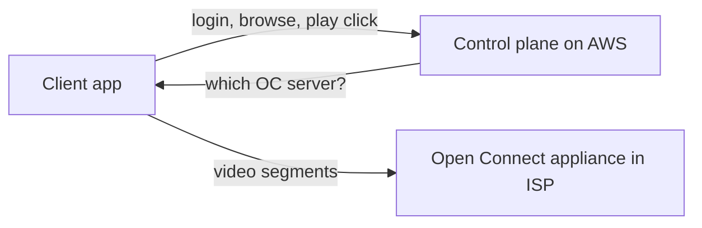

# How Netflix Built It — Streaming & Microservices

> A look at how Netflix delivers video to 200M+ users with high availability, built on
> cloud microservices and its own purpose-built CDN.

## The challenge
Stream high-quality video to **200M+ subscribers** worldwide, on thousands of device
types and every network condition, with minimal buffering — while deploying thousands of
changes a day and surviving constant infrastructure failure. Netflix accounts for a
large share of global internet traffic at peak.

## Key architectural decisions

**1. Cloud migration + microservices (the 2008 turning point)**
A 2008 database corruption took down DVD shipping for days. The lesson: avoid single
points of failure and vertical scaling. Netflix spent ~7 years migrating from a
datacenter monolith to **hundreds of microservices on AWS**, completing in 2016. Each
service is independently deployable, owned by a small team, and built to fail
gracefully. Supporting pieces (the original "Netflix OSS"):
- **Zuul** — API gateway / edge routing.
- **Eureka** — service discovery.
- **Ribbon** — client-side load balancing.
- **Hystrix** — circuit breakers / bulkheads to stop cascading failure.

**2. Control plane (AWS) vs data plane (Open Connect)**
Video bytes are *not* served from AWS. Netflix split the system in two:
- **Control plane on AWS** — signup, auth, the UI/API, search, recommendations, billing,
  encoding pipeline, A/B testing.
- **Data plane on Open Connect** — its **own CDN**: custom caching appliances placed
  **inside ISPs and internet exchange points**. Popular titles are pre-positioned close
  to (often *inside*) the viewer's ISP during off-peak hours.

This keeps video traffic off the public backbone and off AWS egress, and gives smooth
playback near the user.

**3. Encoding + adaptive streaming**
Every title is encoded ahead of time into **many bitrate/resolution renditions** (and
increasingly **per-title / per-scene optimized** encodes to cut bitrate at equal
quality), split into segments. Players use **adaptive bitrate** to switch quality to
match bandwidth.

**4. Resilience / Chaos Engineering**
Netflix pioneered **Chaos Engineering**: **Chaos Monkey** randomly kills production
instances so teams are forced to build services that tolerate failure; the broader
**Simian Army** simulated larger outages (whole availability zones/regions). Resilience
is proven continuously in production, not assumed.

**5. Data & personalization**
- **Cassandra** (AP, write-scalable) for viewing history and other high-write data.
- **EVCache** (distributed Memcached) for caching at huge scale.
- Large **Kafka + Flink/Spark** pipelines feed recommendation and A/B-testing models;
  personalization drives most of what members watch.

## Lessons
- **Microservices + team ownership** unlocked massive scale and continuous delivery —
  but demanded heavy investment in tooling, discovery, and resilience.
- **Own your delivery path** when bandwidth is the core cost (Open Connect).
- **Assume failure** — chaos engineering makes fault tolerance real.
- **Separate control plane from data plane** so heavy bytes scale independently of logic.

## References
- [Netflix Open Connect](https://openconnect.netflix.com/)
- [Netflix Tech Blog](https://netflixtechblog.com/)
- [Chaos Monkey / Simian Army](https://netflix.github.io/chaosmonkey/)
