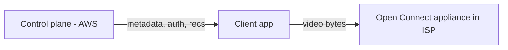

# How Netflix Built It — Streaming & Microservices

> A look at how Netflix delivers video to hundreds of millions of users with high
> availability, built on cloud microservices and its own CDN.

## The challenge
Stream high-quality video to 200M+ subscribers worldwide, on every device and network,
with minimal buffering — while continuously deploying changes and surviving failures.

## Key architectural decisions

**1. All-in on AWS + microservices**
Netflix famously migrated from a datacenter monolith to **hundreds of microservices on
AWS** after a 2008 database corruption outage. Each service is independently deployable
and owned by a small team. An **API gateway (Zuul)** routes requests; **Eureka** does
service discovery; **Ribbon** does client-side load balancing.

**2. Open Connect — their own CDN**
Video isn't served from AWS. Netflix built **Open Connect**: custom caching appliances
placed **inside ISPs and internet exchanges**. Popular content is pre-positioned close
to users (often within their own ISP), so streams travel a short distance.

The **control plane** (login, metadata, recommendations) runs on AWS; the **data plane**
(video bytes) runs on Open Connect.

**3. Adaptive streaming + pre-encoding**
Every title is pre-encoded into many bitrate/resolution renditions and split into
segments. Players use **adaptive bitrate** to switch quality to match bandwidth.

**4. Resilience engineering**
Netflix pioneered **Chaos Engineering** — **Chaos Monkey** randomly kills production
instances to force engineers to build fault-tolerant services. Circuit breakers
(**Hystrix**) prevent cascading failures.

**5. Data & recommendations**
Heavy use of **Cassandra** (AP, write-scalable) for viewing data, **EVCache**
(Memcached) for caching, and large-scale data/ML pipelines for personalization.

## Lessons
- **Microservices + team ownership** enabled massive scale and continuous delivery.
- **Own the delivery path** (Open Connect) when bandwidth is your core cost.
- **Assume failure** — chaos engineering makes resilience real, not theoretical.

## References
- [Netflix Open Connect](https://openconnect.netflix.com/)
- [Netflix Tech Blog](https://netflixtechblog.com/)
- [Chaos Monkey](https://netflix.github.io/chaosmonkey/)
