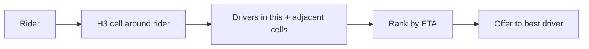

# How Uber Built It — Real-Time Dispatch & Geospatial

> How Uber matches riders and drivers in real time across the globe, and the geospatial
> and architectural ideas that made it scale.

## The challenge
Match millions of riders to nearby drivers in seconds, track live locations at huge
write volume, compute pricing and ETAs, and stay available across hundreds of cities.

## Key architectural decisions

**1. From monolith to domain-oriented microservices**
Uber started as a monolith and moved to thousands of microservices, later consolidating
into a **Domain-Oriented Microservice Architecture (DOMA)** to tame the sprawl —
grouping services into domains with clear interfaces.

**2. H3 — a hexagonal geospatial grid**
The core matching problem is "find available drivers near this rider, fast." Uber built
and open-sourced **H3**, a hierarchical grid that tiles the world into **hexagons**.
Hexagons have uniform neighbor distances (unlike squares), which makes proximity
queries, supply/demand analysis, and surge zones clean.

**3. High-volume location ingestion**
Drivers emit location every few seconds → enormous write throughput of ephemeral data.
Uber keeps live location in fast in-memory/geo stores and processes streams with
**Kafka** + real-time pipelines (e.g. their **Ringpop**/gossip sharding for the
dispatch service, **Schemaless** on MySQL for storage).

**4. Real-time data platform**
Uber runs one of the largest **Apache Kafka** deployments for trip events, plus
**Flink** for stream processing, and **Cadence** (which they created) for orchestrating
long-running workflows (trips, payments) as durable state machines.

**5. Geo-distributed & resilient**
City/region-based partitioning, failover across data centers, and careful handling of
the **matching consistency** problem (never assign one driver to two riders).

## Lessons
- **Pick the right spatial model** — H3 turned an expensive "nearby" query into cheap
  cell lookups.
- **Separate hot ephemeral data** (live location) from durable trip records.
- **Stream-first** — Kafka + stream processing underpin pricing, ETA, and analytics.

## References
- [Uber H3](https://www.uber.com/blog/h3/)
- [Uber Engineering Blog](https://www.uber.com/blog/engineering/)
- [DOMA](https://www.uber.com/blog/microservice-architecture/)
