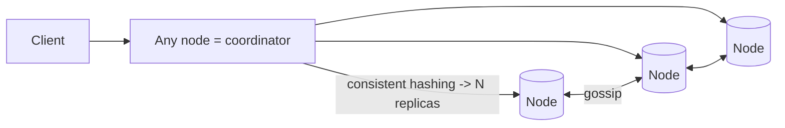
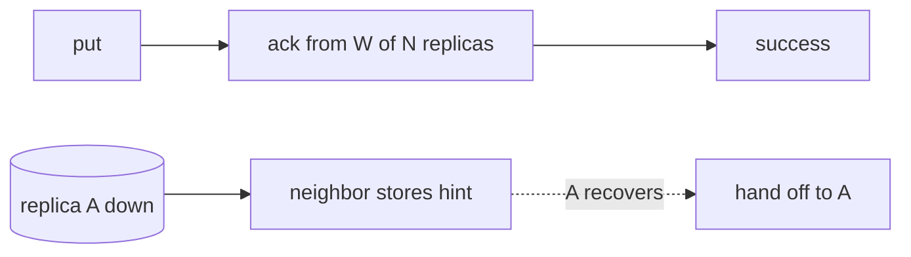

# Case Study: Distributed Key-Value Store (Dynamo-style)

> Design a highly available, horizontally scalable key-value store — the kind of system
> behind DynamoDB and Cassandra.

## 1. Requirements

**Clarifying questions**
- Consistency — strong, eventual, or **tunable**? Read/write ratio?
- Value size limits? Single-DC or **multi-region**? Durability target?

**Functional requirements**
1. `put(key, value)` and `get(key)`.
2. Scale to huge data + throughput across many nodes.
3. Values are opaque blobs.

**Non-functional requirements** (with concrete targets)
| Requirement | Target | Why |
| --- | --- | --- |
| Availability | **always writable** (even during failures) | the core selling point |
| Partition tolerance | **mandatory** | networks fail at scale |
| Consistency | **tunable** (eventual default) | AP system per CAP |
| Latency | **single-digit ms** | predictable performance |
| Scalability | **incremental**, no downtime | add nodes seamlessly |
| SPOF | **none** | no leader to lose |

**Scale assumptions** — petabytes of data, millions of ops/s, commodity nodes that fail
routinely, possibly multi-region.

**Out of scope** — rich queries/joins/transactions (it's a KV store), secondary-index
internals (mention).

**🎯 The dominant requirement:** **high availability + partition tolerance with no SPOF.** Per
CAP, that means favoring **availability + eventual consistency** (an **AP** system), with
strong consistency as a tunable option. Every technique below serves "stay up and writable
while spread across failing nodes."

## 2. Design stance (CAP)
A single node can't hold all data or survive failures → **partition + replicate**. To stay
available during inevitable partitions, choose **AP** (Dynamo lineage). Strong consistency is a
per-request opt-in, not the default.

## 3. High-level architecture

**Leaderless**: any node coordinates any read/write — no primary to fail.

## 4. Core model
- Keys+nodes on a **consistent-hash ring**; each key replicated to the next **N** nodes.
- Tunable consistency via **W** (write acks) and **R** (read responses); **W + R > N** →
  overlapping → read-your-writes.

---

## 5. Deep analysis — biggest problems & solutions

Each problem follows the same walkthrough: **scenario → why it's hard → naive approach &
why it fails → solution → how it works → trade-offs → rule of thumb.**

### 🔴 Problem 1 — Partitioning with minimal reshuffling on membership change

**Scenario.** You run 10 nodes holding billions of keys. You add an 11th node (or one dies).
How much data has to move, and how many cache/DB lookups suddenly miss?

**Why it's hard.** Node membership changes **routinely** at scale (failures, scaling). If most
keys remap on every change, you get massive data movement and cache-miss storms.

**Naive approach & why it fails.** *`node = hash(key) % N`* → changing N from 10 to 11 changes
`% N` for **almost every key**, so nearly all data must move to a different node at once — a
catastrophic reshuffle.

**Solution — consistent hashing with virtual nodes.** Place keys *and* nodes on a hash ring; a
key is owned by the next node clockwise.

**How it works.** Adding/removing a node only affects keys between it and its ring neighbor →
only ~**K/N** keys move. **Virtual nodes** (each physical node occupies many ring positions)
smooth load imbalance and let bigger machines hold proportionally more.
(See [consistent hashing](../1-knowledge/building-blocks/consistent-hashing.md).)

**Trade-offs.** More complex than modulo and needs ring metadata, but it's essential when
membership changes often.

**💡 Rule of thumb:** never `% N` across a changing node set — use consistent hashing so only a
fraction of keys move.

### 🔴 Problem 2 — Staying writable when nodes/replicas are down

**Scenario.** A write for key `K` should go to nodes A, B, C, but A is currently down. The user
still expects their `put` to succeed.

**Why it's hard.** "Always available, even during failures" conflicts with "write must reach its
designated nodes" when some of those nodes are unreachable.

**Naive approach & why it fails.** *Require all N replicas to ack a write* → if any replica is
down, the write fails → you're not highly available, exactly when failures happen.

**Solution — replication + quorum writes + hinted handoff.** Replicate each key to N nodes;
require only **W** acks (not all). If a target is down, a neighbor temporarily accepts the write
as a **hint**.

**How it works.**

The write succeeds once W replicas ack. The neighbor holding the hint **replays** it to A when
A comes back, so A eventually converges — the system never rejected the write.

**Trade-offs.** You stay writable, but data may be temporarily inconsistent across replicas
(handled by Problems 3–5). Hints add bookkeeping.

**💡 Rule of thumb:** require a quorum (not all) and stash hints for down replicas to stay
writable through failures.

### 🔴 Problem 3 — Tunable consistency

**Scenario.** One workload (account balance) needs to read the latest write; another (a feed)
is fine with slightly stale data and wants maximum speed/availability.

**Why it's hard.** A single fixed consistency level can't serve both — strong consistency costs
latency/availability; eventual maximizes them but can read stale.

**Naive approach & why it fails.** *Hard-code "wait for all replicas" (strong) or "ack one"
(fast)* → either too slow/unavailable for the feed, or too stale for the balance.

**Solution — quorum knobs W and R, tunable per operation.** With N replicas, choose how many
must ack a write (W) and respond to a read (R).

**How it works.** If **W + R > N**, the write set and read set **overlap**, so a read is
guaranteed to see the latest acked write (strong-ish). Lower W/R → faster + more available +
more eventual. Common N=3, W=2, R=2. Callers pick per request: strong for the balance read,
eventual for the feed.

**Trade-offs.** Higher W/R = more consistency but more latency and less availability under
failure; it's a per-operation dial, not a global setting.

**💡 Rule of thumb:** expose consistency as a per-request quorum (W, R) so each workload picks
its own point on the curve.

### 🔴 Problem 4 — Resolving concurrent conflicting writes

**Scenario.** Two clients update the same key on different replicas at nearly the same time (or
during a network partition). The replicas now hold **different** values for one key.

**Why it's hard.** Leaderless + multi-replica writes mean there's no single arbiter of "the
latest" value; clocks across nodes aren't perfectly synced.

**Naive approach & why it fails.** *Last-Write-Wins by wall-clock timestamp* → clock skew can
make an **older** write win and **silently discard** a newer one; data is lost without anyone
noticing.

**Solution — track causality with vector clocks (or use LWW / CRDTs deliberately).**

**How it works.**
- **Vector clocks** attach per-replica version counters to values; on read, the system can tell
  whether one version **descends** from another (keep the newer) or they're **concurrent**
  (surface both for the app/client to merge, e.g. merge two shopping carts).
- **CRDTs** are data types (counters, sets) that **merge deterministically** with no
  coordination.
- **LWW** is acceptable when occasional loss is fine and clocks are reasonably synced.

**Trade-offs.** Vector clocks/CRDTs are correct but add metadata and app-side merge logic; LWW
is simple but lossy. Choose per data type.

**💡 Rule of thumb:** don't resolve concurrent writes by raw timestamps — track causality
(vector clocks) or use mergeable types (CRDTs) when correctness matters.

### 🔴 Problem 5 — Detecting failures & repairing diverged replicas

**Scenario.** With no leader, nodes must agree on who's alive, and replicas that diverged
(due to hints, partitions, or dropped messages) must re-converge.

**Why it's hard.** There's no central coordinator to declare membership or force sync, and
comparing entire datasets between replicas would be hugely expensive.

**Naive approach & why it fails.** *A central monitor tracks liveness and a full replica-to-
replica data compare repairs drift* → the monitor is a SPOF, and full compares move terabytes.

**Solution — gossip for membership + read-repair + Merkle-tree anti-entropy.**

**How it works.**
- **Gossip:** nodes periodically exchange membership/health with random peers, so knowledge of
  who's up/down spreads with no central registry (decentralized failure detection).
- **Read repair:** when a read gathers replicas and finds one stale, it writes the newest value
  back to the stale replica opportunistically.
- **Anti-entropy with Merkle trees:** replicas compare **hash trees** of their key ranges;
  matching subtree hashes are skipped, so they exchange and reconcile **only the differing
  ranges** — efficient background repair.

> **Storage engine note:** writes hit a commit log + in-memory memtable, flushed to immutable
> **SSTables** (LSM-tree), merged by compaction → high write throughput; per-SSTable Bloom
> filters speed "key absent" checks.

**Trade-offs.** These mechanisms give decentralized, efficient convergence at the cost of extra
background traffic and eventual (not instant) repair.

**💡 Rule of thumb:** detect membership with gossip and reconcile replicas with Merkle-tree
diffs — never a central monitor or full data compare.

---

## 6. Trade-offs & bottlenecks (summary)
- **AP**: always available, but app handles eventual consistency / conflicts.
- **Quorum tuning** trades latency/availability vs consistency per op.
- **LWW** (simple, lossy) vs **vector clocks/CRDTs** (correct, complex).
- LSM-trees: fast writes but read/space amplification + compaction cost.
- Hot keys still load a key's replicas → caching / key-splitting.

## 7. References
- [Amazon Dynamo paper (2007)](https://www.allthingsdistributed.com/files/amazon-dynamo-sosp2007.pdf)
- [Cassandra architecture](https://cassandra.apache.org/doc/latest/cassandra/architecture/)
- *Designing Data-Intensive Applications* — Ch. 5 & 6
