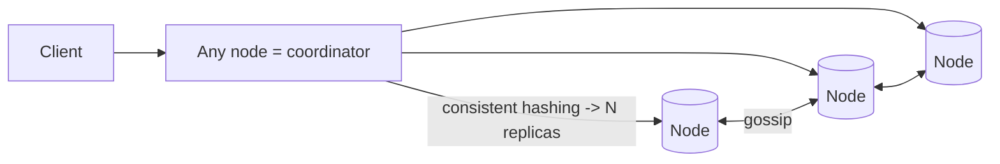
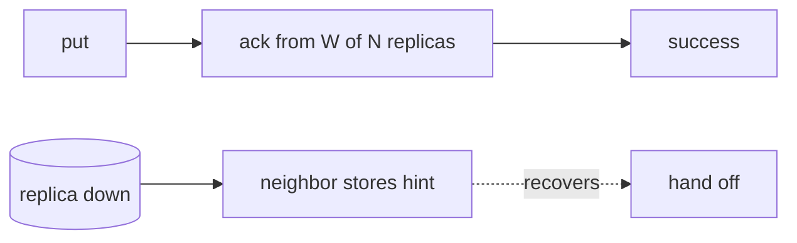

# Case Study: Distributed Key-Value Store (Dynamo-style)

> Design a highly available, horizontally scalable key-value store — the kind of system
> behind DynamoDB and Cassandra.

## 1. Requirements

**Clarifying questions**
- Consistency — strong, eventual, or **tunable**? Read/write ratio?
- Value size limits? Single-DC or **multi-region**? Durability target?

**Functional requirements**
1. `put(key, value)` and `get(key)`.
2. Scale to huge data + throughput across many nodes.
3. Values are opaque blobs.

**Non-functional requirements** (with concrete targets)
| Requirement | Target | Why |
| --- | --- | --- |
| Availability | **always writable** (even during failures) | the core selling point |
| Partition tolerance | **mandatory** | networks fail at scale |
| Consistency | **tunable** (eventual default) | AP system per CAP |
| Latency | **single-digit ms** | predictable performance |
| Scalability | **incremental**, no downtime | add nodes seamlessly |
| SPOF | **none** | no leader to lose |

**Scale assumptions** — petabytes of data, millions of ops/s, commodity nodes that fail
routinely, possibly multi-region.

**Out of scope** — rich queries/joins/transactions (it's a KV store), secondary-index
internals (mention).

**🎯 The dominant requirement:** **high availability + partition tolerance with no SPOF.**
Per CAP, that means favoring **availability + eventual consistency** (an **AP** system),
with strong consistency offered as a tunable option. Every technique below serves "stay
up and writable while spread across failing nodes."

## 2. Design stance (CAP)
A single node can't hold all data or survive failures → **partition + replicate**. To
stay available during inevitable partitions, choose **AP** (Dynamo lineage). Strong
consistency is a per-request opt-in, not the default.

## 3. High-level architecture

**Leaderless**: any node coordinates any read/write — no primary to fail.

## 4. Core model
- Keys+nodes on a **consistent-hash ring**; each key replicated to the next **N** nodes.
- Tunable consistency via **W** (write acks) and **R** (read responses); **W + R > N** →
  overlapping → read-your-writes.

---

## 5. Deep analysis — biggest problems & solutions

### 🔴 Problem 1 — Partitioning with minimal reshuffling on membership change
**Why it's hard:** `hash(key) % N` remaps almost **all** keys when a node is added or
removed (failures are routine at scale) → massive data movement / cache-miss storms.

**Solution — consistent hashing with virtual nodes.** Keys and nodes map onto a ring; a
key is owned by the next node clockwise. Adding/removing a node moves only ~**K/N** keys.
**Virtual nodes** (many ring positions per physical node) smooth load imbalance and let
heterogeneous machines carry proportional load.
(See [consistent hashing](../1-knowledge/building-blocks/consistent-hashing.md).)

### 🔴 Problem 2 — Staying writable when nodes/replicas are down
**Why it's hard:** if a write must reach a specific node and that node is down, a strict
system rejects the write — violating "always available."

**Solution — replication + quorums + hinted handoff.** Each key lives on **N** replicas;
a write succeeds once **W** of them ack (don't need all). If a target replica is down,
another node accepts the write as a **hint** and **hands it off** when the replica
recovers → the system stays writable through failures.

### 🔴 Problem 3 — Tunable consistency
**Why it's hard:** different workloads want different points on the consistency/latency
curve; one fixed setting can't serve all.

**Solution — quorum knobs W and R.** With **W + R > N**, read and write sets overlap, so
a read sees the latest write (strong-ish). Lower W/R → faster + more available + more
eventual. Common N=3, W=2, R=2. Callers tune per operation (e.g. strong for a balance
read, eventual for a feed).

### 🔴 Problem 4 — Resolving concurrent conflicting writes
**Why it's hard:** leaderless + replicas means two clients can write the same key on
different replicas concurrently → divergent versions.

**Solution — version with vector clocks (or LWW/CRDTs).**
- **Last-Write-Wins** (timestamps) — simple but can silently drop a write; needs synced
  clocks.
- **Vector clocks** — track causal history; detect concurrency and surface conflicting
  versions for the app to merge (Dynamo's approach).
- **CRDTs** — types that merge deterministically (counters, sets) with no coordination.

### 🔴 Problem 5 — Detecting failures & repairing replicas
**Why it's hard:** with no central coordinator, nodes must learn who's alive and keep
replicas in sync despite dropped messages.

**Solution — gossip + read-repair + Merkle anti-entropy.**
- **Gossip** spreads membership/health peer-to-peer (decentralized failure detection).
- **Read repair** updates stale replicas detected during a read.
- **Anti-entropy with Merkle trees** lets replicas compare hash trees and sync only the
  differing key ranges efficiently.

> **Storage engine note:** writes go to a commit log + in-memory memtable, flushed to
> immutable **SSTables** (an **LSM-tree**), merged by compaction → high write throughput
> (sequential I/O); per-SSTable Bloom filters speed "key absent" checks.

---

## 6. Trade-offs & bottlenecks (summary)
- **AP**: always available, but app handles eventual consistency / conflicts.
- **Quorum tuning** trades latency/availability vs consistency per op.
- **LWW** (simple, lossy) vs **vector clocks/CRDTs** (correct, complex).
- LSM-trees: fast writes but read/space amplification + compaction cost.
- Hot keys still load a key's replicas → caching / key-splitting.

## 7. References
- [Amazon Dynamo paper (2007)](https://www.allthingsdistributed.com/files/amazon-dynamo-sosp2007.pdf)
- [Cassandra architecture](https://cassandra.apache.org/doc/latest/cassandra/architecture/)
- *Designing Data-Intensive Applications* — Ch. 5 & 6
