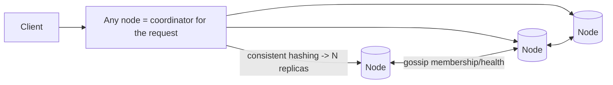
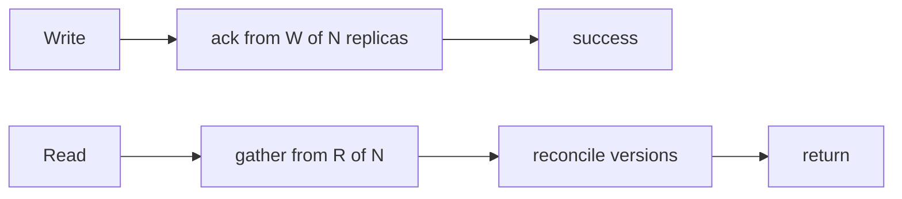

# Case Study: Distributed Key-Value Store (Dynamo-style)

> Design a highly available, horizontally scalable key-value store — the kind of system
> behind DynamoDB and Cassandra.

## 1. Requirements

**Clarifying questions**
- Consistency needs — strong, eventual, or tunable? Read/write ratio?
- Value size limits? Single-DC or multi-region? Durability target?

**Functional**
- `put(key, value)` and `get(key)`.
- Scale to huge data and throughput across many nodes; values are opaque blobs.

**Non-functional**
- **Highly available** (always writable, even during failures), **partition tolerant**.
- **Low latency**, **tunable consistency**, **no single point of failure**,
  incremental scalability.

## 2. Design goals & CAP stance
A single node can't hold all data or survive failures, so we **partition** + **replicate**.
To stay available during the network partitions that *will* happen, we favor
**availability + eventual consistency** — an **AP** system (the Dynamo lineage). Strong
consistency is offered as a tunable option, not the default.

## 3. High-level architecture

**Leaderless**: any node can coordinate any read/write — no primary to fail.

## 4. Core techniques (the Dynamo toolkit)

**Partitioning — consistent hashing.** Keys and nodes map onto a ring; a key is owned by
the next node clockwise, replicated to the next **N** nodes. Adding/removing a node moves
only ~**K/N** keys. **Virtual nodes** smooth load imbalance and let heterogeneous
machines carry proportional load.
(See [consistent hashing](../1-knowledge/building-blocks/consistent-hashing.md).)

**Replication & quorums.** Each key lives on **N** replicas. Tunable consistency via:
- **W** = replicas that must ack a write, **R** = replicas that must respond to a read.
- If **W + R > N** → read and write sets overlap → you read the latest write
  (strong-ish). Lower W/R → faster, more available, more eventual.
- Common: N=3, W=2, R=2.

## 5. Deep dives

**Conflict resolution** — concurrent writes to the same key on different replicas
diverge:
- **Last-Write-Wins (LWW)** via timestamps — simple, but can silently drop a write
  (and depends on synced clocks).
- **Vector clocks** — track causal history; detect concurrent writes and surface
  conflicting versions for the client/app to merge (Dynamo's approach).
- **CRDTs** — data types that merge deterministically without coordination (counters,
  sets).

**Failure handling**
- **Hinted handoff** — if a target replica is down, another node temporarily accepts the
  write and **hands it off** when the replica recovers → stays writable during failures.
- **Read repair** — on a read, if replicas disagree, push the newest value to stale ones.
- **Anti-entropy with Merkle trees** — replicas periodically compare hash trees to find
  and sync only the differing key ranges efficiently.
- **Gossip protocol** — nodes exchange membership/health peer-to-peer (no central
  registry), enabling decentralized failure detection and ring updates.

**Storage engine** — writes go to a **commit log** + in-memory **memtable**, flushed to
immutable sorted **SSTables** (an **LSM-tree**); background **compaction** merges them.
This gives high write throughput (sequential I/O). Bloom filters per SSTable speed up
"key not here" checks.

**Membership & scaling** — adding a node: it claims ring ranges (virtual nodes), streams
its share of data from neighbors, and starts serving — **incremental** scaling with no
downtime.

## 6. Trade-offs & bottlenecks
- **AP design**: always available, but the app must tolerate eventual consistency and
  possibly resolve conflicts.
- **Quorum tuning** trades latency/availability vs consistency **per operation**.
- **LWW** (simple, lossy) vs **vector clocks/CRDTs** (correct, complex).
- LSM-trees give fast writes but **read/space amplification** and compaction overhead.
- Hot keys still concentrate load on a key's replicas → caching / key-splitting.

## 7. References
- [Amazon Dynamo paper (2007)](https://www.allthingsdistributed.com/files/amazon-dynamo-sosp2007.pdf)
- [Cassandra architecture](https://cassandra.apache.org/doc/latest/cassandra/architecture/)
- *Designing Data-Intensive Applications* — Ch. 5 & 6
