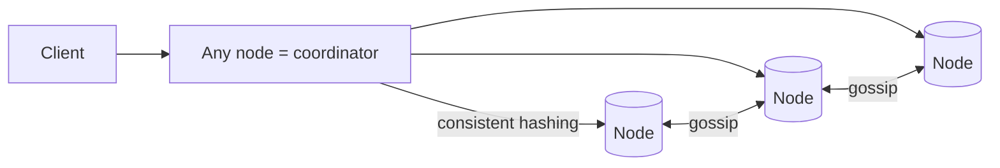

# Case Study: Distributed Key-Value Store (Dynamo-style)

> Design a highly available, horizontally scalable key-value store — the kind of system
> behind DynamoDB and Cassandra.

## 1. Requirements
**Functional**
- `put(key, value)` and `get(key)`.
- Scale to huge data/throughput; data spread across many nodes.

**Non-functional**
- Highly available (always writable), partition tolerant, low latency.
- Tunable consistency; no single point of failure.

## 2. Design goals
A single node can't hold all data or survive failures. We need to **partition** data
across nodes and **replicate** each piece, while staying available during failures —
which (per CAP) means favoring **availability + eventual consistency** (an **AP**
system).

## 3. High-level design

Leaderless: **any node** can accept reads/writes and coordinate.

## 4. Core techniques (the Dynamo toolkit)
**Partitioning — consistent hashing** — keys and nodes map onto a ring; each key is
owned by the next node clockwise. Adding/removing a node moves only a small fraction of
keys. Virtual nodes balance load.
(See [consistent hashing](../1-knowledge/building-blocks/consistent-hashing.md).)

**Replication** — each key is stored on the next **N** nodes on the ring. Survives node
loss.

**Tunable consistency — quorums** — with N replicas, require **W** acks on write and
**R** responses on read. If **W + R > N**, reads and writes overlap → strong-ish
consistency. Lower W/R → faster, more available, more eventual.

## 5. Deep dives
**Handling conflicts** — concurrent writes to the same key on different replicas
diverge. Resolve with:
- **Last-Write-Wins** (timestamps) — simple, can lose data.
- **Vector clocks** — track causality; surface conflicting versions to the app to
  merge.
- **CRDTs** — data types that merge automatically.

**Failure handling**
- **Hinted handoff** — if a replica is down, another node temporarily stores the write
  and forwards it later → stays writable.
- **Anti-entropy / Merkle trees** — replicas periodically compare and reconcile
  differences efficiently.
- **Gossip protocol** — nodes share membership/health info peer-to-peer (no central
  coordinator).

**Storage engine** — writes go to a commit log + memtable, flushed to immutable
**SSTables** (LSM-tree) → high write throughput.

## 6. Trade-offs & bottlenecks
- AP design: always available, but you must handle eventual consistency + conflicts.
- Quorum tuning trades latency/availability vs consistency per operation.
- LWW is simple but lossy; vector clocks/CRDTs are correct but complex.

## 7. References
- [Amazon Dynamo paper (2007)](https://www.allthingsdistributed.com/files/amazon-dynamo-sosp2007.pdf)
- *Designing Data-Intensive Applications* — Ch. 5 & 6
