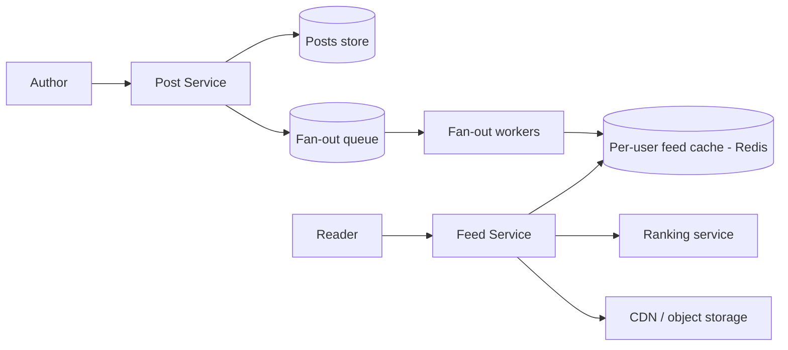

# Case Study: News Feed (Twitter / Facebook)

> Design a feed that shows a user a continuously updated, ranked stream of posts from
> the people/pages they follow.

## 1. Requirements

**Clarifying questions**
- Chronological or **ranked** feed? How fresh must it be (seconds? minutes?)?
- Media supported? Max followers/following? Support **celebrity** accounts (100M
  followers)?
- Read:write ratio? Personalized per user?

**Functional requirements**
1. **Create a post** (text + optional media).
2. **View a feed** of posts from followed accounts, paginated / infinite scroll.
3. Feed reflects a new post within a few seconds.
4. (Ranked variant) order by **relevance**, not just time.
5. Follow/unfollow accounts.

**Non-functional requirements** (with concrete targets)
| Requirement | Target | Why |
| --- | --- | --- |
| Feed load latency | **< 200 ms p99** | core scrolling experience |
| Read:write ratio | **~100:1 or higher** | scrolling ≫ posting → precompute reads |
| Freshness | new post visible in **seconds** | eventual consistency is acceptable |
| Availability | **99.99%** | the feed is the product's home screen |
| Consistency | **eventual** | a few seconds of staleness is fine |

**Scale assumptions** — 300M DAU, ~10 feed opens/user/day, ~2 posts/user/day, avg ~200
followers, some accounts with 10–100M followers.

**Out of scope** — the recommendation/ranking *model* internals, ads insertion,
moderation (mention as hooks).

**🎯 The dominant requirement:** **low read latency at massive read volume.** You cannot
build each feed on demand at 100K+ reads/s — the design is organized around
**precomputing** feeds, which then forces the celebrity and ranking problems below.

## 2. Capacity estimation
- **Reads**: 300M × 10 = 3B/day ≈ **35K/s** avg, **>100K/s** peak.
- **Writes**: 600M posts/day ≈ **7K/s**.
- **Fan-out (push)**: 7K posts/s × 200 followers ≈ **1.4M feed-writes/s** — large but
  shardable; celebrities break it.
- **Storage**: posts 600M/day × ~1 KB ≈ 600 GB/day; media in object storage + CDN.

## 3. High-level architecture

## 4. Data model & API
- `posts`: `post_id (snowflake), author_id, text, media_url, created_at`
- `follows`: `follower_id, followee_id` (indexed both ways)
- `feed_cache`: Redis per-user list/sorted-set of recent `post_id`s (capped ~800)

**API** — `POST /v1/posts`, `GET /v1/feed?cursor=...`, `POST /v1/follow`.

---

## 5. Deep analysis — biggest problems & solutions

### 🔴 Problem 1 — Building feeds fast enough at read time
**Why it's hard:** at 100K+ feed reads/s, querying "recent posts from everyone this user
follows" and merge-sorting on every load is far too expensive and slow.

**Solution — fan-out on write (precompute).** When a user posts, **push** the post_id
into each follower's precomputed feed list (in Redis). A feed read becomes a trivial
cache lookup.

**How it works:** the Post Service drops a fan-out task on a queue; workers look up the
author's followers and append the post_id to each follower's capped Redis list. Reads hit
Redis directly → sub-millisecond.

**Trade-off:** moves work from read time to write time (write amplification) — which
creates Problem 2.

### 🔴 Problem 2 — The celebrity problem (fan-out explosion)
**Why it's hard:** fan-out on write means a post by someone with **50M followers = 50M
cache writes**, a massive spike that also wastes effort on inactive followers.

**Solution — a hybrid push/pull model.** Push for normal accounts; for **celebrities**,
**skip fan-out** and store the post once. At read time, **pull** the small set of
celebrities a user follows and **merge** their recent posts into the precomputed feed.

**How it works:** classify authors by follower count; a "celebrity" flag routes posts to
pull-handling. Feed read = `cached_feed ∪ recent_posts(celebrities_followed)`, merged and
ranked. This bounds write amplification while keeping reads fast.

### 🔴 Problem 3 — Ranking by relevance (not just time)
**Why it's hard:** chronological feeds bury good content; users engage more with a
**relevance-ranked** feed, but scoring must happen within the latency budget.

**Solution — an ML ranking pipeline over a candidate set.**
**How it works:** **candidate generation** (the merged push+pull post set) →
**feature fetch** (author affinity, recency, media type, past engagement) → **scoring**
with a trained model → **re-rank/diversify** (avoid 5 posts from one author). Scores can
be precomputed periodically or computed at read over a bounded candidate set to hold
latency.

### 🔴 Problem 4 — Pagination over a constantly changing feed
**Why it's hard:** with `OFFSET`-based paging, new posts arriving between page loads
shift everything → users see duplicates or skips.

**Solution — cursor-based pagination.** The cursor encodes a stable position
(`(score, post_id)` or timestamp+id). The next page is "items after this cursor,"
unaffected by new inserts at the top.

### 🔴 Problem 5 — Feed storage & inactive users
**Why it's hard:** precomputing and storing feeds for **all** users (including those who
never log in) wastes huge amounts of memory and fan-out work.

**Solution:** **cap** each feed (~800 entries, LRU), and **don't fan out to inactive
users** — lazily rebuild their feed (pull) on next login. Store **post_ids**, not copies;
hydrate to full posts from a posts cache at read time.

---

## 6. Trade-offs & bottlenecks (summary)
- **Push** (fast reads / costly writes) vs **pull** (cheap writes / costly reads) →
  **hybrid** is the production answer.
- Precomputed feeds trade **storage + write amplification** for **read latency**.
- Ranking adds quality but compute/latency; eventual consistency keeps it scalable.
- Hot partitions on celebrity posts → caching + pull handling.

## 7. References
- *Designing Data-Intensive Applications* — Ch. 1 (the Twitter fan-out example)
- [Twitter Engineering blog](https://blog.twitter.com/engineering)
- [Instagram feed ranking](https://instagram-engineering.com/)
