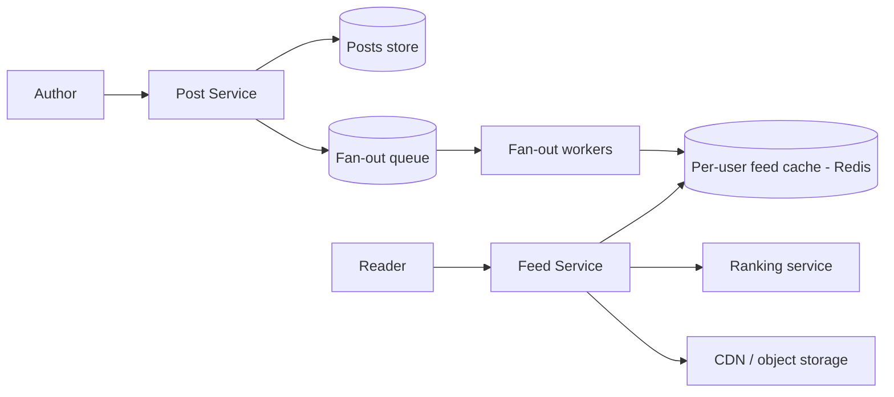
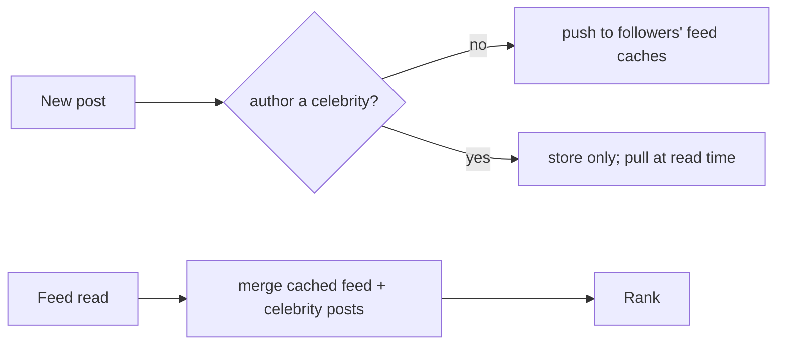

# Case Study: News Feed (Twitter / Facebook)

> Design a feed that shows a user a continuously updated, ranked stream of posts from
> the people/pages they follow.

## 1. Requirements

**Clarifying questions**
- Chronological or ranked feed? How fresh must it be (seconds? minutes?)?
- Media (images/video) supported? Max followers/following?
- Read:write ratio? Do we need to support "celebrity" accounts with 100M followers?

**Functional**
- Create a post (text + optional media).
- View a feed of posts from accounts you follow, ranked, with pagination/infinite
  scroll.
- Feed reflects a new post within a few seconds (eventual consistency OK).

**Non-functional**
- **Extremely read-heavy** (scrolling ≫ posting).
- **Low-latency feed loads** (< ~200 ms perceived).
- Highly available; a few seconds of staleness is acceptable.

## 2. Capacity estimation
- **300M DAU**, each opens the feed ~10×/day → 3B feed reads/day ≈ **35K reads/s**
  average, **>100K/s** peak. Generating each feed from scratch per request is far too
  expensive → **precompute** feeds.
- **2 posts/user/day** → 600M posts/day ≈ **7K writes/s**.
- **Fan-out cost**: avg 200 followers → a normal post = 200 feed-cache writes; 7K
  posts/s × 200 ≈ **1.4M feed writes/s** on push — large but shardable. Celebrities
  break this (see deep dive).
- **Storage**: posts 600M/day × ~1 KB (incl. metadata) ≈ 600 GB/day; media in object
  storage + CDN.

## 3. High-level architecture


## 4. Data model & API
- `posts`: `post_id (snowflake), author_id, text, media_url, created_at`
- `follows`: `follower_id, followee_id, created_at` (index both directions)
- `feed_cache`: Redis list/sorted-set per user → recent `post_id`s (capped, e.g. last
  ~800)

**API**
```
POST /v1/posts            { text, media? } -> { post_id }
GET  /v1/feed?cursor=...  -> { items:[...], next_cursor }   # cursor pagination
POST /v1/follow           { followee_id }
```

## 5. Deep dives

**Fan-out: push vs pull — the central decision**

- **Fan-out on write (push / "spread on write")** — when a user posts, write the
  `post_id` into **every follower's** precomputed feed list.
  - ✅ Feed reads are a trivial cache lookup → fast, cheap reads.
  - ⚠️ Write amplification: a post by someone with 50M followers = 50M writes (the
    **celebrity problem**); also wastes work for inactive followers.

- **Fan-out on read (pull)** — store posts only once; at read time, fetch recent posts
  from everyone the user follows and merge-sort.
  - ✅ Cheap writes, no wasted fan-out.
  - ⚠️ Expensive, slow reads (query N followees every load); bad for users following
    thousands.

- **Hybrid (real-world: Twitter/Instagram)** — **push** for normal accounts; for
  **celebrities**, skip fan-out and **pull** their recent posts at read time, merging
  them into the precomputed feed. Resolves both the celebrity write storm and slow
  reads.



**Ranking** — chronological is simplest. Real feeds use an **ML ranking** model scoring
each candidate post by predicted engagement (affinity to author, recency, media type,
past interactions). Pipeline: **candidate generation** (who/what could appear) →
**feature fetch** → **scoring** → **re-rank/diversify**. Can be precomputed or done at
read over a candidate set.

**Pagination** — use **cursor-based** pagination keyed on `(score, post_id)` or
timestamp, never `OFFSET` — offsets break and re-show items as new posts arrive.

**Feed cache management** — cap each user's cached feed (e.g. ~800 entries). Don't
fan-out to **inactive** users (lazily build their feed on next login). Hydrate
`post_id`s → full post objects from a posts cache at read time (store IDs, not copies).

**Storage choices** — posts in a sharded wide-column/NoSQL store (write-heavy,
time-ordered), feed lists in Redis, media in S3 + CDN, social graph in a graph/DB
optimized for follower lookups.

## 6. Trade-offs & bottlenecks
- **Push** = fast reads / costly writes (celebrities); **pull** = cheap writes / costly
  reads → **hybrid** is the production answer.
- Precomputed feeds trade **storage + write amplification** for **read latency**.
- Ranking improves quality but adds compute/latency and infra complexity.
- Eventual consistency (a post may take seconds to appear) keeps the system scalable.
- Hot partitions on celebrity posts → caching + pull handling.

## 7. References
- *Designing Data-Intensive Applications* — Ch. 1 (the Twitter fan-out example)
- [Twitter Engineering blog](https://blog.twitter.com/engineering)
- [Instagram feed ranking](https://instagram-engineering.com/)
