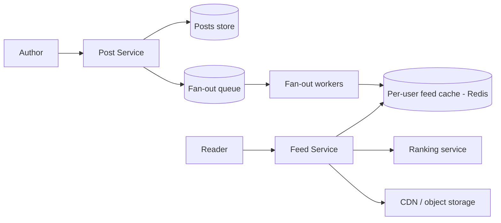
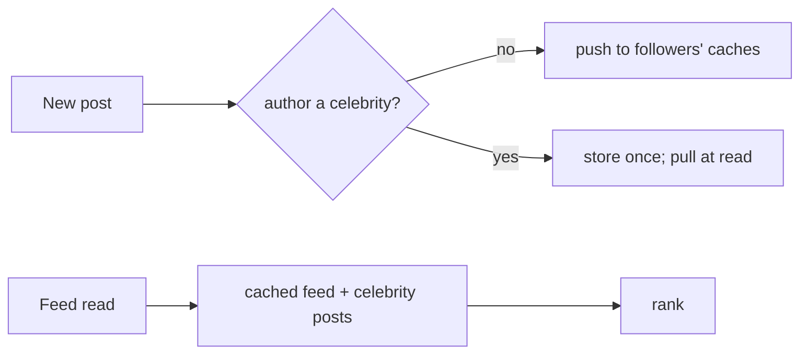

# Case Study: News Feed (Twitter / Facebook)

> Design a feed that shows a user a continuously updated, ranked stream of posts from
> the people/pages they follow.

## 1. Requirements

**Clarifying questions**
- Chronological or **ranked** feed? How fresh must it be (seconds? minutes?)?
- Media supported? Max followers/following? Support **celebrity** accounts (100M
  followers)?
- Read:write ratio? Personalized per user?

**Functional requirements**
1. **Create a post** (text + optional media).
2. **View a feed** of posts from followed accounts, paginated / infinite scroll.
3. Feed reflects a new post within a few seconds.
4. (Ranked variant) order by **relevance**, not just time.
5. Follow/unfollow accounts.

**Non-functional requirements** (with concrete targets)
| Requirement | Target | Why |
| --- | --- | --- |
| Feed load latency | **< 200 ms p99** | core scrolling experience |
| Read:write ratio | **~100:1 or higher** | scrolling ≫ posting → precompute reads |
| Freshness | new post visible in **seconds** | eventual consistency is acceptable |
| Availability | **99.99%** | the feed is the product's home screen |
| Consistency | **eventual** | a few seconds of staleness is fine |

**Scale assumptions** — 300M DAU, ~10 feed opens/user/day, ~2 posts/user/day, avg ~200
followers, some accounts with 10–100M followers.

**Out of scope** — the ranking *model* internals, ads insertion, moderation (hooks).

**🎯 The dominant requirement:** **low read latency at massive read volume.** You cannot
build each feed on demand at 100K+ reads/s — the design is organized around
**precomputing** feeds, which then forces the celebrity and ranking problems below.

## 2. Capacity estimation
- **Reads**: 300M × 10 = 3B/day ≈ **35K/s** avg, **>100K/s** peak.
- **Writes**: 600M posts/day ≈ **7K/s**.
- **Fan-out (push)**: 7K posts/s × 200 followers ≈ **1.4M feed-writes/s** — large but
  shardable; celebrities break it.
- **Storage**: posts 600M/day × ~1 KB ≈ 600 GB/day; media in object storage + CDN.

## 3. High-level architecture

## 4. Data model & API
- `posts`: `post_id (snowflake), author_id, text, media_url, created_at`
- `follows`: `follower_id, followee_id` (indexed both ways)
- `feed_cache`: Redis per-user list/sorted-set of recent `post_id`s (capped ~800)

**API** — `POST /v1/posts`, `GET /v1/feed?cursor=...`, `POST /v1/follow`.

---

## 5. Deep analysis — biggest problems & solutions

Each problem follows the same walkthrough: **scenario → why it's hard → naive approach &
why it fails → solution → how it works → trade-offs → rule of thumb.**

### 🔴 Problem 1 — Building feeds fast enough at read time

**Scenario.** 100K+ users per second open their feed. Each follows ~200 accounts. The feed
must render in < 200 ms.

**Why it's hard.** Read volume is ~100× write volume and latency-critical. Doing the work
*when the user asks* means a big query + sort on every one of 100K/s requests.

**Naive approach & why it fails.** *On feed open, query recent posts from all 200 followees
and merge-sort* (fan-out on read) → that's 200 lookups + a sort per request, ×100K/s. The
database and latency budget both collapse, and users following thousands are far worse.

**Solution — fan-out on write (precompute the feed).** Do the expensive merge **once at
write time**, not on every read. When a user posts, push the post into each follower's
precomputed feed list.

**How it works (step by step).**
1. Post Service stores the post and drops a fan-out task on a queue.
2. Fan-out workers look up the author's followers.
3. For each follower, append the `post_id` to their capped **Redis** feed list.
4. A feed read is now a single Redis lookup → sub-millisecond.

**Trade-offs.** Moves cost from read → write (write amplification), trading more storage and
write work for fast reads — which is the right trade for 100:1 read-heavy, but creates the
celebrity problem (Problem 2).

**💡 Rule of thumb:** in heavily read-skewed systems, precompute the read on write so reads
are O(1) lookups.

### 🔴 Problem 2 — The celebrity problem (fan-out explosion)

**Scenario.** A celebrity with **50M followers** posts. Pure fan-out-on-write means **50M
feed writes** for that single post — a huge spike — and many go to followers who'll never
log in soon.

**Why it's hard.** Write amplification scales with follower count; a few accounts have
orders of magnitude more followers than everyone else, so they alone can dominate write
load and cause latency spikes.

**Naive approach & why it fails.** *Fan out every post to every follower* → works for normal
users, but celebrity posts create write storms, hot partitions, and wasted work on inactive
followers.

**Solution — a hybrid model: push for normal users, pull for celebrities.** Don't fan out
celebrity posts. Store them once; **merge them in at read time** for the small number of
celebrities a user follows.

**How it works (step by step).**
1. Classify authors by follower count (flag "celebrities").
2. Normal author posts → fan-out-on-write to followers' caches (Problem 1).
3. Celebrity posts → stored once, **not** fanned out.
4. On feed read: take the user's precomputed feed **and** pull recent posts from the few
   celebrities they follow, then merge + rank.

**Trade-offs.** Adds read-time merge work for celebrity-followers (small, bounded set), but
eliminates the 50M-write spike. This hybrid is what Twitter/Instagram actually do.

**💡 Rule of thumb:** when one strategy blows up for outliers, special-case the outliers
(pull for the few huge accounts) rather than penalizing everyone.

### 🔴 Problem 3 — Ranking by relevance, within the latency budget

**Scenario.** A user follows 500 accounts; hundreds of candidate posts exist. Showing them
purely newest-first buries the posts they'd most engage with — but scoring must finish
inside ~200 ms.

**Why it's hard.** Relevance ranking needs features and a model evaluation per candidate
post, multiplied by every feed load — expensive if done naively on the hot path.

**Naive approach & why it fails.** *Sort the merged feed strictly by timestamp* → simple and
fast, but engagement drops because the most relevant content isn't surfaced; *or* score
everything synchronously with a heavy model → blows the latency budget.

**Solution — an ML ranking pipeline over a bounded candidate set.**

**How it works (step by step).**
1. **Candidate generation** — the merged push+pull post set (already bounded).
2. **Feature fetch** — author affinity, recency, media type, past engagement, etc.
3. **Scoring** — a trained model assigns each candidate a relevance score.
4. **Re-rank / diversify** — avoid 5 posts from one author; blend in freshness.
Scores can be **precomputed** periodically and/or computed at read over the small candidate
set to stay within latency.

**Trade-offs.** Much better engagement at the cost of compute + infra complexity + harder
debugging ("why did I see this?"). Bounding the candidate set keeps latency in check.

**💡 Rule of thumb:** rank a small candidate set, not the whole corpus; precompute features
where you can.

### 🔴 Problem 4 — Pagination over a constantly changing feed

**Scenario.** A user scrolls. Between loading page 1 and page 2, new posts arrive at the
top. With `OFFSET 20`, page 2 now re-shows items that shifted down — duplicates and skips.

**Why it's hard.** Offset-based paging assumes a stable list, but feeds change at the head
continuously.

**Naive approach & why it fails.** *`LIMIT 20 OFFSET 20`* → as new posts push items down,
offsets point at shifted positions → users see repeats or miss posts; deep offsets are also
slow.

**Solution — cursor-based (keyset) pagination.** The cursor encodes a **stable position**
(e.g. `(score, post_id)` or `created_at`+id); the next page is "items after this cursor."

**How it works.** Page 1 returns items plus a `next_cursor` (the last item's key). Page 2
requests `?cursor=<that key>`, fetching items strictly after it — unaffected by new inserts
at the head.

**Trade-offs.** Cursors are stable and efficient but don't support "jump to page N" (rarely
needed in a feed). Worth it for correctness.

**💡 Rule of thumb:** never paginate a live, head-changing list with OFFSET — use a cursor
on a stable sort key.

### 🔴 Problem 5 — Feed storage & inactive users

**Scenario.** Hundreds of millions of accounts exist, but a large fraction rarely log in.
Precomputing and storing a feed for **every** account — and fanning out to them — wastes
enormous memory and write work.

**Why it's hard.** Fan-out cost and feed-cache memory scale with *all* followers, but value
is only delivered to *active* ones.

**Naive approach & why it fails.** *Maintain an unbounded precomputed feed for every user* →
memory explodes and you do millions of writes for users who never read them.

**Solution — cap feeds + skip inactive users (lazy build).** Bound each feed (e.g. last
~800 entries, LRU) and **don't fan out to inactive users**; rebuild their feed by pull on
next login.

**How it works.** Track last-active timestamps; fan-out workers skip users inactive beyond a
threshold. On their next login, build the feed on demand (pull) and resume push afterward.
Store **post_ids** only; hydrate to full posts from a posts cache at read time.

**Trade-offs.** Inactive users pay a one-time slower first load; everyone else gets cheap
fast feeds and you save massive fan-out/memory.

**💡 Rule of thumb:** don't precompute for users who won't read it — build lazily for the
inactive tail.

---

## 6. Trade-offs & bottlenecks (summary)
- **Push** (fast reads / costly writes) vs **pull** (cheap writes / costly reads) →
  **hybrid** is the production answer.
- Precomputed feeds trade **storage + write amplification** for **read latency**.
- Ranking adds quality but compute/latency; eventual consistency keeps it scalable.
- Hot partitions on celebrity posts → caching + pull handling.

## 7. References
- *Designing Data-Intensive Applications* — Ch. 1 (the Twitter fan-out example)
- [Twitter Engineering blog](https://blog.twitter.com/engineering)
- [Instagram feed ranking](https://instagram-engineering.com/)
