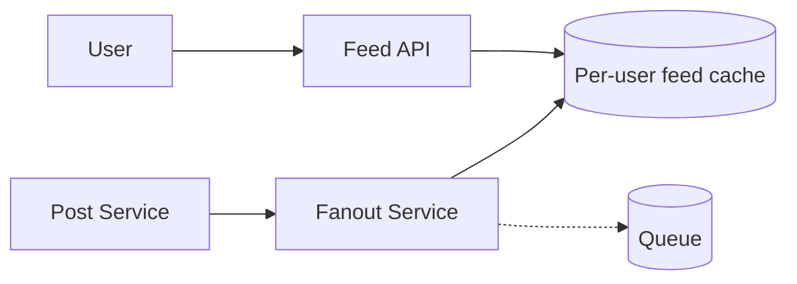

# Case Study: News Feed (Twitter / Facebook)

> Design a feed that shows a user a continuously updated, ranked stream of posts from
> the people/pages they follow.

## 1. Requirements
**Functional**
- Post content; view a feed of posts from followees, newest/ranked first.
- Feed updates reasonably quickly after a follower posts.

**Non-functional**
- Read-heavy (people scroll far more than they post), low-latency feed loads.
- Highly available; eventual consistency is acceptable (a few seconds of delay is OK).

## 2. Estimations
- 300M DAU, each loads feed ~10×/day → ~35M feed reads/sec at peak is too high to
  generate on the fly per request → must **precompute**.
- 2 posts/user/day → ~600M posts/day → ~7K writes/sec.

## 3. High-level design

## 4. Data model & API
- `posts`: `post_id, author_id, content, created_at`
- `follows`: `follower_id, followee_id`
- `feed_cache`: per user, a list of recent `post_id`s (in Redis)

**API** — `POST /posts`, `GET /feed?cursor=...` (cursor pagination).

## 5. Deep dives
**Fan-out: push vs pull — the core decision**
- **Fan-out on write (push)** — when a user posts, push the post_id into every
  follower's precomputed feed list. Feed reads are then a fast cache lookup.
  - ✅ Fast reads. ⚠️ Expensive for users with millions of followers (a single post =
    millions of writes) — the **celebrity problem**.
- **Fan-out on read (pull)** — build the feed at read time by querying recent posts of
  everyone you follow and merging.
  - ✅ Cheap writes. ⚠️ Slow, heavy reads.
- **Hybrid (what Twitter/Instagram do)** — push for normal users; **pull** for
  celebrities (merge celebrity posts in at read time). Best of both.

**Ranking** — newest-first is simplest; real feeds rank by an ML relevance score
(engagement, recency, affinity). Compute features and score at read or precompute.

**Pagination** — use **cursor-based** pagination (post_id/timestamp), not offset, so
new posts don't shift pages.

**Storage** — posts in a sharded store; feed lists in Redis; media in object storage +
CDN.

## 6. Trade-offs & bottlenecks
- Push = fast reads, costly writes (celebrities); pull = cheap writes, costly reads →
  **hybrid** resolves it.
- Precomputed feeds trade storage + write amplification for read latency.
- Ranking adds quality but cost/complexity; eventual consistency keeps it scalable.

## 7. References
- [Twitter's timeline architecture](https://blog.twitter.com/engineering)
- *Designing Data-Intensive Applications* — Ch. 1 (the Twitter example)
