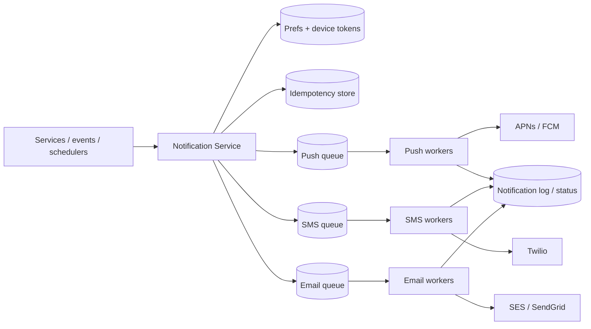

# Case Study: Notification System

> Design a service that sends notifications to users across multiple channels — push
> (mobile), SMS, and email — reliably and at scale.

## 1. Requirements

**Clarifying questions**
- Which channels (push/SMS/email/in-app)? Transactional, promotional, or both?
- Who triggers them (services, schedulers, user actions)?
- Templating, localization, scheduling, user preferences/opt-outs?
- Delivery guarantee and ordering?

**Functional requirements**
1. Send via **push (APNs/FCM), SMS, email**, in-app.
2. **Event-triggered + templated**, with localization.
3. Respect **user preferences/opt-outs** and quiet hours.
4. **Deduplicate** and **rate-limit per user**.
5. Support **priorities** and **scheduling**.

**Non-functional requirements** (with concrete targets)
| Requirement | Target | Why |
| --- | --- | --- |
| Throughput | **handle 10M+ in a burst** | broadcasts/breaking news |
| Delivery guarantee | **at-least-once + dedup** | don't lose; don't spam |
| Latency | transactional **< seconds**; bulk best-effort | OTP vs marketing |
| Availability | **99.9%+** | OTPs gate logins |
| Auditability | full per-message status log | compliance + debugging |

**Scale assumptions** — 100M notifications/day baseline; single broadcasts of tens of
millions within minutes; provider rate limits cap per-channel throughput.

**Out of scope** — building carriers/SMTP (we integrate providers), the marketing
campaign UI.

**🎯 The dominant requirement:** **reliable, deduplicated delivery under spiky load,
asynchronously.** Everything is built around queues + idempotency + priority lanes so a
50M-user blast never delays an OTP and nothing is sent twice or lost.

## 2. Capacity estimation
- **100M/day** ≈ **1,160/s** average; broadcasts inject **tens of millions** in minutes
  → must buffer and drain at provider-safe rates.
- Per-channel provider limits (APNs/FCM/Twilio/SES) bound worker throughput.

## 3. High-level architecture

## 4. Data model & API
- `device_tokens`: `user_id, platform, token, updated_at`
- `preferences`: `user_id, channel, category, enabled, quiet_hours, locale`
- `templates`: `template_id, channel, locale, subject, body`
- `notification_log`: `id, user_id, channel, status, provider_msg_id, sent_at`

**API** — `POST /v1/notifications { user_id|segment, template_id, data, channels,
priority, dedup_key } -> 202 { request_id }`.

---

## 5. Deep analysis — biggest problems & solutions

### 🔴 Problem 1 — Absorbing huge spikes without melting providers
**Why it's hard:** a "breaking news to 50M users" push injects tens of millions of sends
in minutes, but APNs/FCM/Twilio enforce rate limits and your workers can only push so
fast. A synchronous design would collapse.

**Solution — async, queue-buffered pipeline with worker pools.** The API only validates,
renders, and **enqueues**, returning immediately (`202`). Per-channel **workers** drain
the queue at a **provider-safe rate**. The queue is the shock absorber; a broadcast is
expanded (segment → user list) by a fan-out job and trickled out.

### 🔴 Problem 2 — Reliable delivery despite provider failures
**Why it's hard:** external providers fail transiently (timeouts, 5xx) or permanently
(invalid token), and you must not silently drop messages.

**Solution — retries with backoff + dead-letter queue.** Retry transient failures with
**exponential backoff + jitter**; route messages that exhaust retries to a **DLQ** for
inspection/replay. Prune permanently-invalid device tokens on `Unregistered` errors.
Support **multi-provider failover** (secondary SMS/email vendor) for provider outages.

### 🔴 Problem 3 — Preventing duplicate notifications
**Why it's hard:** at-least-once queues + retries mean the same logical notification can
be processed twice → users get spammed.

**Solution — idempotency keys / dedup store.** Each notification carries a `dedup_key`;
before sending, atomically check-and-set it in a Redis store with a TTL. If already
present, skip. This turns at-least-once into **effectively-once**.

### 🔴 Problem 4 — Urgent vs bulk (priority inversion)
**Why it's hard:** if an OTP sits behind a 50M-message marketing blast in one queue, the
user can't log in for minutes — unacceptable.

**Solution — separate priority lanes.** Transactional (OTP, password reset) and bulk
(marketing) use **different queues/worker pools**, with transactional drained first/with
reserved capacity. Urgent messages never queue behind bulk.

### 🔴 Problem 5 — Respecting preferences, quiet hours & noise
**Why it's hard:** sending to opted-out users or at 3am, or 10 separate "new like"
pushes, harms UX and may violate regulations.

**Solution — a preference + aggregation gate.** Before enqueueing a send, check
opt-outs, category prefs, locale, quiet hours, and per-user rate limits; **collapse**
noisy events ("3 new likes" instead of 3 pushes). Honor regional compliance (e.g.
unsubscribe links for email).

---

## 6. Trade-offs & bottlenecks (summary)
- At-least-once + idempotency (practical) vs exactly-once (hard).
- External providers are the real **bottleneck/SPOF** → failover, respect limits, prune
  tokens.
- Priority lanes prevent bulk from starving urgent.
- Exact delivery/read tracking adds cost; balance auditability vs volume.

## 7. References
- [FCM](https://firebase.google.com/docs/cloud-messaging) ·
  [APNs](https://developer.apple.com/documentation/usernotifications)
- [System Design Primer](https://github.com/donnemartin/system-design-primer)
- Uber/Slack notification-platform engineering blogs
