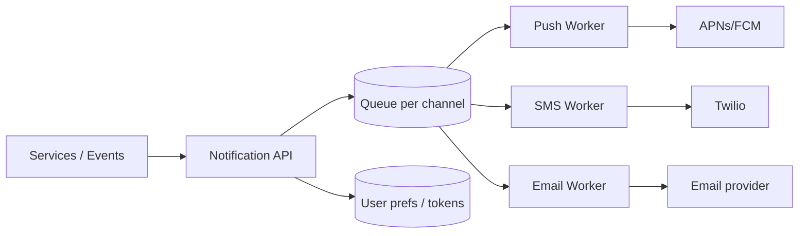

# Case Study: Notification System

> Design a service that sends notifications to users across multiple channels — push
> (mobile), SMS, and email — reliably and at scale.

## 1. Requirements
**Functional**
- Send notifications via push (APNs/FCM), SMS, and email.
- Support different triggers (events) and templates.
- Respect user preferences and opt-outs; deduplicate; rate-limit per user.

**Non-functional**
- High throughput, reliable (at-least-once) delivery, retries on failure.
- Near-real-time but async; not on a user-facing hot path.

## 2. Estimations
- 100M notifications/day → ~1,160/sec average, with large spikes (e.g. a marketing
  blast or breaking-news push to millions at once).

## 3. High-level design

## 4. Data model & API
- `device_tokens`: `user_id, platform, token`
- `preferences`: `user_id, channel, enabled, quiet_hours`
- `templates`: `template_id, channel, body`
- `notification_log`: `id, user_id, channel, status, sent_at` (for dedupe + audit)

**API** — `POST /notifications {user_id, template_id, data, channels}`.

## 5. Deep dives
**Async pipeline with queues** — the API just validates and enqueues; per-channel
**workers** pull from queues and call external providers. Queues absorb spikes and
let each channel scale independently.

**Reliability & retries** — provider calls fail; retry with **exponential backoff**,
and route permanent failures to a **dead-letter queue**. Use **idempotency keys** so a
retry doesn't double-send (at-least-once + dedup ≈ effectively-once).

**Third-party providers** — you don't run your own carrier/APNs; you integrate
**FCM/APNs** (push), **Twilio** (SMS), **SES/SendGrid** (email). Abstract them behind a
channel interface; handle per-provider rate limits.

**User preferences & throttling** — check opt-outs, quiet hours, and per-user rate
limits before sending; collapse/aggregate noisy notifications.

**Fan-out spikes** — a "breaking news to 50M users" push is enqueued and drained by a
worker pool; prioritize transactional (OTP) over bulk (marketing) with separate
queues/priorities.

## 6. Trade-offs & bottlenecks
- At-least-once + idempotency vs exactly-once (hard) — choose at-least-once with
  dedupe.
- External providers are the bottleneck/SPOF → multi-provider failover, respect rate
  limits.
- Separate priority lanes so marketing blasts don't delay OTPs.

## 7. References
- [FCM](https://firebase.google.com/docs/cloud-messaging) ·
  [APNs](https://developer.apple.com/documentation/usernotifications)
- [System Design Primer](https://github.com/donnemartin/system-design-primer)
