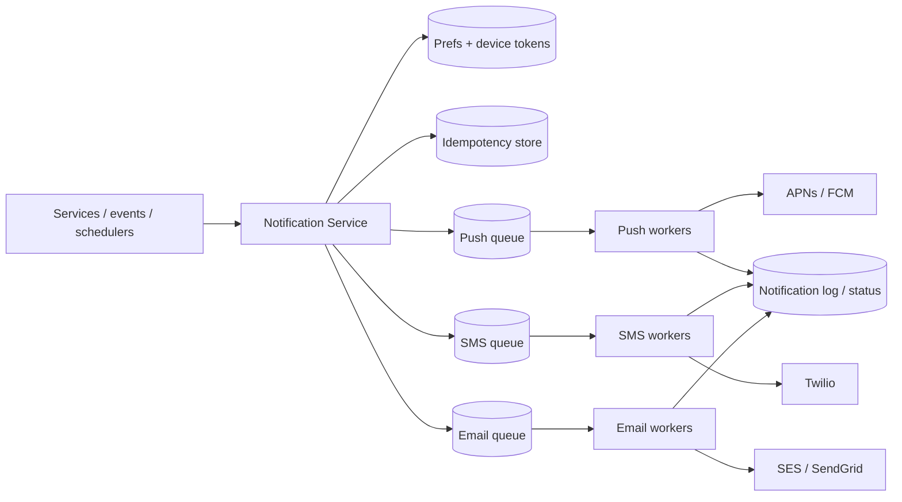

# Case Study: Notification System

> Design a service that sends notifications to users across multiple channels — push
> (mobile), SMS, and email — reliably and at scale.

## 1. Requirements

**Clarifying questions**
- Which channels (push/SMS/email/in-app)? Transactional, promotional, or both?
- Who triggers them (services, schedulers, user actions)?
- Templating, localization, scheduling, user preferences/opt-outs?
- Delivery guarantee and ordering?

**Functional requirements**
1. Send via **push (APNs/FCM), SMS, email**, in-app.
2. **Event-triggered + templated**, with localization.
3. Respect **user preferences/opt-outs** and quiet hours.
4. **Deduplicate** and **rate-limit per user**.
5. Support **priorities** and **scheduling**.

**Non-functional requirements** (with concrete targets)
| Requirement | Target | Why |
| --- | --- | --- |
| Throughput | **handle 10M+ in a burst** | broadcasts/breaking news |
| Delivery guarantee | **at-least-once + dedup** | don't lose; don't spam |
| Latency | transactional **< seconds**; bulk best-effort | OTP vs marketing |
| Availability | **99.9%+** | OTPs gate logins |
| Auditability | full per-message status log | compliance + debugging |

**Scale assumptions** — 100M notifications/day baseline; single broadcasts of tens of
millions within minutes; provider rate limits cap per-channel throughput.

**Out of scope** — building carriers/SMTP (we integrate providers), the campaign UI.

**🎯 The dominant requirement:** **reliable, deduplicated delivery under spiky load,
asynchronously.** Everything is built around queues + idempotency + priority lanes so a
50M-user blast never delays an OTP and nothing is sent twice or lost.

## 2. Capacity estimation
- **100M/day** ≈ **1,160/s** average; broadcasts inject **tens of millions** in minutes →
  must buffer and drain at provider-safe rates.
- Per-channel provider limits (APNs/FCM/Twilio/SES) bound worker throughput.

## 3. High-level architecture

## 4. Data model & API
- `device_tokens`: `user_id, platform, token, updated_at`
- `preferences`: `user_id, channel, category, enabled, quiet_hours, locale`
- `templates`: `template_id, channel, locale, subject, body`
- `notification_log`: `id, user_id, channel, status, provider_msg_id, sent_at`

**API** — `POST /v1/notifications { user_id|segment, template_id, data, channels, priority,
dedup_key } -> 202 { request_id }`.

---

## 5. Deep analysis — biggest problems & solutions

Each problem follows the same walkthrough: **scenario → why it's hard → naive approach &
why it fails → solution → how it works → trade-offs → rule of thumb.**

### 🔴 Problem 1 — Absorbing huge spikes without melting providers

**Scenario.** A breaking-news event triggers a push to **50M users**. That's tens of millions
of sends in a few minutes, but APNs/FCM accept only so many per second and your senders are
finite.

**Why it's hard.** The arrival rate (one API call → 50M sends) vastly exceeds the sustainable
delivery rate, and external providers will throttle or reject if you blast them.

**Naive approach & why it fails.** *The triggering service loops over 50M users and calls the
provider synchronously* → it blocks for ages, provider rate limits kick in, failures
cascade back into the caller, and a retry storm makes it worse.

**Solution — an async, queue-buffered pipeline with worker pools.** The API only validates,
renders, and **enqueues**, returning `202` immediately. Per-channel **workers** drain the
queue at a **provider-safe rate**.

**How it works (step by step).**
1. Caller hits `POST /notifications` with a user or **segment**; API returns `202`.
2. A fan-out job expands a segment into per-user messages onto the channel queue.
3. Channel workers pull at a controlled rate (respecting provider limits) and send.
4. The queue absorbs the spike; the 50M trickle out over minutes without overload.

**Trade-offs.** Delivery is now **asynchronous** (eventual) — fine for notifications. The
queue is the shock absorber; you size worker pools to provider limits.

**💡 Rule of thumb:** never fan out a mass send synchronously — enqueue and drain at the
downstream's safe rate.

### 🔴 Problem 2 — Reliable delivery despite provider failures

**Scenario.** During a send, Twilio returns intermittent `503`s, some device tokens are
stale (the app was uninstalled), and SES briefly times out.

**Why it's hard.** External providers fail transiently (retryable) and permanently (invalid
token) and you must neither drop messages nor hammer a struggling provider.

**Naive approach & why it fails.** *Send once; on error, drop it* → lost notifications. *Retry
immediately and forever* → you amplify load on an already-failing provider and spin on
permanently-bad tokens.

**Solution — retries with exponential backoff + jitter, a dead-letter queue, and token
hygiene.**

**How it works.**
1. On a **transient** error, requeue with **exponential backoff + jitter** (avoid synchronized
   retry storms).
2. After N attempts, move the message to a **dead-letter queue** for inspection/replay.
3. On a **permanent** error (e.g. APNs `Unregistered`), **delete the device token** so you
   stop sending to it.
4. Support **multi-provider failover** (secondary SMS/email vendor) for provider outages.

**Trade-offs.** Retries + DLQ add moving parts but make delivery robust; backoff trades a
little latency for stability.

**💡 Rule of thumb:** retry transient failures with backoff, DLQ the rest, and prune dead
endpoints so you don't retry the impossible.

### 🔴 Problem 3 — Preventing duplicate notifications

**Scenario.** A worker sends a push, then crashes before acking the queue. The message is
redelivered and sent **again** — the user gets the same alert twice (or ten times under a bad
retry loop).

**Why it's hard.** At-least-once queues + retries inherently allow re-processing; without a
guard, every redelivery is a duplicate send.

**Naive approach & why it fails.** *Assume the queue delivers exactly once* → it doesn't;
crashes and retries guarantee occasional duplicates, which spam users and erode trust.

**Solution — idempotency keys backed by a dedup store.** Each notification carries a stable
`dedup_key`; before sending, atomically check-and-set it.

**How it works.** Before calling the provider, `SET dedup_key NX EX <ttl>` in Redis. If the
key already exists, **skip** (already sent). If set succeeds, send. This makes
re-processing safe → **effectively-once** delivery on top of at-least-once transport.

**Trade-offs.** Needs a fast dedup store and careful key design (what defines "the same"
notification); TTL bounds memory. Worth it to avoid spamming users.

**💡 Rule of thumb:** on at-least-once infrastructure, make the side effect idempotent with a
dedup key — don't chase true exactly-once.

### 🔴 Problem 4 — Urgent vs bulk (priority inversion)

**Scenario.** A 50M-user marketing blast is draining the queue when a user requests a login
**OTP**. Behind the blast, the OTP waits minutes — the user can't log in.

**Why it's hard.** A single shared queue serves both, so low-value bulk traffic can starve
high-value transactional messages (priority inversion).

**Naive approach & why it fails.** *One queue, FIFO* → urgent messages sit behind millions of
promotional ones; *or* try to reorder a giant queue at runtime → complex and fragile.

**Solution — separate priority lanes (queues + worker pools).** Transactional and bulk use
**different queues** with dedicated/reserved capacity.

**How it works.** Route by `priority`: OTP/security → high-priority queue with reserved
workers drained first; marketing → bulk queue. Urgent messages never queue behind bulk; bulk
can be rate-limited independently.

**Trade-offs.** A bit more infra (multiple queues/pools) for a guarantee that urgent traffic
isn't starved.

**💡 Rule of thumb:** isolate latency-critical traffic in its own lane so bulk work can't
starve it.

### 🔴 Problem 5 — Respecting preferences, quiet hours & noise

**Scenario.** A user opted out of marketing, is asleep at 3am local time, and just got 8
likes in a minute. Sending 8 pushes — or any marketing push — is wrong and may break
regulations.

**Why it's hard.** Correct sending depends on per-user, per-category preferences, locale/time
zone, and de-noising — all checked before every send.

**Naive approach & why it fails.** *Send whatever the trigger asks* → opt-out violations,
3am buzzes, and notification fatigue that drives users to disable notifications entirely.

**Solution — a preference + aggregation gate before enqueueing.**

**How it works.** Before queuing a send, check: opt-outs, category prefs, **locale/quiet
hours**, and per-user rate limits; **collapse** noisy events ("3 new likes" instead of 3
pushes). Honor regional compliance (unsubscribe links for email, consent for SMS).

**Trade-offs.** Adds a check (and a short aggregation window/delay) per send, but protects UX
and compliance — and ultimately keeps notifications effective.

**💡 Rule of thumb:** the cheapest, best-received notification is the one you correctly decide
**not** to send — gate and aggregate before sending.

---

## 6. Trade-offs & bottlenecks (summary)
- At-least-once + idempotency (practical) vs exactly-once (hard).
- External providers are the real **bottleneck/SPOF** → failover, respect limits, prune
  tokens.
- Priority lanes prevent bulk from starving urgent.
- Exact delivery/read tracking adds cost; balance auditability vs volume.

## 7. References
- [FCM](https://firebase.google.com/docs/cloud-messaging) ·
  [APNs](https://developer.apple.com/documentation/usernotifications)
- [System Design Primer](https://github.com/donnemartin/system-design-primer)
- Uber/Slack notification-platform engineering blogs
