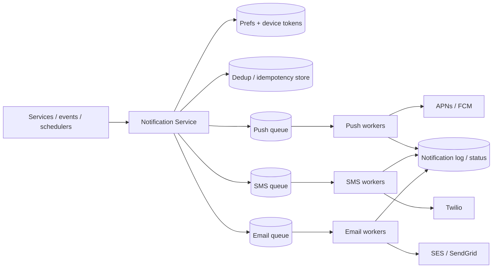

# Case Study: Notification System

> Design a service that sends notifications to users across multiple channels — push
> (mobile), SMS, and email — reliably and at scale.

## 1. Requirements

**Clarifying questions**
- Which channels (push/SMS/email/in-app)? Transactional, promotional, or both?
- Who triggers them (other services, scheduled jobs, user actions)?
- Need templating, localization, scheduling, user preferences/opt-outs?
- Delivery guarantee and ordering requirements?

**Functional**
- Send via **push (APNs/FCM), SMS, email** (and in-app).
- Event-triggered + templated; respect **user preferences/opt-outs** and quiet hours.
- **Deduplicate**, **rate-limit per user**, and support priorities.

**Non-functional**
- **High throughput** with large spikes (marketing blast / breaking news to millions).
- **Reliable at-least-once** delivery with retries; async (not on a user hot path).
- Auditable (who got what, when, status).

## 2. Capacity estimation
- **100M notifications/day** ≈ **1,160/s** average; a single broadcast can inject
  **tens of millions** in minutes → must buffer and drain.
- Per-channel provider limits (APNs/FCM/Twilio/SES) cap throughput → queue + worker
  pools sized to provider rate limits.

## 3. High-level architecture


## 4. Data model & API
- `device_tokens`: `user_id, platform, token, updated_at`
- `preferences`: `user_id, channel, category, enabled, quiet_hours, locale`
- `templates`: `template_id, channel, locale, subject, body`
- `notification_log`: `id, user_id, channel, template_id, status, provider_msg_id,
  sent_at` (dedup + audit)

**API**
```
POST /v1/notifications
  { user_id|segment, template_id, data, channels:[push,email], priority, dedup_key }
  202 Accepted -> { request_id }
```

## 5. Deep dives

**Async pipeline with per-channel queues** — the API only **validates, renders, and
enqueues**, returning immediately. Channel-specific **workers** pull from their queue
and call the external provider. Queues absorb spikes and let each channel scale and fail
independently.

**Reliability, retries & idempotency**
- Provider calls fail transiently → retry with **exponential backoff + jitter**; route
  permanent failures to a **dead-letter queue** for inspection.
- **At-least-once** delivery means duplicates are possible → use an **idempotency
  key/dedup store** (e.g. `dedup_key` in Redis with TTL) so the same logical
  notification isn't sent twice (≈ effectively-once).

**Third-party providers** — you don't operate carriers/APNs; integrate **FCM/APNs**
(push), **Twilio** (SMS), **SES/SendGrid** (email) behind a common `Channel` interface.
Handle per-provider rate limits, token invalidation (prune dead device tokens on
`Unregistered` errors), and provider **failover** (secondary SMS/email provider).

**Preferences, throttling & quiet hours** — before sending, check opt-outs, category
preferences, locale, quiet hours, and **per-user rate limits**; **collapse/aggregate**
noisy events ("3 new likes" instead of 3 pushes).

**Priorities & fan-out spikes** — separate **priority lanes/queues**: transactional
(OTP, password reset) must never be delayed behind a 50M-user marketing blast. A
broadcast is expanded (segment → user list) by a fan-out job and drained by a large
worker pool at provider-safe rates.

**Scheduling** — delayed/scheduled notifications go to a time-bucketed store or
delay-queue; a scheduler enqueues them when due.

## 6. Trade-offs & bottlenecks
- **At-least-once + idempotency** (practical) vs exactly-once (hard) → choose the former.
- External providers are the real **bottleneck/SPOF** → multi-provider failover, respect
  rate limits, prune bad tokens.
- Priority lanes prevent bulk traffic from starving urgent messages.
- Tracking exact delivery/read status adds cost; balance auditability vs volume.

## 7. References
- [FCM](https://firebase.google.com/docs/cloud-messaging) ·
  [APNs](https://developer.apple.com/documentation/usernotifications)
- [System Design Primer](https://github.com/donnemartin/system-design-primer)
- Uber/Slack notification platform engineering blogs
