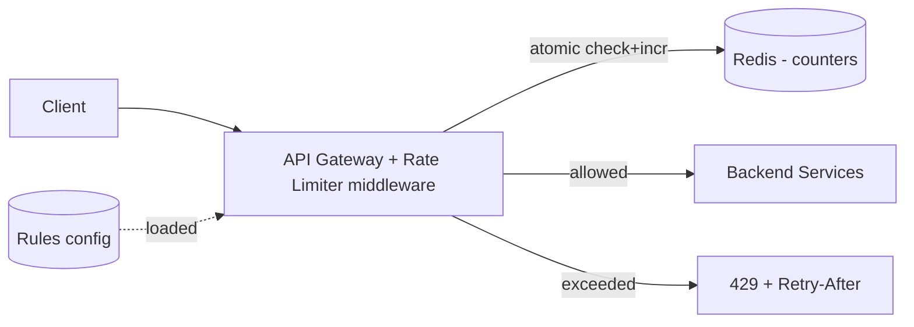
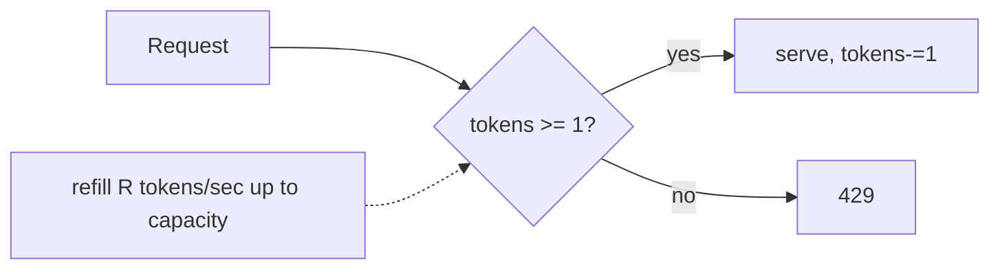

# Case Study: Distributed Rate Limiter

> Design a service that limits how many requests a client can make in a time window,
> shared correctly across many server instances.

## 1. Requirements

**Clarifying questions**
- Limit by what key — user ID, API key, IP, or endpoint? Multiple tiers?
- Where does it run — a library in each service, a sidecar, or centralized at the
  gateway?
- Hard or soft limit? What's the behavior on the limiter's own failure?
- Do we need to tell clients their remaining quota?

**Functional**
- Limit requests per client to **N per window** (configurable per rule/tier/endpoint).
- Return **`429 Too Many Requests`** with `Retry-After` when exceeded.
- Support multiple, layered rules (e.g. 10/s AND 1000/day).

**Non-functional**
- **Very low latency** (< ~1 ms) — it's on every request's hot path.
- **Highly available** and memory-efficient.
- **Accurate** across a distributed fleet, with a clear failure policy.

## 2. Capacity estimation
- 1M users, peak 100 req/s each at the edge → up to **100M req/s** checks in the
  extreme; realistically the limiter must add **< 1 ms** and tiny memory per key.
- Per-key state is a few bytes (counter + timestamp) → millions of keys fit in a few GB
  of Redis.

## 3. High-level architecture

Enforce at the **gateway/edge** so rejected traffic never reaches backends.

## 4. Algorithms (pick per need)

| Algorithm | Idea | Pros | Cons |
| --- | --- | --- | --- |
| **Fixed window** | count per calendar window | trivial, low memory | 2× burst at window edge |
| **Sliding window log** | store timestamp of each request | exact | memory-heavy (one entry/req) |
| **Sliding window counter** | weighted blend of current+prev window | smooth, cheap | slight approximation |
| **Token bucket** | tokens refill at rate R, each req takes 1 | allows bursts, popular | needs tokens+timestamp state |
| **Leaky bucket** | queue drains at constant rate | smooths output | queues add latency |

**Token bucket** is the most common general choice (burst-friendly); **sliding window
counter** when you want smooth enforcement without burst spikes.



## 5. Deep dives

**Distributed counters** — a shared **Redis** holds counters so the limit is global
across all gateway instances. The check-and-increment must be **atomic** to avoid races
(two concurrent requests both reading "4" and both passing a limit of 5). Use a **Lua
script** (runs atomically in Redis) implementing the chosen algorithm, e.g. token
bucket:
```
-- KEYS[1]=bucket  ARGV: now, rate, capacity, requested
-- read tokens+last_refill, refill = (now-last)*rate, cap at capacity,
-- if tokens>=requested: tokens-=requested, allow; else deny. Write back with TTL.
```

**Latency vs accuracy trade-off**
- **Centralized Redis** — accurate, but one network hop per request (~sub-ms in-DC).
- **Local token bucket + async sync** — each node enforces locally and periodically
  reconciles a shared count. Faster, but can **overshoot** the global limit by up to
  (nodes × local allowance). Good when approximate is acceptable.

**Failure policy — fail open vs fail closed**
- **Fail open** (allow on Redis outage) — protects user experience; risks overload.
- **Fail closed** (block) — protects backends; can cause an outage. Most user-facing
  APIs **fail open** with local fallback limits.

**Sync vs async, and where rules live** — rate-limit rules (per tier/route) live in a
config store, hot-reloaded into the gateway. Hierarchical limits (per-second +
per-day) are checked together.

**Response contract** — return `429` with `Retry-After: <seconds>` and headers
`X-RateLimit-Limit`, `X-RateLimit-Remaining`, `X-RateLimit-Reset` so well-behaved
clients back off.

**Hot-key / sharding** — a single very active key (one huge customer) can hotspot one
Redis shard → shard counters by key, or give big customers dedicated buckets.

## 6. Trade-offs & bottlenecks
- Redis is a potential **SPOF/bottleneck** → replicate (with failover) and shard
  counters by key; consider local fallback.
- **Strict global accuracy** costs a network hop; **local+sync** is faster but leaks.
- Token bucket = burst-tolerant; sliding window = smoother but more state.
- Clock skew across nodes can affect window math → rely on Redis server time in the Lua
  script.

## 7. References
- [Stripe — Scaling your API with rate limiters](https://stripe.com/blog/rate-limiters)
- [Cloudflare — counting things at scale](https://blog.cloudflare.com/counting-things-a-lot-of-different-things/)
- [Figma — rate limiting with Redis](https://www.figma.com/blog/an-alternative-approach-to-rate-limiting/)
