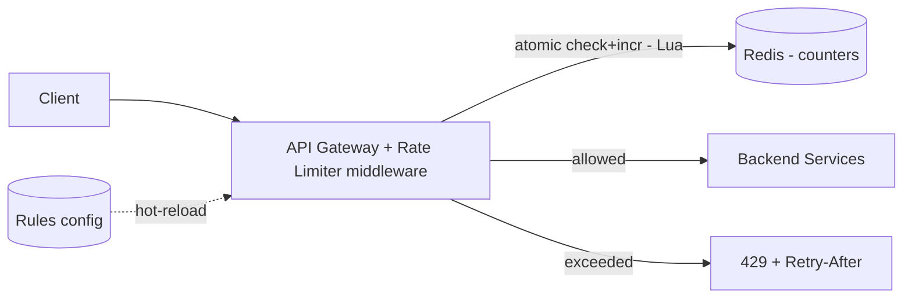

# Case Study: Distributed Rate Limiter

> Design a service that limits how many requests a client can make in a time window,
> shared correctly across many server instances.

## 1. Requirements

**Clarifying questions**
- Limit by what key — user ID, API key, IP, or endpoint? Multiple tiers/plans?
- Where does it run — a library in each service, a sidecar, or centralized at the
  gateway?
- Hard or soft limit? What happens if the limiter itself (Redis) is down?
- Do we expose remaining quota to clients?

**Functional requirements**
1. Limit requests per client to **N per window** (configurable per rule/tier/endpoint).
2. Return **`429 Too Many Requests`** with `Retry-After` when exceeded.
3. Support **layered rules** (e.g. 10/s AND 1,000/day simultaneously).
4. Surface quota state via headers (`X-RateLimit-*`).

**Non-functional requirements** (with concrete targets)
| Requirement | Target | Why |
| --- | --- | --- |
| Added latency | **< 1 ms p99** | runs on every request's hot path |
| Availability | **must not take down the API** | a dead limiter shouldn't block traffic |
| Accuracy | **close to exact** across the fleet | leaks defeat the purpose |
| Memory | a few bytes/key | millions of active keys |
| Failure mode | **defined** (fail-open vs closed) | must be a deliberate choice |

**Scale assumptions** — 1M users, up to ~100 req/s each at peak; millions of active
counter keys.

**Out of scope** — DDoS/L3-L4 volumetric defense (CDN/WAF concern), billing/quota
purchase flows.

**🎯 The dominant requirement:** **sub-millisecond latency + correctness under
concurrency.** The whole design revolves around an atomic, fast, shared counter that
stays accurate across many instances without adding noticeable latency.

## 2. Capacity estimation
- Up to ~**100M req/s** of checks in the extreme; each must add **< 1 ms** and a few
  bytes of state.
- Per-key state (counter + timestamp) is tiny → millions of keys fit in a few GB of Redis.

## 3. High-level architecture

## 4. Algorithms (pick per need)
| Algorithm | Idea | Pros | Cons |
| --- | --- | --- | --- |
| Fixed window | count per calendar window | trivial, low memory | 2× burst at edge |
| Sliding window log | store each request timestamp | exact | memory-heavy |
| Sliding window counter | weighted current+prev window | smooth, cheap | slight approximation |
| **Token bucket** | tokens refill at rate R | burst-friendly, popular | needs tokens+ts state |
| Leaky bucket | queue drains at constant rate | smooths output | adds latency |

---

## 5. Deep analysis — biggest problems & solutions

Each problem follows the same walkthrough: **scenario → why it's hard → naive approach &
why it fails → solution → how it works → trade-offs → rule of thumb.**

### 🔴 Problem 1 — Race conditions in distributed counting

**Scenario.** A user with a limit of 5/sec sends 5 requests at the same instant. They land
on 5 different gateway nodes. Each node reads the shared counter as "4", each sees "< 5",
each allows — the user got 9 through a limit of 5.

**Why it's hard.** The check ("is count < limit?") and the update ("increment") must be a
**single atomic operation** on shared state, but they happen across the network from many
nodes at once.

**Naive approach & why it fails.** *Read the counter, compare in app code, then write it
back* → this read-modify-write is **not atomic**; concurrent requests interleave between
the read and the write (a classic lost-update race), so the limit leaks under exactly the
load you care about.

**Solution — do the check-and-increment atomically inside Redis with a Lua script.** Redis
is single-threaded and runs a Lua script as one indivisible unit, so the decision and the
update can't interleave.

**How it works (step by step).**
1. The gateway calls `EVAL <script> key now ...`.
2. Inside Redis, the script reads the counter/bucket state.
3. It applies the algorithm (e.g. token bucket: refill, check `tokens >= 1`).
4. If allowed, it decrements/increments and writes back **with a TTL**; returns
   allow/deny — all atomically, in one round trip.

**Trade-offs / alternatives.** `INCR`+`EXPIRE` is atomic enough for fixed-window;
`MULTI/WATCH` transactions work but are clumsier; per-node local counters avoid Redis
entirely but lose global accuracy (Problem 2).

**💡 Rule of thumb:** never do check-then-act on shared counters in app code — push the
whole decision into one atomic server-side operation.

### 🔴 Problem 2 — Latency vs accuracy across the fleet

**Scenario.** Your gateways run in many instances. A perfectly accurate global limit needs
every request to consult one shared counter — but the limiter must add < 1 ms, and that
network hop competes with the budget.

**Why it's hard.** "Exactly accurate global count" and "add no latency" are in direct
tension: accuracy wants a single shared source of truth; latency wants to avoid the hop.

**Naive approach & why it fails.** *Each node keeps its own in-memory counter for speed*
→ with N nodes, a user can do up to N × limit because no node sees the others' counts; the
global limit is silently multiplied.

**Solution — choose the point on the curve per use case.**
- **Centralized Redis (accurate):** one sub-ms in-DC hop, correct global count. Default.
- **Local bucket + async reconcile (fast):** nodes enforce locally and periodically sync a
  shared tally. Near-zero latency, but can **overshoot** by up to `nodes ×
  local_allowance`.

**How it works.** For centralized, co-locate Redis in the same AZ as the gateways and
pipeline calls (sub-ms). For local+sync, give each node a slice of the global budget and
rebalance the slices via gossip/periodic flush so the *total* stays near the limit.

**Trade-offs.** Centralized = accurate but a hard dependency on Redis latency/availability;
local+sync = fast and resilient but approximate. Pick based on how strict the limit must
be.

**💡 Rule of thumb:** strict limits → centralized atomic counter; very high volume with
loose limits → local counters that periodically reconcile.

### 🔴 Problem 3 — What happens when the limiter (Redis) fails?

**Scenario.** Redis (holding all counters) has an outage. Every incoming request now can't
get a rate-limit decision.

**Why it's hard.** Both default behaviors are bad: block everything (the limiter outage
becomes a full **API outage**) or allow everything (you're **unprotected** during the
exact moment load may be spiking).

**Naive approach & why it fails.** *Treat a Redis error as "deny"* → a single cache blip
takes down your whole API for all users. *Treat it as "allow" with no guard* → a traffic
spike during the outage can overwhelm backends.

**Solution — a deliberate failure policy: fail-open with a local fallback limit.** On Redis
error, allow the request (favor availability) **but** apply a conservative in-memory
per-node limit so you're not fully exposed. Critical internal systems may instead fail
closed.

**How it works.** Wrap the Redis call with a short timeout + circuit breaker; on
trip, switch to a local token bucket with a tighter limit; restore centralized counting
when Redis recovers. Run Redis with replication/automatic failover so this path is rare.

**Trade-offs.** Fail-open risks brief over-admission; fail-closed risks an outage. The
local fallback splits the difference. The key is that it's **chosen and documented**, not
accidental.

**💡 Rule of thumb:** decide fail-open vs fail-closed on purpose, and keep a cheap local
fallback for the dependency-down case.

### 🔴 Problem 4 — Bursts vs smoothness (algorithm choice)

**Scenario.** With a "5 per minute" **fixed window**, a client sends 5 requests at 11:00:59
and 5 more at 11:01:00 — that's **10 requests in 2 seconds**, double the intended rate,
because the window reset between them.

**Why it's hard.** Simple counters reset on window boundaries, allowing a 2× burst right at
the edge; but some endpoints genuinely need to allow short bursts while others must be
strictly smooth.

**Naive approach & why it fails.** *Just use a fixed-window counter everywhere* → cheap and
simple, but the boundary-burst lets clients defeat the intended rate and can spike your
backend.

**Solution — pick the algorithm to match the goal.**
- **Token bucket** — *allows* controlled bursts up to bucket size, refilling at rate R.
  Good for user-facing APIs that should tolerate brief spikes.
- **Sliding-window counter** — *eliminates* the boundary spike using a weighted blend of
  the current and previous window. Good when traffic must be smooth.

**How it works.** Token bucket stores `tokens` + `last_refill`; each request refills based
on elapsed time, then spends a token. Sliding-window counter weights the previous window's
count by the fraction of it still in view and adds the current window's count.

**Trade-offs.** Token bucket tolerates bursts (feature or bug, depending); sliding window
is smoother but slightly more state/compute. Fixed window is simplest but has the edge
spike.

**💡 Rule of thumb:** token bucket when bursts are OK; sliding window when they're not;
avoid plain fixed window for anything you care about precisely.

### 🔴 Problem 5 — Hot keys / one huge customer

**Scenario.** One enterprise customer (or one IP behind a NAT for thousands of users)
generates a huge share of traffic. All their counter operations hit the **single Redis
shard** that owns their key.

**Why it's hard.** Rate-limit state is keyed per client, so a single very active client
concentrates load on one shard — a hotspot that sharding *by key* doesn't relieve for that
one key.

**Naive approach & why it fails.** *Hash all keys across the Redis cluster and assume even
load* → spreads different keys well, but the one mega-customer's key still maps to exactly
one shard and overloads it.

**Solution — dedicated buckets for big keys + upstream defenses.** Give very large
customers their **own bucket/shard** (or split their limit across sub-keys), and push
abusive single-IP traffic up to the WAF/CDN layer.

**How it works.** Detect high-cardinality offenders from metrics; route them to a separate
counter namespace/shard so their volume doesn't affect others. For a hot IP, add an edge
rule (Cloudflare/WAF) so it's throttled before reaching your gateway.

**Trade-offs.** Dedicated handling adds a bit of routing complexity but isolates blast
radius; combining edge + app-layer limiting covers both volumetric and per-key abuse.

**💡 Rule of thumb:** sharding spreads *many* keys; a single hot key needs its own
bucket/shard or an upstream throttle.

---

## 6. Trade-offs & bottlenecks (summary)
- Redis is a potential **SPOF/bottleneck** → replicate + shard + local fallback.
- **Global accuracy** costs a hop; **local+sync** is faster but leaks.
- Token bucket (bursty) vs sliding window (smooth).
- Fail-open (availability) vs fail-closed (protection) — choose deliberately.

## 7. References
- [Stripe — Scaling your API with rate limiters](https://stripe.com/blog/rate-limiters)
- [Cloudflare — counting things at scale](https://blog.cloudflare.com/counting-things-a-lot-of-different-things/)
- [Figma — rate limiting with Redis](https://www.figma.com/blog/an-alternative-approach-to-rate-limiting/)
