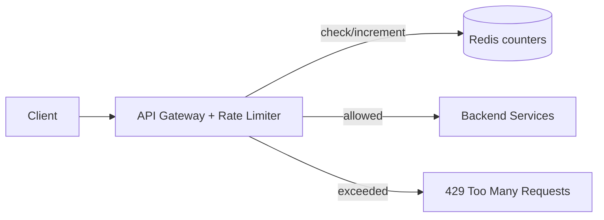

# Case Study: Distributed Rate Limiter

> Design a service that limits how many requests a client can make in a time window,
> shared correctly across many server instances.

## 1. Requirements
**Functional**
- Limit requests per client (by API key / user / IP) to N per window.
- Return `429 Too Many Requests` when exceeded, with `Retry-After`.
- Support different rules/tiers per client or endpoint.

**Non-functional**
- Low latency (it's on every request's hot path), highly available.
- Accurate enough across a distributed fleet; fail open vs fail closed decision.

## 2. Estimations
- 1M users, 100 req/s peak each at the edge → must add **< 1 ms** overhead.
- Counters stored in memory (Redis) — tiny per key (a few bytes).

## 3. High-level design

Enforce at the **gateway/edge** so bad traffic is dropped before reaching services.

## 4. Algorithm choice
- **Token bucket** (most common) — `tokens`, `last_refill` per key in Redis; allows
  bursts. Refill lazily on each request.
- **Sliding window counter** — smooths the fixed-window boundary spike with a weighted
  blend of current + previous window.
See [rate limiting concepts](../1-knowledge/building-blocks/rate-limiting.md).

## 5. Deep dives
**Distributed counters** — a single Redis holds the shared counter so the limit is
global across all gateway instances. Use atomic ops (`INCR`, or a **Lua script**) to
avoid race conditions when read-modify-write happens concurrently.

**Latency vs accuracy** — a strictly global counter adds a network hop per request.
Options:
- **Centralized Redis** — accurate, one hop (~sub-ms in-DC).
- **Local + sync** — each node keeps a local counter and periodically reconciles;
  faster but can overshoot the limit slightly.

**Race conditions** — concurrent increments can exceed the limit; fix with atomic
Lua scripts or Redis transactions.

**Failure mode** — if Redis is down, do you **fail open** (allow all, prioritize
availability) or **fail closed** (block, prioritize protection)? Usually fail open for
user-facing traffic.

**Response headers** — `X-RateLimit-Limit`, `X-RateLimit-Remaining`,
`X-RateLimit-Reset`, `Retry-After`.

## 6. Trade-offs & bottlenecks
- Redis is a potential SPOF/bottleneck → replicate + shard counters by key.
- Token bucket = burst-friendly; sliding window = smoother but more state.
- Tighter accuracy costs latency; pick per use case.

## 7. References
- [Stripe — Scaling your API with rate limiters](https://stripe.com/blog/rate-limiters)
- [Cloudflare rate limiting](https://blog.cloudflare.com/counting-things-a-lot-of-different-things/)
