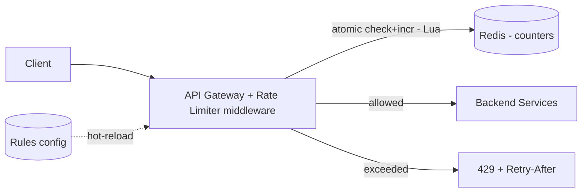

# Case Study: Distributed Rate Limiter

> Design a service that limits how many requests a client can make in a time window,
> shared correctly across many server instances.

## 1. Requirements

**Clarifying questions**
- Limit by what key — user ID, API key, IP, or endpoint? Multiple tiers/plans?
- Where does it run — a library in each service, a sidecar, or centralized at the
  gateway?
- Hard or soft limit? What happens if the limiter itself (Redis) is down?
- Do we expose remaining quota to clients?

**Functional requirements**
1. Limit requests per client to **N per window** (configurable per rule/tier/endpoint).
2. Return **`429 Too Many Requests`** with `Retry-After` when exceeded.
3. Support **layered rules** (e.g. 10/s AND 1,000/day simultaneously).
4. Surface quota state via headers (`X-RateLimit-*`).

**Non-functional requirements** (with concrete targets)
| Requirement | Target | Why |
| --- | --- | --- |
| Added latency | **< 1 ms p99** | runs on every request's hot path |
| Availability | **must not take down the API** | a dead limiter shouldn't block all traffic |
| Accuracy | **close to exact** across the fleet | leaks defeat the purpose |
| Memory | a few bytes/key | millions of active keys |
| Failure mode | **defined** (fail-open vs closed) | must be a deliberate choice |

**Scale assumptions** — 1M users, up to ~100 req/s each at peak; millions of active
counter keys.

**Out of scope** — DDoS/L3-L4 volumetric defense (that's a CDN/WAF/scrubbing concern),
billing/quota purchase flows.

**🎯 The dominant requirement:** **sub-millisecond latency + correctness under
concurrency.** The whole design revolves around an atomic, fast, shared counter that
stays accurate across many instances without adding noticeable latency.

## 2. Capacity estimation
- Up to ~**100M req/s** of checks in the extreme; each must add **< 1 ms** and a few
  bytes of state.
- Per-key state (counter + timestamp) is tiny → millions of keys fit in a few GB of
  Redis.

## 3. High-level architecture

Enforce at the **gateway/edge** so rejected traffic never reaches backends.

## 4. Algorithms (pick per need)
| Algorithm | Idea | Pros | Cons |
| --- | --- | --- | --- |
| Fixed window | count per calendar window | trivial, low memory | 2× burst at edge |
| Sliding window log | store each request timestamp | exact | memory-heavy |
| Sliding window counter | weighted current+prev window | smooth, cheap | slight approximation |
| **Token bucket** | tokens refill at rate R | burst-friendly, popular | needs tokens+ts state |
| Leaky bucket | queue drains at constant rate | smooths output | adds latency |

---

## 5. Deep analysis — biggest problems & solutions

### 🔴 Problem 1 — Race conditions in distributed counting
**Why it's hard:** two requests for the same key arrive concurrently on different
gateway nodes, both read the counter as "4", both see "< 5", both pass — the limit is
silently exceeded. A naive read-modify-write across the network is not atomic.

**Solution — atomic check-and-increment in Redis via a Lua script.** Redis executes the
script atomically (single-threaded), so the read, the limit decision, and the write
happen as one indivisible operation.

**How it works:** the gateway calls `EVAL` with a Lua script implementing the chosen
algorithm (e.g. token bucket: read `tokens`+`last_refill`, compute refill, if
`tokens>=1` decrement and allow, else deny, then write back with a TTL). One round trip,
no races.

**Alternatives:** `INCR` + `EXPIRE` works for fixed-window; Redis transactions
(`MULTI/WATCH`) are clumsier than a Lua script. Per-node local counters avoid Redis but
lose global accuracy (see Problem 2).

### 🔴 Problem 2 — Latency vs accuracy across the fleet
**Why it's hard:** a perfectly **global** counter requires a network hop to a shared
store on every request; but the limiter must add < 1 ms. There's tension between
"exactly accurate" and "don't add latency."

**Solution — choose per use case:**
- **Centralized Redis (accurate):** one sub-ms in-DC hop; correct global count. Default
  for most APIs.
- **Local bucket + async reconcile (fast):** each node enforces locally and periodically
  syncs a shared tally. Near-zero latency, but can **overshoot** by up to
  `nodes × local_allowance`. Use when approximate is acceptable (e.g. very high-volume,
  loose limits).

**How it works:** for centralized, co-locate Redis in the same AZ/DC as the gateways and
pipeline calls. For local+sync, allocate each node a slice of the global budget and
rebalance via gossip/periodic flush.

### 🔴 Problem 3 — What happens when the limiter (Redis) fails?
**Why it's hard:** if every request depends on Redis and Redis is down, do you block all
traffic (outage) or allow all traffic (no protection)?

**Solution — an explicit failure policy, usually fail-open with a local fallback.** On
Redis error, allow the request (prioritize availability) but apply a **conservative
local in-memory limit** so you're not completely unprotected. Critical internal systems
may instead **fail closed**. The point is it's a **deliberate, documented** choice, plus
Redis replication/failover to make outages rare.

### 🔴 Problem 4 — Bursts vs smoothness (algorithm choice)
**Why it's hard:** fixed-window counters allow a **2× burst** at the window boundary
(5 requests at 0:59 + 5 at 1:00 = 10 in 2 seconds). Some endpoints must smooth traffic.

**Solution:** use **token bucket** to *allow* controlled bursts (good for user-facing
APIs) or **sliding-window counter** to *eliminate* the boundary spike with a weighted
blend of the current and previous window. Pick per endpoint.

### 🔴 Problem 5 — Hot keys / one huge customer
**Why it's hard:** a single very active key (a giant customer or a hot IP) concentrates
all its traffic on one Redis shard → hotspot.

**Solution:** **shard counters by key** so load spreads across the Redis cluster, and
give very large customers **dedicated buckets/shards**. For an IP under attack, combine
with upstream WAF/CDN rules.

---

## 6. Trade-offs & bottlenecks (summary)
- Redis is a potential **SPOF/bottleneck** → replicate + shard + local fallback.
- **Global accuracy** costs a hop; **local+sync** is faster but leaks.
- Token bucket (bursty) vs sliding window (smooth).
- Fail-open (availability) vs fail-closed (protection) — choose deliberately.

## 7. References
- [Stripe — Scaling your API with rate limiters](https://stripe.com/blog/rate-limiters)
- [Cloudflare — counting things at scale](https://blog.cloudflare.com/counting-things-a-lot-of-different-things/)
- [Figma — rate limiting with Redis](https://www.figma.com/blog/an-alternative-approach-to-rate-limiting/)
