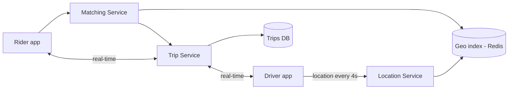

# Case Study: Ride-Sharing Service (Uber / Lyft)

> Design a system that matches riders with nearby drivers in real time, tracks
> locations, and manages trips and pricing.

## 1. Requirements
**Functional**
- Riders request a ride; match with the nearest available driver.
- Real-time location tracking of drivers and the trip.
- Trip lifecycle (request → match → pickup → drop-off), fare calculation.

**Non-functional**
- Low-latency matching, real-time updates, high availability.
- Geospatial scale: millions of drivers reporting location frequently.

## 2. Estimations
- Drivers send location updates every ~4 s → 1M active drivers ≈ 250K location
  writes/sec. Location is **write-heavy and ephemeral**.

## 3. High-level design

## 4. Data model & API
- `drivers`: `driver_id, status, current_geohash`
- `trips`: `trip_id, rider_id, driver_id, status, pickup, dropoff, fare`
- Live driver locations in an in-memory **geospatial index** (Redis GEO / quadtree).

**API** — `POST /rides` (request), `PATCH /drivers/location`, trip status via
WebSocket/push.

## 5. Deep dives
**Geospatial indexing — the heart of matching** — to find "drivers near me" fast, you
can't scan all drivers. Partition the map:
- **Geohash** — encode lat/long into a short string; nearby points share prefixes, so
  a prefix query finds neighbors. (Used with Redis GEO.)
- **Quadtree / S2 / H3** — hierarchical spatial cells; Uber created **H3** (hexagonal
  grid) for this.

Matching queries the cell(s) around the rider for available drivers, then ranks by
ETA.

**Location updates** — extremely high write volume of short-lived data → keep current
location in an **in-memory store (Redis)**, not a disk DB. Persist trip history
separately.

**Matching** — find nearby drivers → score by ETA/rating → offer to the best →
handle accept/decline/timeout → assign. Avoid double-assigning a driver (locking /
state machine).

**Real-time tracking** — driver and rider keep a push channel (WebSocket) for live
position and trip-state updates.

**Surge pricing** — compute supply/demand per geo-cell; multiply fares where demand
≫ supply.

## 6. Trade-offs & bottlenecks
- In-memory geo index = fast matching but must be replicated/sharded by region.
- High-frequency location writes → ephemeral store, not durable DB; trade durability
  for throughput on live location.
- Matching consistency: must not assign one driver to two riders → coordination.

## 7. References
- [Uber H3 geospatial index](https://www.uber.com/blog/h3/)
- [Uber engineering blog](https://www.uber.com/blog/engineering/)
