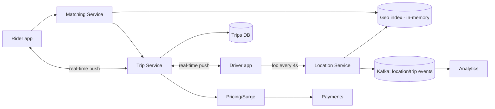
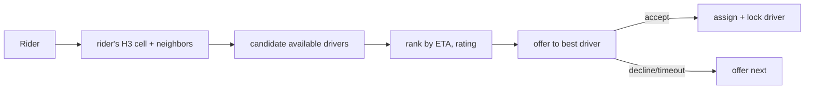

# Case Study: Ride-Sharing Service (Uber / Lyft)

> Design a system that matches riders with nearby drivers in real time, tracks
> locations, and manages trips and pricing.

## 1. Requirements

**Clarifying questions**
- City-scale or global? How fresh must driver locations be? ETA accuracy?
- Pooling/shared rides? Surge pricing? Scheduled rides?
- One match per request, or offer to multiple drivers?

**Functional**
- Rider requests a ride; system **matches the nearest suitable driver**.
- **Real-time location** of drivers and live trip tracking.
- Trip lifecycle: request → match → en-route → pickup → drop-off → payment.
- Fare calculation, ETAs, surge pricing.

**Non-functional**
- **Low-latency matching** (seconds), real-time updates, **high availability**.
- Handle **geospatial scale**: millions of drivers reporting location every few seconds.
- Strong correctness on assignment (never double-book a driver).

## 2. Capacity estimation
- **1M active drivers**, location every ~4 s → **250K location writes/s** — high-volume,
  **ephemeral** data (latest wins; history less critical).
- Ride requests far fewer than location updates, but matching must query a dense geo
  index fast.

## 3. High-level architecture


## 4. Data model & API
- `drivers`: `driver_id, status (available/on_trip/offline), vehicle, rating, cell_id`
- `trips`: `trip_id, rider_id, driver_id, status, pickup_geo, dropoff_geo, fare,
  timestamps`
- **Live driver location** in an **in-memory geospatial index** (Redis GEO / quadtree /
  H3 cells), not a disk DB.

**API**
```
PATCH /v1/drivers/location   { lat, lng }      # high-frequency
POST  /v1/rides              { pickup, dropoff } -> { trip_id, status }
WS    /v1/trips/{id}         # live driver position + status
```

## 5. Deep dives

**Geospatial indexing — the heart of matching.** "Find available drivers near me" can't
scan all drivers. Partition the map:
- **Geohash** — encode lat/lng into a string; nearby points share prefixes → prefix
  query finds neighbors (works with Redis GEO).
- **Quadtree** — recursively subdivide dense areas into cells.
- **H3 (Uber's hexagonal grid)** — uniform neighbor distances; great for "nearby",
  supply/demand, and surge zones. (See [Uber case study](./companies/uber.md).)

Matching queries the rider's cell + adjacent cells for available drivers, then ranks by
ETA/rating.



**High-volume location ingestion** — 250K writes/s of short-lived data → keep current
position in **in-memory stores** (sharded/replicated by region), stream raw updates to
**Kafka** for analytics and ETA models. Don't durably persist every ping.

**Matching correctness** — a driver must not be offered/assigned to two riders at once.
Use a **state machine** per driver with locking (e.g. compare-and-set on `status`), and
an offer→accept→assign protocol with timeouts and fallback to the next candidate.

**Real-time tracking** — driver and rider hold push channels (WebSocket) for live
position and status; the Trip Service coordinates state transitions.

**Pricing & surge** — base fare + distance/time; **surge** multiplies fares per geo-cell
when demand ≫ supply (computed from real-time supply/demand per cell). ETAs from a
routing/traffic service.

**Geo-partitioning & resilience** — partition services/data by city/region; failover
across data centers; regional isolation contains outages.

## 6. Trade-offs & bottlenecks
- In-memory geo index = fast matching but must be **sharded + replicated** by region;
  rebuild on failover.
- High-frequency location writes → **ephemeral store** (trade durability for
  throughput); persist trips separately.
- Matching consistency (no double-assignment) needs coordination/locks → adds latency;
  balance speed vs correctness.
- Surge computation is a hot, real-time aggregation per cell.

## 7. References
- [Uber H3 geospatial index](https://www.uber.com/blog/h3/)
- [Uber Engineering Blog](https://www.uber.com/blog/engineering/)
- [Lyft engineering](https://eng.lyft.com/)
