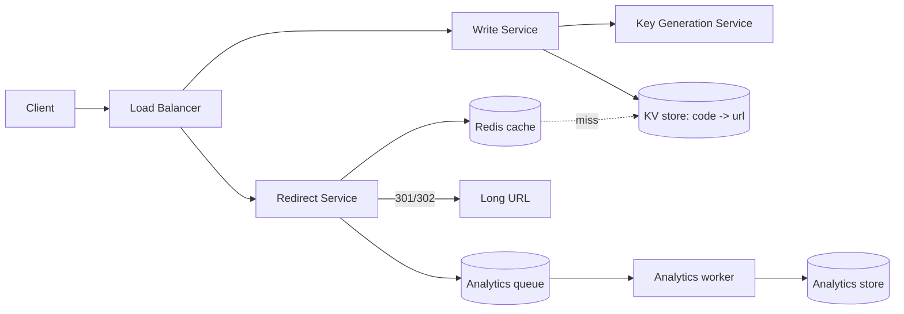

# Case Study: URL Shortener (TinyURL / bit.ly)

> Build a service that turns a long URL into a short one (e.g. `bit.ly/3xY9aZ`) and
> redirects users from the short link to the original.

## 1. Requirements

**Clarifying questions to ask first** (always scope the problem):
- Custom aliases allowed? Link expiration (default TTL)? Analytics on clicks? Edit/delete?
- One-to-one (each long URL → one code) or a new code per request?
- Who can create links — authenticated users only, or anonymous too?
- Expected scale (links/day, read:write ratio)? Retention period?

**Functional requirements**
1. Create a short URL from a long URL.
2. Optional **custom alias** and **expiration**.
3. **Redirect** a short URL to the original long URL.
4. (Optional) per-link **click analytics**.
5. (Optional) user can **delete/disable** a link.

**Non-functional requirements** (with concrete targets)
| Requirement | Target | Why |
| --- | --- | --- |
| Availability | **99.99%** | a broken redirect breaks every link ever shared |
| Redirect latency | **< 50 ms p99** | it's on the user's critical path |
| Read:write ratio | **~100:1** | shapes caching + read-replica strategy |
| Durability | no lost mappings | a lost row = a dead link forever |
| Consistency | redirect can be **eventually consistent** | a new link being readable a few ms later is fine |
| Security | codes **not enumerable** | prevent scraping/guessing all links |

**Scale assumptions** — 100M new links/day, 5-year retention, 100:1 reads.

**Out of scope** — user accounts/billing UI, abuse/malware scanning (mention as an
extension), full analytics product.

**🎯 The dominant requirement:** **availability + read latency** on the redirect path.
Every major decision (caching, replication, KGS) optimizes for "redirects always work,
instantly." Link *creation* can be slower and is far lower volume.

## 2. Capacity estimation

Assume **100M new URLs/day**.
- **Write QPS** = 100M / 86,400 s ≈ **1,160/s**; peak ≈ 2× ≈ **2,300/s**.
- **Read QPS** at 100:1 ≈ **116K/s**; peak ≈ **230K/s**.
- **Storage**: ~500 B/record × 100M/day = **50 GB/day** → ~**90 TB / 5 yr**.
- **Key space**: base62, **62⁷ ≈ 3.5 trillion** codes → 7 chars lasts ~96 years at
  100M/day. 6 chars (56B) runs out in ~2 years → use **7 chars**.

## 3. High-level architecture


## 4. Data model & API

**Table** `urls`: `short_code (PK)`, `long_url`, `owner_id`, `created_at`, `expires_at`.

**API**
```
POST /api/v1/urls   { long_url, custom_alias?, expiry? } -> 201 { short_url }
GET  /{short_code}  -> 302 Location: <long_url>   (404 if missing/expired)
```

---

## 5. Deep analysis — biggest problems & solutions

The interesting part of any design is the handful of genuinely hard problems. For each:
*what makes it hard → the technical solution → how it works → trade-offs/alternatives.*

### 🔴 Problem 1 — Generating short, unique, non-guessable codes at scale
**Why it's hard:** at 2,300 writes/s you must guarantee **uniqueness** (no two URLs get
the same code) without a slow "check-if-exists" on every write, and ideally codes
shouldn't be sequential (guessable → scraping/enumeration). A single global counter is a
**SPOF and a write bottleneck**.

**Solution — a Key Generation Service (KGS):** pre-generate random, unused 7-char base62
keys **offline** into an "available keys" table. Creating a link = pop a key.

**How it works:** each app server **checks out a block** of keys (e.g. 1,000) from the
KGS in one call, then hands them out locally with zero contention; the KGS marks blocks
used. Replicate the KGS DB. On server crash you waste at most a block of keys —
irrelevant against a 3.5-trillion keyspace.

**Alternatives & trade-offs:**
| Approach | Unique? | Guessable? | Cost |
| --- | --- | --- | --- |
| Hash(long_url) + truncate | collisions possible | no | re-hash on collision (extra read) |
| Global counter + base62 | yes | **yes, sequential** | counter is a bottleneck/SPOF |
| Snowflake-style ID + base62 | yes | sortable (semi-guessable) | no central counter |
| **KGS (pre-generated random)** | **yes** | **no** | tiny; needs a keys table |

→ KGS is the production choice for a public service; a counter only if predictability is
acceptable.

### 🔴 Problem 2 — Serving 230K redirects/sec with < 50 ms latency
**Why it's hard:** the redirect is on the user's critical path and read volume is ~100×
writes. Hitting the database on every click won't hold the latency or the load.

**Solution — aggressive multi-layer caching.** Link popularity is **heavily skewed** (a
few links get most clicks), so a cache absorbs the vast majority of reads.

**How it works:** redirect path checks **Redis (LRU)** first; on miss, read the KV store
and populate the cache. Hot links can also be cached at the **CDN edge**. The KV store
itself (DynamoDB/Cassandra) is partitioned by `hash(short_code)` and replicated for the
remaining misses. Cache hit ratios are very high in practice.

**Trade-off:** cache adds a (small) staleness window if a link is edited/disabled →
short TTL + explicit invalidation on change.

### 🔴 Problem 3 — Analytics vs redirect cost (301 vs 302)
**Why it's hard:** you want click analytics, but the redirect itself must be cheap.
- **301 Permanent** — browser caches it → future clicks skip your server (low load) but
  you **lose analytics** and can't change/disable the link.
- **302 Found** — every click hits you → **full analytics** + you can update/disable, at
  the cost of more traffic.

**Solution:** use **302**, and keep analytics **off the hot path** — emit a click event
to a **queue (Kafka)** and aggregate asynchronously (counts, geo, referrer). The redirect
returns immediately; analytics processing happens downstream.

### 🔴 Problem 4 — Hot keys (a viral link)
**Why it's hard:** one extremely popular link concentrates reads on a **single cache key
/ DB partition**, creating a hotspot that one node must absorb.

**Solution:** rely on **CDN edge caching** (the viral link is cached at hundreds of
PoPs, so origin barely sees it) and/or **replicate the hot key** across cache nodes. The
skew that hurts is also what makes edge caching extremely effective here.

### 🔴 Problem 5 — Storage growth & reclaiming expired links
**Why it's hard:** ~50 GB/day grows to ~90 TB over 5 years, and expired links waste space
and keys.

**Solution:** store `expires_at`; a **lazy check on read** returns 404 for expired links
(no scan needed), and a **background reclaimer** sweeps expired rows and returns their
codes to the KGS available-keys pool. Cold data can be tiered to cheaper storage.

---

## 6. Trade-offs & bottlenecks (summary)
- **KGS (random, scalable)** vs **counter (sequential, SPOF)** → KGS for public use.
- **302 (analytics, more load)** vs **301 (cheap, no analytics)** → 302 + async pipeline.
- Read-heavy → the redirect path must be the fastest thing; writes can be slower.
- Viral links → CDN edge caching + hot-key replication.

## 7. References
- [System Design Primer — Pastebin / URL shortener](https://github.com/donnemartin/system-design-primer)
- *Designing Data-Intensive Applications* — Kleppmann
- [Instagram's 64-bit ID scheme](https://instagram-engineering.com/sharding-ids-at-instagram-1cf5a71e5a5c)
