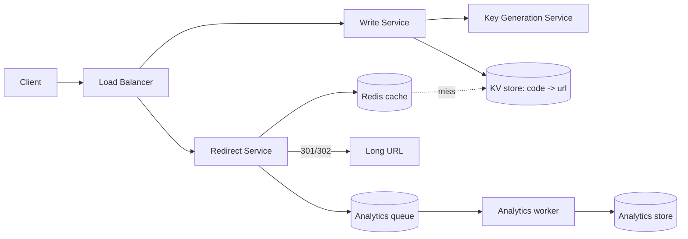

# Case Study: URL Shortener (TinyURL / bit.ly)

> Build a service that turns a long URL into a short one (e.g. `bit.ly/3xY9aZ`) and
> redirects users from the short link to the original.

## 1. Requirements

**Clarifying questions to ask first** (always scope the problem):
- Custom aliases allowed? Link expiration (default TTL)? Analytics on clicks? Edit/delete?
- One-to-one (each long URL → one code) or a new code per request?
- Who can create links — authenticated users only, or anonymous too?
- Expected scale (links/day, read:write ratio)? Retention period?

**Functional requirements**
1. Create a short URL from a long URL.
2. Optional **custom alias** and **expiration**.
3. **Redirect** a short URL to the original long URL.
4. (Optional) per-link **click analytics**.
5. (Optional) user can **delete/disable** a link.

**Non-functional requirements** (with concrete targets)
| Requirement | Target | Why |
| --- | --- | --- |
| Availability | **99.99%** | a broken redirect breaks every link ever shared |
| Redirect latency | **< 50 ms p99** | it's on the user's critical path |
| Read:write ratio | **~100:1** | shapes caching + read-replica strategy |
| Durability | no lost mappings | a lost row = a dead link forever |
| Consistency | redirect can be **eventually consistent** | a new link readable a few ms later is fine |
| Security | codes **not enumerable** | prevent scraping/guessing all links |

**Scale assumptions** — 100M new links/day, 5-year retention, 100:1 reads.

**Out of scope** — user accounts/billing UI, abuse/malware scanning (mention as an
extension), full analytics product.

**🎯 The dominant requirement:** **availability + read latency** on the redirect path.
Every major decision (caching, replication, KGS) optimizes for "redirects always work,
instantly." Link *creation* can be slower and is far lower volume.

## 2. Capacity estimation

Assume **100M new URLs/day**.
- **Write QPS** = 100M / 86,400 s ≈ **1,160/s**; peak ≈ 2× ≈ **2,300/s**.
- **Read QPS** at 100:1 ≈ **116K/s**; peak ≈ **230K/s**.
- **Storage**: ~500 B/record × 100M/day = **50 GB/day** → ~**90 TB / 5 yr**.
- **Key space**: base62, **62⁷ ≈ 3.5 trillion** codes → 7 chars lasts ~96 years at
  100M/day. 6 chars (56B) runs out in ~2 years → use **7 chars**.

## 3. High-level architecture


## 4. Data model & API

**Table** `urls`: `short_code (PK)`, `long_url`, `owner_id`, `created_at`, `expires_at`.

**API**
```
POST /api/v1/urls   { long_url, custom_alias?, expiry? } -> 201 { short_url }
GET  /{short_code}  -> 302 Location: <long_url>   (404 if missing/expired)
```

---

## 5. Deep analysis — biggest problems & solutions

Each problem follows the same walkthrough: **scenario → why it's hard → naive approach &
why it fails → solution → how it works → trade-offs → rule of thumb.**

### 🔴 Problem 1 — Generating short, unique, non-guessable codes at scale

**Scenario.** At peak you create ~2,300 links/sec across many app servers. Two different
long URLs must never receive the same 7-char code, and an attacker shouldn't be able to
start at `aaaaaaa` and walk every link in your system.

**Why it's hard.** Three requirements pull against each other: **uniqueness** (no
collisions, ever), **no coordination** (a global lock/counter would bottleneck writes and
be a SPOF), and **unpredictability** (codes shouldn't be sequential).

**Naive approach & why it fails.**
- *Random 7 chars per request* → must do a "does this code exist?" DB read every time to
  check collisions; under load collisions and read cost grow.
- *Global auto-increment counter* → guarantees uniqueness but is **sequential
  (guessable)** and a single counter is a **write bottleneck and SPOF**.

**Solution — a Key Generation Service (KGS).** A separate service pre-generates random,
unique, unused 7-char base62 keys **offline**, stored in an "available keys" table.
Creating a link just **takes** a ready-made key — no hashing, no collision check on the
hot path.

**How it works (step by step).**
1. Offline, the KGS generates random codes, dedupes them, and fills an `available_keys`
   table (and tracks `used_keys`).
2. Each app server **checks out a block** (e.g. 1,000 keys) in one call; the KGS marks
   that block used.
3. The server hands out keys from its in-memory block with **zero contention**; when the
   block runs low it fetches another.
4. The KGS DB is replicated. If a server crashes, it loses at most its block (~1,000
   keys) — negligible against 3.5 trillion.

**Trade-offs / alternatives.**
| Approach | Unique? | Guessable? | Hot-path cost | SPOF? |
| --- | --- | --- | --- | --- |
| Hash(long_url)+truncate | collisions possible | no | re-hash on collision | no |
| Global counter + base62 | yes | **yes** | cheap | **counter** |
| Snowflake ID + base62 | yes | sortable | cheap | no |
| **KGS (pre-generated)** | **yes** | **no** | **~zero** | KGS DB (replicate) |

**Rule of thumb:** pre-generate keys offline so the write path never has to *search* for
a free code.

### 🔴 Problem 2 — Serving 230K redirects/sec under 50 ms

**Scenario.** Every click on every short link ever shared hits your redirect endpoint —
~230K/sec at peak, each expecting a near-instant `302`.

**Why it's hard.** Reads are ~100× writes and latency-critical. A database round trip per
redirect (even ~5–10 ms) at 230K/s overwhelms the DB and blows the latency budget.

**Naive approach & why it fails.** *Look up `short_code` in the DB on every redirect* →
the database becomes the bottleneck, p99 latency spikes, and one hot link can saturate a
partition.

**Solution — aggressive multi-layer caching.** Link popularity is **heavily skewed** (a
few links get the vast majority of clicks), so a cache serves almost all reads.

**How it works (step by step).**
1. Redirect service checks **Redis (LRU)** for `short_code → long_url`.
2. **Hit** (the common case) → return `302` immediately (sub-millisecond).
3. **Miss** → read the KV store, return the redirect, and **populate the cache** for next
   time.
4. Very hot links are additionally cached at the **CDN edge**, so they never reach origin.
5. The backing store (DynamoDB/Cassandra) is partitioned by `hash(short_code)` and
   replicated for the few misses.

**Trade-offs.** Caching adds a small **staleness window** if a link is edited/disabled →
use a short TTL + explicit cache invalidation on change. Memory cost is modest because
only the hot set needs to be resident.

**Rule of thumb:** in a 100:1 read-heavy system, design the read path around the cache;
the DB is the fallback, not the front line.

### 🔴 Problem 3 — Click analytics without slowing the redirect (301 vs 302)

**Scenario.** Product wants per-link click counts, geography, and referrers — but you
can't let analytics work add latency to the redirect.

**Why it's hard.** The redirect status code itself changes who sees the click:
- **301 Permanent** → the browser **caches** it and skips your server next time → low
  load but you **lose analytics** and can't disable/change the link.
- **302 Found** → every click hits you → **full analytics** + control, at higher traffic.

**Naive approach & why it fails.** *Use 302 and write the analytics row synchronously
before redirecting* → the analytics DB write is now in the user's critical path, adding
latency and a failure dependency.

**Solution — use 302 and move analytics off the hot path.** Return the redirect first;
record the click **asynchronously**.

**How it works (step by step).**
1. Redirect service resolves the code and returns `302` immediately.
2. In parallel, it emits a lightweight **click event** to a queue (Kafka).
3. **Analytics workers** consume the stream and aggregate counts/geo/referrer into an
   analytics store.
4. Dashboards read the aggregated data — never the hot redirect path.

**Trade-offs.** 302 costs more traffic than 301 but is the standard choice because
analytics + link control are usually required. Analytics become **eventually** accurate
(a few seconds behind), which is fine.

**Rule of thumb:** never put best-effort work (analytics) in a latency-critical path —
fire an event and aggregate downstream.

### 🔴 Problem 4 — Hot keys (a single viral link)

**Scenario.** One link goes viral and alone receives tens of thousands of redirects per
second — far more than any single cache node or DB partition should handle.

**Why it's hard.** All that traffic targets **one** key, so it concentrates on the one
cache node / partition that owns it (a hotspot), regardless of how well you sharded.

**Naive approach & why it fails.** *Rely only on consistent hashing to spread keys* →
spreading helps *across* keys, but a single hot key still lands on one node.

**Solution — push the hot key to the edge and/or replicate it.**

**How it works.**
1. **CDN edge caching** — the viral link is cached at hundreds of PoPs, so each PoP serves
   its region and the origin barely sees the traffic. (The popularity skew that *causes*
   the hotspot is exactly what makes edge caching so effective.)
2. **Key replication** — for in-cluster hotspots, replicate the hot key across multiple
   cache nodes and spread reads among them.

**Trade-offs.** Edge caching adds a staleness window (TTL) for that link; replication adds
a bit of memory/coordination. Both are cheap relative to the relief they provide.

**Rule of thumb:** sharding solves *many keys*; hot-key problems need *edge caching or
per-key replication*.

### 🔴 Problem 5 — Storage growth & reclaiming expired links

**Scenario.** At ~50 GB/day the store grows to ~90 TB over 5 years, and expired links keep
occupying rows and consuming codes from the keyspace.

**Why it's hard.** You can't scan 90 TB to find expired links, and you don't want expiry
checks slowing the redirect path.

**Naive approach & why it fails.** *Run a periodic full-table scan to delete expired rows*
→ expensive, and it competes with live traffic.

**Solution — lazy expiry on read + a background reclaimer.**

**How it works.**
1. Store `expires_at` on each row.
2. On a redirect, **lazily check** `expires_at`; if past, return `404` (no scan needed).
3. A **background reclaimer** sweeps expired rows in batches and returns their codes to
   the KGS available-keys pool.
4. Cold/old data can be tiered to cheaper storage.

**Trade-offs.** Lazy expiry means an expired row physically lingers until the sweep — fine,
since the read already returns 404. Reclaiming keys keeps the keyspace efficient.

**Rule of thumb:** expire lazily on access; reclaim space in the background, never on the
hot path.

---

## 6. Trade-offs & bottlenecks (summary)
- **KGS (random, scalable)** vs **counter (sequential, SPOF)** → KGS for public use.
- **302 (analytics, more load)** vs **301 (cheap, no analytics)** → 302 + async pipeline.
- Read-heavy → the redirect path must be the fastest thing; writes can be slower.
- Viral links → CDN edge caching + hot-key replication.

## 7. References
- [System Design Primer — Pastebin / URL shortener](https://github.com/donnemartin/system-design-primer)
- *Designing Data-Intensive Applications* — Kleppmann
- [Instagram's 64-bit ID scheme](https://instagram-engineering.com/sharding-ids-at-instagram-1cf5a71e5a5c)
