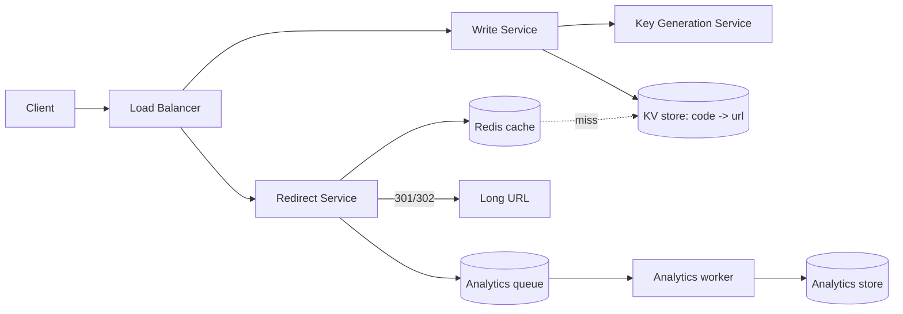

# Case Study: URL Shortener (TinyURL / bit.ly)

> Build a service that turns a long URL into a short one (e.g. `bit.ly/3xY9aZ`) and
> redirects users from the short link to the original.

## 1. Requirements

**Clarifying questions to ask first** (always scope the problem):
- Custom aliases allowed? Link expiration? Analytics on clicks? Edit/delete links?
- One-to-one (each long URL → one code) or always generate a new code per request?
- Who can create links — authenticated users only, or anonymous too?

**Functional**
- Create a short URL from a long URL; optional custom alias and expiry.
- Redirect a short URL to the original long URL.
- (Optional) per-link click analytics.

**Non-functional**
- **High availability** — a broken redirect breaks every link ever shared; this is the
  top priority.
- **Low latency** redirects (< ~50 ms) — they sit in the user's critical path.
- **Read-heavy**: redirects ≫ creations, roughly **100:1**.
- Short codes should not be easily enumerable (don't leak/allow scraping all links).

## 2. Capacity estimation

Assume **100M new URLs/day**.
- **Write QPS** = 100M / 86,400 s ≈ **1,160 writes/s**; peak ≈ 2× ≈ **2,300/s**.
- **Read QPS** at 100:1 ≈ **116K reads/s**; peak ≈ **230K/s**.
- **Storage**: each record ≈ `short_code(7) + long_url(~200) + metadata(~100)` ≈ 500 B.
  - 100M/day × 500 B = **50 GB/day** → ~**18 TB/year** → ~**90 TB / 5 yr**.
- **Cache memory**: cache the hot 20% of daily reads. 230K/s × 0.2 × 500 B working set
  is small — a few hundred GB of Redis across the fleet comfortably holds the hot set.
- **Key space**: base62 (a–z A–Z 0–9). **62⁷ ≈ 3.5 trillion** codes — 7 chars lasts
  ~96 years at 100M/day. 6 chars (56B) would run out in ~2 years, so **7 chars**.

## 3. High-level architecture


## 4. Data model & API

**Table** `urls` (key-value friendly):
| column | type | notes |
| --- | --- | --- |
| `short_code` | string (PK) | base62, 7 chars |
| `long_url` | string | original URL |
| `owner_id` | string | nullable |
| `created_at` | timestamp | |
| `expires_at` | timestamp | nullable |

**API**
```
POST /api/v1/urls
  body: { "long_url": "...", "custom_alias": "...?", "expiry": "...?" }
  201:  { "short_url": "https://sho.rt/3xY9aZ" }

GET /{short_code}
  302 Location: <long_url>     # redirect
  404 if not found / expired
```
Rate-limit creation per user/IP to prevent abuse.

## 5. Deep dives

**Generating the short code** — three strategies and their trade-offs:

1. **Hash + truncate** — `base62(md5(long_url))[:7]`. Simple and gives one-to-one
   mapping, but truncation causes **collisions**; resolve by appending a salt and
   re-hashing on conflict (extra read per create).
2. **Counter + base62 encode** — a global incrementing ID encoded to base62. **No
   collisions**, but IDs are **sequential and guessable** (you can walk all links). A
   single counter is also a bottleneck/SPOF.
3. **Key Generation Service (KGS)** — a separate service **pre-generates** random,
   unused 7-char keys into a "available keys" table offline. Create = pop one key.
   - ✅ No collisions, no per-request hashing, not guessable, very fast.
   - Concurrency: each app server checks out a **block** of keys (e.g. 1,000) to avoid
     contention; KGS marks them used. Replicate the KGS DB; a small risk of wasting
     keys on crash (acceptable — the keyspace is huge).

> **Distributed counter option:** if going with counters, use range allocation (each
> node gets ID ranges) or a **Snowflake-style** 64-bit ID (timestamp + machine + seq)
> to avoid a single global counter.

**Redirect: 301 vs 302**
- **301 Permanent** — browsers cache it, so subsequent clicks skip your server. Less
  load, but you **lose click analytics** and can't change the destination.
- **302 Found (temporary)** — every click hits your server → accurate analytics + you
  can update/disable links. Costs more traffic. **Most shorteners use 302.**

**Caching** — the redirect path is extremely cacheable. Put hot codes in Redis (LRU),
optionally also at the CDN edge. Cache hit ratio is very high because link popularity is
heavily skewed (a few links get most clicks).

**Database choice** — a **key-value / wide-column store** (DynamoDB, Cassandra) fits:
the only access pattern is "get by `short_code`". Partition by `hash(short_code)` for
even spread; replicate for availability.

**Analytics without slowing redirects** — don't write analytics synchronously. Emit a
click event to a **queue** (Kafka) and aggregate asynchronously (clicks, geo, referrer).

**Handling expiration & cleanup** — store `expires_at`; a lazy check on read returns 404
for expired links, and a background job reclaims expired codes back into the KGS pool.

## 6. Trade-offs & bottlenecks
- **Counter (sequential, guessable, SPOF)** vs **KGS (random, scalable)** → KGS for a
  public service; counter only if predictability is fine.
- **301 (cheap, no analytics)** vs **302 (analytics, more load)** → 302 is standard.
- Read-heavy → the redirect path must be the fastest thing in the system; lean on cache
  + replicas; the write path can be slower.
- Hot-key risk: a viral link concentrates reads on one cache key/partition → replicate
  that key / rely on CDN edge caching.

## 7. References
- [System Design Primer — Pastebin / URL shortener](https://github.com/donnemartin/system-design-primer)
- *Designing Data-Intensive Applications* — Kleppmann
- [Instagram's 64-bit ID scheme](https://instagram-engineering.com/sharding-ids-at-instagram-1cf5a71e5a5c)
