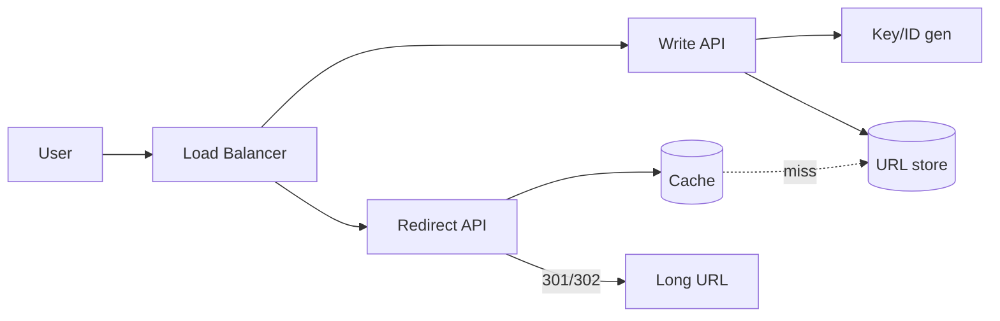

# Case Study: URL Shortener (TinyURL / bit.ly)

> Build a service that turns a long URL into a short one (e.g. `bit.ly/3xY9aZ`) and
> redirects users from the short link to the original.

## 1. Requirements
**Functional**
- Create a short URL from a long URL (optionally a custom alias + expiry).
- Redirect a short URL to the original.

**Non-functional**
- Highly available (redirects must always work), low-latency redirects.
- Read-heavy: redirects ≫ creations (~100:1).
- Short links not guessable/predictable (optional).

## 2. Estimations
- 100M new URLs/day → ~1,160 writes/sec; reads ~100× → ~116K reads/sec.
- 5 years retention → 100M × 365 × 5 ≈ **182B URLs**.
- ~500 bytes/record → ~91 TB over 5 years.
- Short-code length: with base62 (a–z, A–Z, 0–9), **7 chars = 62⁷ ≈ 3.5 trillion**
  combinations — plenty.

## 3. High-level design

## 4. Data model & API
**Table** `urls`: `short_code (PK)`, `long_url`, `created_at`, `expires_at`,
`owner_id`.

**API**
- `POST /urls {long_url, custom_alias?, expiry?}` → `{short_url}`
- `GET /{short_code}` → `301/302` redirect to `long_url`

## 5. Deep dives
**Generating the short code** — three approaches:
1. **Hash (MD5/SHA) + take first chars** — risk collisions; handle by re-hashing.
2. **Counter + base62 encode** — a global auto-increment ID encoded to base62. No
   collisions; but sequential = guessable. Use a distributed counter (e.g. a
   **Key Generation Service** pre-allocating ID ranges, or Redis `INCR`, or Twitter
   Snowflake-style IDs).
3. **Pre-generated keys** — a KGS produces random unused keys offline and hands them
   out; fast and collision-free.

**Redirect: 301 vs 302** — `301` (permanent) is cached by browsers → fewer hits to
your server but you lose click analytics; `302` (temporary) routes every click
through you (better analytics, more load). Most shorteners use 302.

**Caching** — redirects are extremely cacheable (LRU). Hot links live in Redis/CDN.

**Scale** — the store is a perfect fit for a **key-value DB** (key = short_code);
shard by short_code hash.

## 6. Trade-offs & bottlenecks
- Counter-based IDs are simple but sequential/guessable → use random KGS keys if
  unpredictability matters.
- 301 saves load but kills analytics; 302 is the common choice.
- Read-heavy → lean hard on caching + read replicas; the redirect path must be the
  fastest part.

## 7. References
- [System Design Primer — Pastebin/URL shortener](https://github.com/donnemartin/system-design-primer)
- *Designing Data-Intensive Applications*
