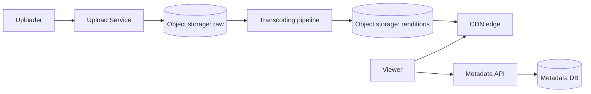
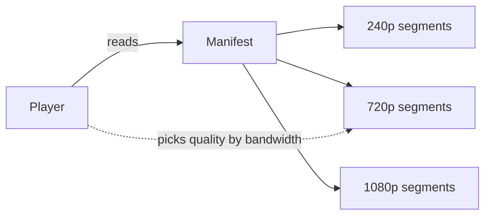

# Case Study: Video Streaming Service (YouTube / Netflix)

> Design a platform to upload, process, store, and stream video to millions of users at
> varying network speeds and devices.

## 1. Requirements
**Functional**
- Upload videos; process them; stream/playback with adaptive quality.
- Search, recommendations, view counts, comments (focus here: upload + playback).

**Non-functional**
- Massive read scale, low startup latency, smooth playback worldwide.
- Very storage- and bandwidth-heavy; highly available.

## 2. Estimations
- Read:write hugely skewed — far more views than uploads.
- Video dominates storage/bandwidth → **CDN is essential**; raw + multiple encoded
  renditions multiply storage.

## 3. High-level design

## 4. Data model & API
- `videos`: `video_id, uploader_id, title, status, duration, created_at`
- `renditions`: `video_id, resolution, codec, url`
- Metadata in a relational/NoSQL store; video bytes in **object storage**; served via
  **CDN**.

**API** — `POST /videos` (upload, often via presigned URL / chunked), `GET /videos/{id}`
(metadata + manifest URL).

## 5. Deep dives
**Upload & transcoding** — uploads go to object storage (chunked/resumable). A
**transcoding pipeline** (often a DAG of jobs on a worker fleet) converts the raw file
into many **renditions**: multiple resolutions (240p–4K) and codecs, split into small
**segments**.

**Adaptive Bitrate Streaming (ABR)** — using **HLS** or **MPEG-DASH**, the video is
chopped into a few-second segments at each quality, described by a **manifest**. The
player measures bandwidth and switches quality per segment → smooth playback on bad
networks without rebuffering.

**Delivery via CDN** — segments are cached at edge PoPs near users. Netflix goes
further with **Open Connect** appliances inside ISPs. This offloads ~all read traffic
from the origin.

**Metadata & views** — metadata served from a fast store; view counts updated
asynchronously (approximate, batched) to avoid write hotspots.

## 6. Trade-offs & bottlenecks
- Pre-encoding many renditions costs storage/compute but enables ABR + reach.
- CDN cost vs origin load — CDN is non-negotiable for video.
- View counts: exact (expensive) vs eventually-consistent/approximate (scalable).

## 7. References
- [Netflix Open Connect](https://openconnect.netflix.com/)
- [HLS](https://developer.apple.com/streaming/) · [MPEG-DASH](https://dashif.org/)
