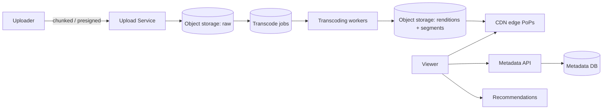
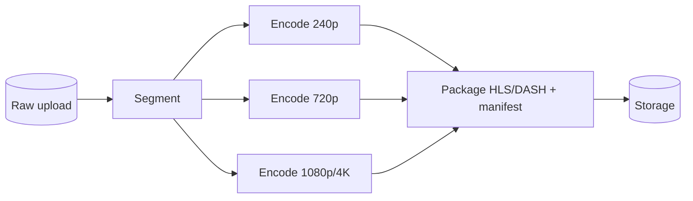

# Case Study: Video Streaming Service (YouTube / Netflix)

> Design a platform to upload, process, store, and stream video to millions of users at
> varying network speeds and devices.

## 1. Requirements

**Clarifying questions**
- User-generated uploads (YouTube) or curated catalog (Netflix)? Live or VOD?
- Devices/resolutions to support? Global audience? DRM needed?
- Features in scope — just upload + playback, or also search/recs/comments?

**Functional**
- **Upload** videos; **process/transcode** them; **stream** with adaptive quality.
- Playback across devices and networks with minimal buffering; resume, seek.

**Non-functional**
- **Massive read scale**, **low startup latency** (< ~1–2 s to first frame), smooth
  playback worldwide.
- Very **storage- and bandwidth-heavy**; highly available and durable.

## 2. Capacity estimation
- Reads ≫ writes by orders of magnitude (one upload → millions of views).
- One source video is encoded into **many renditions** (e.g. 240p→4K × codecs), each
  split into segments → **storage multiplies ~5–10×** the raw size.
- Bandwidth dominates cost: e.g. 1M concurrent streams × 5 Mbps = **5 Tbps** → only a
  **CDN** can serve this; origin would melt.

## 3. High-level architecture


## 4. Data model & API
- `videos`: `video_id, uploader_id, title, description, status, duration, created_at`
- `renditions`: `video_id, resolution, codec, bitrate, manifest_url`
- `views`: aggregated asynchronously (approximate counts)
- Metadata in relational/NoSQL; **video bytes in object storage**; delivered via **CDN**.

**API**
```
POST /v1/videos                 -> { video_id, upload_url (presigned) }
POST /v1/videos/{id}/complete   -> triggers transcoding
GET  /v1/videos/{id}            -> { metadata, manifest_url }
```

## 5. Deep dives

**Upload & resumable transfer** — large files upload via **chunked/resumable** uploads
to object storage using **presigned URLs** (client → storage directly, bypassing your
servers). On completion, enqueue a transcoding job.

**Transcoding pipeline** — a **DAG of jobs** on a worker fleet converts the raw upload
into many **renditions**: multiple resolutions/bitrates and codecs (H.264/H.265/AV1),
each chopped into small (2–10 s) **segments**, plus thumbnails. This is CPU-heavy and
embarrassingly parallel → autoscaled worker pool; jobs are idempotent and retried.



**Adaptive Bitrate Streaming (ABR)** — using **HLS** or **MPEG-DASH**, a **manifest**
lists each quality's segments. The **player** measures bandwidth/buffer and picks the
quality **per segment**, switching up/down to avoid rebuffering on changing networks.
This is why video "starts blurry then sharpens."

**Delivery via CDN** — segments are cached at edge PoPs near users; the origin is hit
only on cache miss. **Netflix Open Connect** goes further, placing caching appliances
**inside ISPs**. Pre-position popular titles at the edge ahead of demand.

**Metadata, views & recommendations** — metadata served from a fast store; **view
counts** updated **asynchronously** and approximately (batched/streamed) to avoid write
hotspots; recommendations from offline ML pipelines.

**DRM & licensing** — premium content uses DRM (Widevine/FairPlay/PlayReady) and signed,
expiring URLs so segments can't be freely downloaded/hotlinked.

## 6. Trade-offs & bottlenecks
- Pre-encoding many renditions costs **storage + compute** but enables ABR + device
  reach (vs encoding on the fly = cheaper storage, worse latency/scale).
- **CDN cost** vs origin load — CDN is non-negotiable for video economics.
- View counts: exact (expensive, hot keys) vs eventually-consistent/approximate
  (scalable).
- Startup latency vs quality: smaller initial segments / lower start quality reduce
  time-to-first-frame.

## 7. References
- [Netflix Open Connect](https://openconnect.netflix.com/)
- [HLS](https://developer.apple.com/streaming/) · [MPEG-DASH](https://dashif.org/)
- [Netflix Tech Blog — encoding](https://netflixtechblog.com/)
