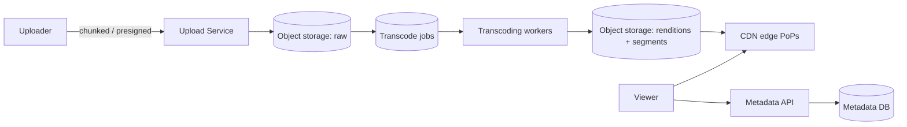
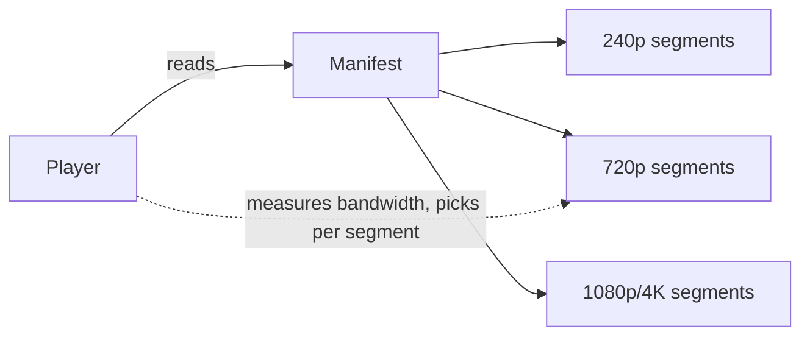
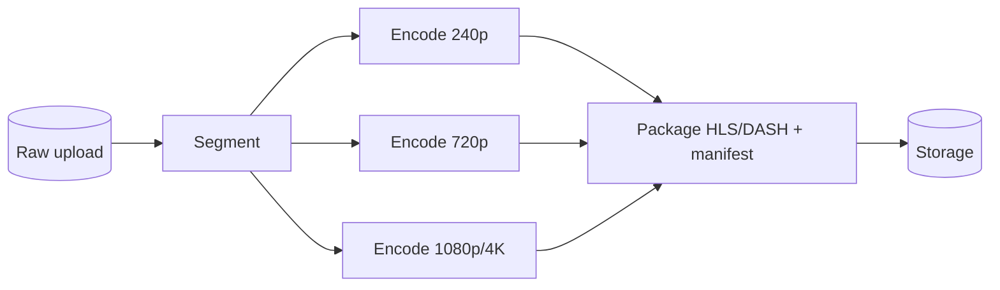

# Case Study: Video Streaming Service (YouTube / Netflix)

> Design a platform to upload, process, store, and stream video to millions of users at
> varying network speeds and devices.

## 1. Requirements

**Clarifying questions**
- User uploads (YouTube) or curated catalog (Netflix)? Live or VOD?
- Devices/resolutions? Global audience? DRM required?
- Scope — just upload + playback, or also search/recs/comments?

**Functional requirements**
1. **Upload** videos (large, resumable).
2. **Process/transcode** into multiple qualities.
3. **Stream** with adaptive quality; seek, resume.
4. Store metadata; serve thumbnails.
5. (Optional) view counts, search, recommendations.

**Non-functional requirements** (with concrete targets)
| Requirement | Target | Why |
| --- | --- | --- |
| Read scale | **millions of concurrent streams** | one upload → millions of views |
| Startup latency | **< 1–2 s to first frame** | abandonment rises with delay |
| Playback smoothness | **minimal rebuffering** | core quality metric |
| Durability | **never lose a video** | 11 nines on storage |
| Availability | **99.99%** | |

**Scale assumptions** — reads ≫ writes; bandwidth dominates cost (e.g. 1M streams × 5 Mbps
= **5 Tbps**); each source encoded into 5–10× renditions.

**Out of scope (or note)** — recommendation internals, live-streaming transport, moderation.

**🎯 The dominant requirement:** **serving enormous read bandwidth with low startup latency
and smooth playback.** This forces a CDN-first delivery design plus adaptive bitrate
streaming; the origin never serves video bytes directly at scale.

## 2. Capacity estimation
- Encoding multiplies storage **~5–10×** raw (renditions × codecs × segments).
- 1M concurrent × 5 Mbps = **5 Tbps** → only a **CDN** can serve this.
- Uploads are comparatively rare but large (GB-scale) → resumable transfer.

## 3. High-level architecture

## 4. Data model & API
- `videos`: `video_id, uploader_id, title, status, duration, created_at`
- `renditions`: `video_id, resolution, codec, bitrate, manifest_url`
- Metadata in relational/NoSQL; **bytes in object storage**; delivered via **CDN**.

**API** — `POST /v1/videos -> { video_id, upload_url }`, `POST /v1/videos/{id}/complete`,
`GET /v1/videos/{id} -> { metadata, manifest_url }`.

---

## 5. Deep analysis — biggest problems & solutions

Each problem follows the same walkthrough: **scenario → why it's hard → naive approach &
why it fails → solution → how it works → trade-offs → rule of thumb.**

### 🔴 Problem 1 — Serving terabits/sec of read bandwidth

**Scenario.** A new release draws 1M concurrent viewers at ~5 Mbps each = **5 Tbps**, from
users all over the world.

**Why it's hard.** No single origin (or its egress bill) can push terabits/sec, and serving
distant users from one region adds 100s of ms of latency and rebuffering.

**Naive approach & why it fails.** *Stream video straight from your origin/object storage* →
the origin's bandwidth and your egress costs explode, and far-away users get high latency and
stalls.

**Solution — CDN-first delivery (and, at the extreme, ISP-embedded caches).** Cache video
**segments** at edge PoPs near users; the origin is hit only on a cache miss.

**How it works.** The player fetches segments from the nearest edge. Because content
popularity is **highly skewed**, edge hit ratios are very high, so the origin sees a tiny
fraction of traffic. **Netflix Open Connect** goes further, placing appliances **inside ISPs**
and pre-positioning popular titles before demand.

**Trade-offs.** CDN costs money and adds cache-invalidation/freshness concerns, but it's the
only economical way to serve video bandwidth; versioned segment URLs sidestep invalidation.

**💡 Rule of thumb:** never serve heavy static bytes (video/images) from origin at scale —
cache them at the edge.

### 🔴 Problem 2 — Smooth playback on unpredictable networks

**Scenario.** A viewer on mobile moves from Wi-Fi to a weak cellular signal mid-video. A fixed
1080p stream stalls and buffers repeatedly.

**Why it's hard.** Available bandwidth fluctuates per user and over time; one fixed quality
either rebuffers (too high) or looks bad (too low).

**Naive approach & why it fails.** *Serve a single MP4 at one bitrate* → high bitrate stalls
on slow networks; low bitrate wastes good networks; seeking re-downloads large files.

**Solution — Adaptive Bitrate Streaming (HLS/DASH).** Pre-encode each title into multiple
bitrates, each split into short **segments**, described by a **manifest**; the **player**
chooses quality **per segment**.

**How it works.**

The player monitors throughput + buffer level and steps quality up or down each segment,
keeping playback smooth as the network changes.

**Trade-offs.** Requires pre-encoding many renditions (storage + compute), but delivers
smooth playback and device reach. This is why video "starts blurry, then sharpens."

**💡 Rule of thumb:** chop media into segments at multiple bitrates and let the client adapt —
push the quality decision to the edge of the system (the player).

### 🔴 Problem 3 — Turning one upload into many renditions, fast

**Scenario.** A creator uploads a 4K file. It must become 240p–4K in several codecs, each
segmented, before it can stream — without making the uploader wait or blocking other uploads.

**Why it's hard.** Transcoding is CPU-heavy and must scale with upload volume; doing it
inline would be slow and fragile.

**Naive approach & why it fails.** *Transcode synchronously on the upload server, one quality
at a time* → uploads back up, a single big file ties up a server, and a crash mid-encode loses
progress.

**Solution — an async, parallel transcoding pipeline on an autoscaled worker fleet.**

**How it works (step by step).**

1. On upload completion, enqueue a transcode job.
2. Workers split the video and encode each quality/codec **in parallel**.
3. Package into HLS/DASH segments + manifest; write to storage; mark the video ready.
Jobs are **idempotent** and retried, so worker failures don't corrupt output.

**Trade-offs.** Pre-encoding many variants costs storage + compute, but it's what enables ABR
and broad device support; autoscaling matches cost to upload volume.

**💡 Rule of thumb:** make heavy media processing async, parallel, and idempotent — never on
the upload's critical path.

### 🔴 Problem 4 — Uploading huge files reliably

**Scenario.** A user uploads a 4 GB video over a flaky connection. At 95% the connection drops.

**Why it's hard.** Large uploads over unreliable networks fail partway, and streaming GB of
data **through** your app servers wastes their bandwidth/memory.

**Naive approach & why it fails.** *A single multipart POST through the app server* → a drop
restarts from zero, and app servers become an expensive bandwidth bottleneck.

**Solution — chunked, resumable uploads directly to object storage via presigned URLs.**

**How it works.** The client requests an upload URL and uploads in **chunks** straight to
object storage (e.g. S3 multipart) using **presigned URLs**, bypassing app servers. Failed
chunks retry **individually**; on completion the service is notified to start transcoding.

**Trade-offs.** A bit more client complexity (chunking, resume) in exchange for reliability
and keeping huge transfers off your servers.

**💡 Rule of thumb:** upload big blobs straight to storage in resumable chunks — don't proxy
them through app servers.

### 🔴 Problem 5 — View counts at scale

**Scenario.** A viral video gets 50K views/sec. Each view wants to increment a counter.

**Why it's hard.** Incrementing one row 50K times/sec is a **write hotspot**; exact real-time
counts are expensive and contended.

**Naive approach & why it fails.** *`UPDATE videos SET views = views + 1` per view* → all
writes contend on one row/partition; the DB chokes and counts lag or lock.

**Solution — async, approximate aggregation.** Emit view **events** to a stream and aggregate
out of band; update the displayed count periodically.

**How it works.** Each view publishes an event to Kafka; stream processors aggregate counts in
windows (optionally with approximate structures like HyperLogLog for unique viewers) and
update the shown count every few seconds. The hot write path is just an append to a log.

**Trade-offs.** The displayed count is **eventually** accurate (slightly stale) — perfectly
fine for a view counter — in exchange for removing the hotspot.

**💡 Rule of thumb:** for high-volume counters, log events and aggregate asynchronously;
exact, real-time counts aren't worth the hotspot.

---

## 6. Trade-offs & bottlenecks (summary)
- Pre-encoding renditions costs storage+compute but enables ABR + reach (vs on-the-fly).
- **CDN** cost vs origin load — non-negotiable for video economics.
- Exact vs approximate view counts.
- Startup latency vs initial quality (smaller/low-quality first segments start faster).

## 7. References
- [Netflix Open Connect](https://openconnect.netflix.com/)
- [HLS](https://developer.apple.com/streaming/) · [MPEG-DASH](https://dashif.org/)
- [Netflix Tech Blog — encoding](https://netflixtechblog.com/)
