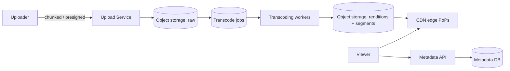

# Case Study: Video Streaming Service (YouTube / Netflix)

> Design a platform to upload, process, store, and stream video to millions of users at
> varying network speeds and devices.

## 1. Requirements

**Clarifying questions**
- User uploads (YouTube) or curated catalog (Netflix)? Live or VOD?
- Devices/resolutions? Global audience? DRM required?
- Scope — just upload + playback, or also search/recs/comments?

**Functional requirements**
1. **Upload** videos (large, resumable).
2. **Process/transcode** into multiple qualities.
3. **Stream** with adaptive quality; seek, resume.
4. Store metadata; serve thumbnails.
5. (Optional) view counts, search, recommendations.

**Non-functional requirements** (with concrete targets)
| Requirement | Target | Why |
| --- | --- | --- |
| Read scale | **millions of concurrent streams** | one upload → millions of views |
| Startup latency | **< 1–2 s to first frame** | abandonment rises with delay |
| Playback smoothness | **minimal rebuffering** | core quality metric |
| Durability | **never lose a video** | 11 nines on storage |
| Availability | **99.99%** | |

**Scale assumptions** — reads ≫ writes by orders of magnitude; bandwidth dominates cost
(e.g. 1M streams × 5 Mbps = **5 Tbps**); each source encoded into 5–10× renditions.

**Out of scope (or note)** — recommendation model internals, live-streaming transport,
content moderation.

**🎯 The dominant requirement:** **serving enormous read bandwidth with low startup
latency and smooth playback.** This forces a CDN-first delivery design plus adaptive
bitrate streaming; the origin never serves video bytes directly at scale.

## 2. Capacity estimation
- Encoding multiplies storage **~5–10×** raw (renditions × codecs × segments).
- 1M concurrent × 5 Mbps = **5 Tbps** → only a **CDN** can serve this.
- Uploads are comparatively rare but large (GB-scale) → resumable transfer.

## 3. High-level architecture

## 4. Data model & API
- `videos`: `video_id, uploader_id, title, status, duration, created_at`
- `renditions`: `video_id, resolution, codec, bitrate, manifest_url`
- Metadata in relational/NoSQL; **bytes in object storage**; delivered via **CDN**.

**API** — `POST /v1/videos -> { video_id, upload_url }`, `POST
/v1/videos/{id}/complete`, `GET /v1/videos/{id} -> { metadata, manifest_url }`.

---

## 5. Deep analysis — biggest problems & solutions

### 🔴 Problem 1 — Serving terabits/sec of read bandwidth
**Why it's hard:** millions of concurrent streams = multiple Tbps; no origin (or AWS
egress bill) can serve that, and far-away users would suffer high latency.

**Solution — CDN-first delivery.** Video segments are cached at **edge PoPs** near users;
the origin is hit only on a cache miss. **Netflix Open Connect** goes further, placing
caching appliances **inside ISPs**, and **pre-positions** popular titles at the edge
before demand.

**How it works:** the player fetches segments from the nearest edge; popularity skew
means edge hit ratios are very high, so the origin/storage sees a tiny fraction of
traffic.

### 🔴 Problem 2 — Smooth playback on unpredictable networks
**Why it's hard:** a user's bandwidth fluctuates (mobile, congestion); a fixed quality
either rebuffers (too high) or looks bad (too low).

**Solution — Adaptive Bitrate Streaming (HLS/DASH).** Each title is pre-encoded into
multiple bitrates, each split into 2–10 s **segments**, described by a **manifest**. The
**player** measures bandwidth/buffer and picks the quality **per segment**, switching up
or down seamlessly.

### 🔴 Problem 3 — Turning one upload into many renditions, fast
**Why it's hard:** every upload must become many resolution/codec combinations split into
segments — CPU-heavy work that can't block the uploader and must scale with upload
volume.

**Solution — a parallel transcoding pipeline.** On upload completion, enqueue a job; a
**DAG of tasks** on an autoscaled worker fleet segments the video and encodes each
quality **in parallel**, then packages HLS/DASH + manifest. Jobs are **idempotent** and
retried, so worker failures don't corrupt output.

### 🔴 Problem 4 — Uploading huge files reliably
**Why it's hard:** GB-scale uploads over flaky connections fail and shouldn't restart
from zero, and shouldn't stream through your app servers.

**Solution — chunked, resumable uploads via presigned URLs.** The client uploads
**directly to object storage** in chunks using **presigned URLs** (bypassing app
servers); failed chunks retry individually; on completion the service is notified to start
transcoding.

### 🔴 Problem 5 — View counts at scale
**Why it's hard:** incrementing a counter on every view of a viral video creates a write
hotspot; exact real-time counts are expensive.

**Solution — async, approximate aggregation.** Emit view events to a stream (Kafka);
aggregate counts in batches/windows and update displayed counts periodically. Slight
staleness is fine for a view counter.

---

## 6. Trade-offs & bottlenecks (summary)
- Pre-encoding renditions costs storage+compute but enables ABR + reach (vs on-the-fly).
- **CDN** cost vs origin load — non-negotiable for video economics.
- Exact vs approximate view counts.
- Startup latency vs initial quality (smaller/low-quality first segments start faster).

## 7. References
- [Netflix Open Connect](https://openconnect.netflix.com/)
- [HLS](https://developer.apple.com/streaming/) · [MPEG-DASH](https://dashif.org/)
- [Netflix Tech Blog — encoding](https://netflixtechblog.com/)
