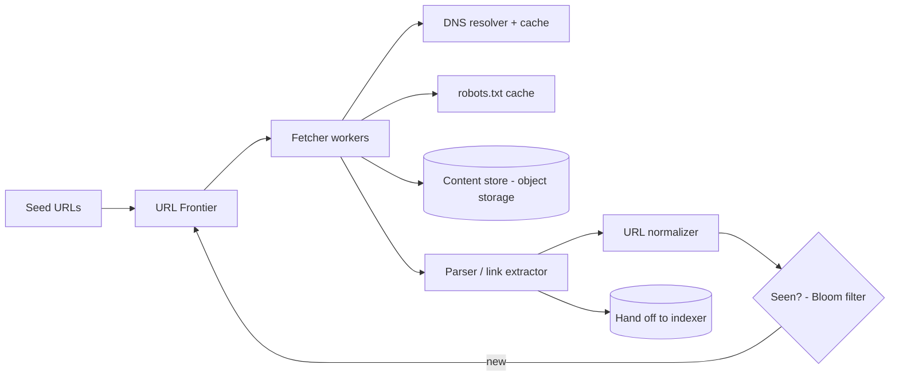
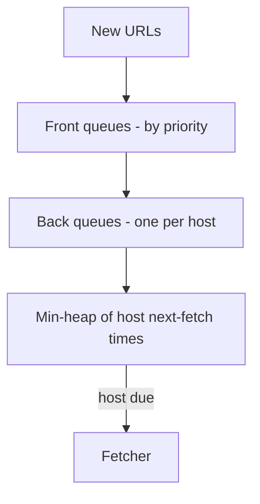

# Case Study: Web Crawler

> Design a system that systematically browses the web, downloads pages, and extracts
> links to discover more pages — the foundation of a search engine's index.

## 1. Requirements

**Clarifying questions**
- Scope — whole web or specific domains? HTML only or images/PDF/video?
- One-time crawl or **continuous** with freshness re-crawling?
- Politeness constraints? Respect `robots.txt`? Render JavaScript pages?

**Functional requirements**
1. Start from **seed URLs**; fetch pages; **extract links**; recurse.
2. **Store page content** for downstream indexing.
3. **Avoid re-crawling** the same URL.
4. Respect **`robots.txt`** and crawl delays.
5. (Continuous) **re-crawl** for freshness.

**Non-functional requirements** (with concrete targets)
| Requirement | Target | Why |
| --- | --- | --- |
| Throughput | **~400+ pages/s** sustained | 1B pages/month |
| Politeness | **never overload a host** | avoid bans / harm |
| Fault tolerance | resume after node failure | long-running, large |
| Freshness | re-crawl by change rate | search index must be current |
| Extensibility | add content types | HTML now, media later |

**Scale assumptions** — 1B pages/month, avg ~500 KB/page (~500 TB/month), billions of known
URLs.

**Out of scope (or note)** — the indexing/ranking system, full JS rendering at scale
(selective), spam classification.

**🎯 The dominant requirement:** **massive throughput while staying polite and not re-doing
work.** The design centers on the URL Frontier (priority + politeness) and scalable
deduplication.

## 2. Capacity estimation
- **1B pages/month** ≈ **~400 pages/s** sustained (peak higher).
- ~500 KB/page → **~500 TB/month** raw → object storage.
- Billions of URLs in the "seen" set → can't fit raw in RAM → **Bloom filter** + durable store.

## 3. High-level architecture

## 4. Components
- **URL Frontier** — prioritized, politeness-aware queue of URLs to crawl.
- **Fetcher** — worker pool downloading pages (DNS caching, timeouts, retries).
- **Parser** — extracts links + content; normalizes URLs.
- **Dedup ("seen") service** — Bloom filter + durable seen-set.
- **Content store** — object storage for raw HTML; metadata DB for crawl state.

---

## 5. Deep analysis — biggest problems & solutions

Each problem follows the same walkthrough: **scenario → why it's hard → naive approach &
why it fails → solution → how it works → trade-offs → rule of thumb.**

### 🔴 Problem 1 — Prioritizing important pages *and* being polite (the URL Frontier)

**Scenario.** You discover 10,000 new links on `nytimes.com` and also want to crawl high-value
pages first. You must crawl important pages soon — but you must **not** fire thousands of
simultaneous requests at nytimes.com.

**Why it's hard.** Two goals conflict: **priority** (crawl important pages first) pushes you to
grab many high-value URLs at once, while **politeness** (per-host rate limit) forbids
hammering any single host.

**Naive approach & why it fails.** *One global priority queue, fetch the top URLs in parallel*
→ a popular host's many high-priority URLs get fetched all at once → you overload (and get
banned by) that host.

**Solution — a two-layer frontier (Mercator-style): priority front queues + per-host back
queues.**

**How it works.**

1. **Front queues** bucket URLs by **priority**; a biased selector pulls more from high-priority
   queues.
2. Each URL is routed to a **back queue dedicated to its host**.
3. A **min-heap** tracks each host's "next allowed fetch time"; a fetcher only pulls a host's
   URL when its delay has elapsed.
Throughput comes from crawling **many hosts in parallel**, each politely.

**Trade-offs.** More moving parts than a single queue, but it's the only way to honor priority
and politeness simultaneously.

**💡 Rule of thumb:** separate "what to crawl next" (priority) from "when may I hit this host"
(politeness) into two layers.

### 🔴 Problem 2 — Deduplicating billions of URLs

**Scenario.** Every page yields dozens of links; most you've already seen. You must answer
"seen this URL?" billions of times, fast, without re-crawling duplicates.

**Why it's hard.** The seen-set is billions of entries — far too large for RAM — and a durable
DB lookup per URL (at hundreds of pages/s × dozens of links) is too slow.

**Naive approach & why it fails.** *Keep a hash set of all seen URLs in memory* → it doesn't
fit. *Check a database for every extracted URL* → the lookup rate crushes the DB and slows the
crawl.

**Solution — a Bloom filter in front of a durable seen-set.** The **Bloom filter** is a compact
probabilistic membership structure answering "definitely new" or "probably seen" in memory.

**How it works.** Each normalized URL is checked against the Bloom filter; "probably seen" →
skip (or confirm against the durable set for important cases); "definitely new" → enqueue and
record. Also **content-dedup** via a fingerprint (e.g. SimHash) to skip near-duplicate/mirror
pages.

**Trade-offs.** Bloom filters have **false positives** (occasionally mark a genuinely new URL as
seen → skip it) but never false negatives. At web scale, missing a tiny fraction of URLs is an
acceptable trade for fitting the check in memory.

**💡 Rule of thumb:** when an exact set is too big for memory, use a Bloom filter and accept
rare false positives.

### 🔴 Problem 3 — Honoring robots.txt and per-host limits

**Scenario.** A site's `robots.txt` disallows `/private/` and sets a crawl-delay of 10s.
Ignoring it gets your crawler **IP-banned** and may legally/ethically harm the site.

**Why it's hard.** Rules are per-host and must be enforced on **every** fetch, but fetching
`robots.txt` each time would itself be impolite and slow.

**Naive approach & why it fails.** *Crawl freely and ignore robots* → bans, complaints, and
possible legal issues; *fetch robots.txt before every page* → doubles requests and adds
latency.

**Solution — cache robots rules per host + enforce politeness via host-partitioned queues.**

**How it works.** On first contact with a host, fetch and **cache** its parsed `robots.txt`
(refresh periodically). Check allowed paths + crawl-delay from cache on each fetch. Because the
frontier is **partitioned by host** (Problem 1), one worker owns a host and consistently
enforces its delay. Identify with a clear `User-Agent`.

**Trade-offs.** Caching risks briefly-stale rules (bounded by refresh interval) but is required
for politeness and performance.

**💡 Rule of thumb:** cache per-host crawl rules and enforce them at the host-owning worker —
never fetch robots per page.

### 🔴 Problem 4 — Crawler traps & keeping content fresh

**Scenario.** A site has an infinite calendar (`?date=...` forever) that generates endless
unique URLs; meanwhile, a news homepage you crawled yesterday is already stale.

**Why it's hard.** Traps can consume the crawler indefinitely; freshness requires re-crawling,
which competes with discovering new pages.

**Naive approach & why it fails.** *Follow every link blindly and never revisit* → you fall
into traps (wasting capacity) and your index goes stale.

**Solution — trap heuristics + change-rate-based re-crawl scheduling.**

**How it works.** Apply **depth limits**, URL-pattern detection (e.g. repeating segments,
ever-growing query params), and per-host page caps to escape traps. Schedule **re-crawls** by
observed **change frequency** — crawl news often, static archives rarely — balancing freshness
against new-page discovery.

**Trade-offs.** Heuristics may occasionally skip legitimate deep pages; change-rate estimation
is approximate. Both are necessary to bound work.

**💡 Rule of thumb:** bound the crawl with depth/pattern limits, and re-crawl proportional to
how often a page actually changes.

### 🔴 Problem 5 — Coordinating a distributed crawl

**Scenario.** You run hundreds of crawler nodes. They must divide the web without overlapping,
keep politeness + dedup correct, and survive nodes dying.

**Why it's hard.** Politeness and dedup are **per-host** state; if two nodes crawl the same host
independently, they violate the host's rate limit and double-crawl.

**Naive approach & why it fails.** *Let any node crawl any URL* → multiple nodes hit the same
host (impolite), and dedup state is fragmented, causing re-crawls.

**Solution — partition hosts across nodes via consistent hashing.**

**How it works.** Each host maps to a node by **consistent hashing**, so a single node owns that
host's politeness timer + dedup state. Adding/removing nodes moves only a fraction of hosts
(not everything). A coordination service tracks assignments and reassigns a failed node's hosts
to others.

**Trade-offs.** Adds coordination, but keeps per-host invariants correct and makes scaling +
failure recovery incremental.

**💡 Rule of thumb:** shard by the entity that owns the invariant (host) with consistent
hashing, so per-host rules stay correct as the fleet changes.

---

## 6. Trade-offs & bottlenecks (summary)
- **Bloom filter** saves memory at the cost of rare false positives (acceptable).
- **Politeness** caps per-host throughput; scale via many parallel hosts.
- **Priority vs coverage** and **freshness vs cost** of re-crawling.
- DNS + robots lookups are hot paths → aggressive caching.

## 7. References
- *Introduction to Information Retrieval* — Manning et al. (Web crawling chapter)
- Mercator — *A scalable, extensible web crawler* (classic design)
- [System Design Primer](https://github.com/donnemartin/system-design-primer)
