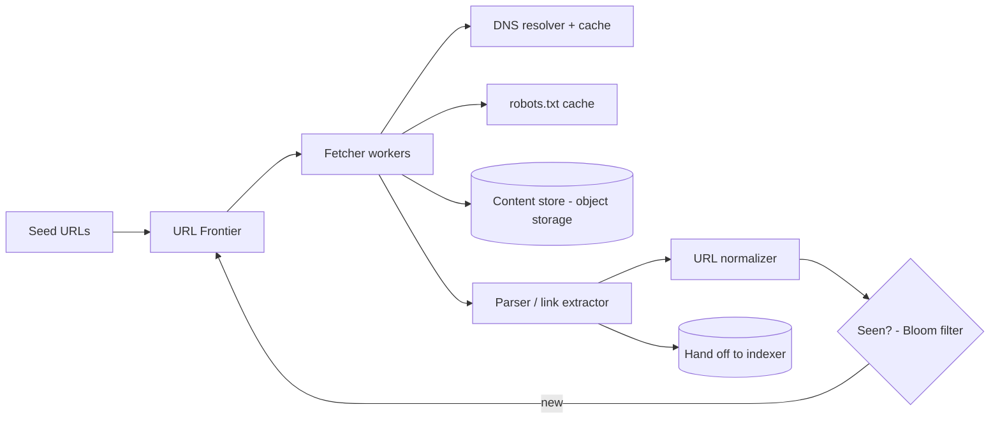
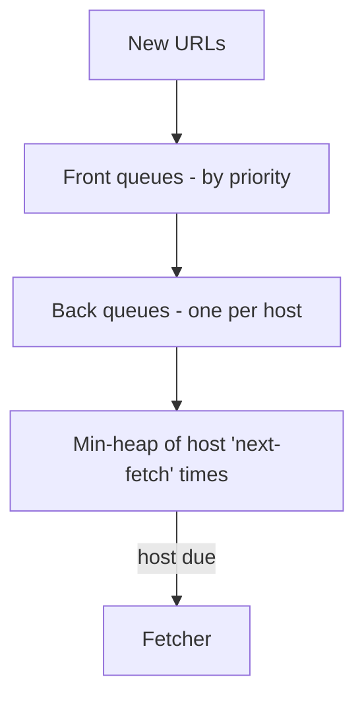

# Case Study: Web Crawler

> Design a system that systematically browses the web, downloads pages, and extracts
> links to discover more pages — the foundation of a search engine's index.

## 1. Requirements

**Clarifying questions**
- Scope — whole web or a set of domains? HTML only, or images/PDF/video too?
- One-time crawl or continuous with **freshness** re-crawling?
- Politeness constraints? Respect `robots.txt`? JavaScript-rendered pages?

**Functional**
- Start from **seed URLs**; fetch pages; **extract links**; recurse.
- Store page content for downstream indexing.
- **Avoid re-crawling** the same URL; respect `robots.txt` and crawl delays.

**Non-functional**
- **Massive scale** (billions of pages), **high throughput**.
- **Politeness** (don't overload any site), **fault tolerance**, **extensibility**
  (add content types), **freshness**.

## 2. Capacity estimation
- **1B pages/month** ≈ **~400 pages/s** sustained (peak higher).
- Avg page ~500 KB → **~500 TB/month** raw content → object storage.
- URL "seen" set of billions of entries → can't fit raw in memory → **Bloom filter** +
  durable store.

## 3. High-level architecture

## 4. Components
- **URL Frontier** — the prioritized, politeness-aware queue of URLs to crawl.
- **Fetcher** — worker pool downloading pages (with DNS caching, timeouts, retries).
- **Parser / link extractor** — pulls links + content; normalizes URLs.
- **Dedup ("seen") service** — Bloom filter in front of a durable seen-set.
- **Content store** — object storage for raw HTML; metadata DB for crawl state.
- **robots.txt cache** — per-host rules, refreshed periodically.

## 5. Deep dives

**URL Frontier design (the crux)** — must balance **priority** (crawl important pages
first) with **politeness** (never hammer one host). A common design (Mercator-style) uses
**two queue layers**:
- **Front queues** — bucket URLs by priority; a biased selector pulls more from
  high-priority queues.
- **Back queues** — each maps to a **single host**; a URL is dispatched only when that
  host's back queue is "due" (a per-host timer enforces a polite delay).

**Deduplication at scale** — billions of URLs can't all sit in RAM. A **Bloom filter**
gives a compact, probabilistic "have I seen this?" (false positives rare → occasionally
skip a genuinely new URL, acceptable) backed by a durable seen-set. Also dedup
**content** by hashing (e.g. SimHash) to skip near-duplicate pages and mirrors.

**Politeness & robots.txt** — fetch and honor each site's `robots.txt` (allowed paths,
crawl-delay), identify with a User-Agent, and rate-limit per host. Essential to avoid
being blocked or causing harm; partition the frontier **by host** so one worker owns a
host and enforces its delay.

**Traps, freshness & JS** — detect **crawler traps** (infinite calendars, session-id
URLs) with depth limits and URL pattern heuristics. **Re-crawl** pages on a schedule
based on observed change frequency (news pages often, archives rarely). JS-heavy pages
need a **headless browser** rendering pool (expensive → selective).

**Distributed coordination** — shard hosts across crawler nodes via **consistent
hashing**, so politeness and dedup stay correct as the fleet scales; a coordination
service tracks assignments and handles node failure.

## 6. Trade-offs & bottlenecks
- **Bloom filter** saves memory at the cost of rare false positives (skips a few new
  URLs) — the right trade at this scale.
- **Politeness** caps per-host throughput but is mandatory; total throughput comes from
  crawling **many hosts in parallel**.
- **Priority vs coverage** and **freshness vs cost** (re-crawling competes with
  discovering new pages).
- DNS and `robots.txt` lookups are hot paths → aggressive caching.

## 7. References
- *Introduction to Information Retrieval* — Manning et al. (Web crawling chapter)
- [Mercator: A scalable, extensible web crawler](https://research.google/) (classic
  design)
- [System Design Primer](https://github.com/donnemartin/system-design-primer)
