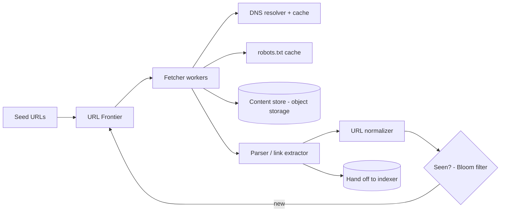
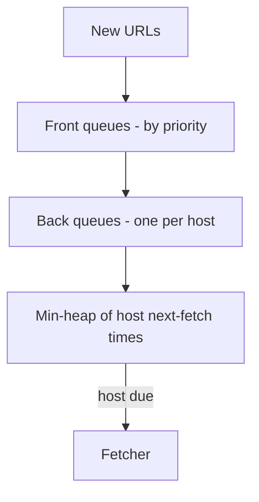

# Case Study: Web Crawler

> Design a system that systematically browses the web, downloads pages, and extracts
> links to discover more pages — the foundation of a search engine's index.

## 1. Requirements

**Clarifying questions**
- Scope — whole web or specific domains? HTML only or images/PDF/video?
- One-time crawl or **continuous** with freshness re-crawling?
- Politeness constraints? Respect `robots.txt`? Render JavaScript pages?

**Functional requirements**
1. Start from **seed URLs**; fetch pages; **extract links**; recurse.
2. **Store page content** for downstream indexing.
3. **Avoid re-crawling** the same URL.
4. Respect **`robots.txt`** and crawl delays.
5. (Continuous) **re-crawl** for freshness.

**Non-functional requirements** (with concrete targets)
| Requirement | Target | Why |
| --- | --- | --- |
| Throughput | **~400+ pages/s** sustained | 1B pages/month |
| Politeness | **never overload a host** | avoid bans / harm |
| Fault tolerance | resume after node failure | long-running, large |
| Freshness | re-crawl by change rate | search index must be current |
| Extensibility | add content types | HTML now, media later |

**Scale assumptions** — 1B pages/month, avg ~500 KB/page (~500 TB/month), billions of
known URLs.

**Out of scope (or note)** — the indexing/ranking system itself, full JS rendering at
scale (selective), spam classification.

**🎯 The dominant requirement:** **massive throughput while staying polite and not
re-doing work.** The design centers on the URL Frontier (priority + politeness) and
scalable deduplication.

## 2. Capacity estimation
- **1B pages/month** ≈ **~400 pages/s** sustained (peak higher).
- ~500 KB/page → **~500 TB/month** raw → object storage.
- Billions of URLs in the "seen" set → can't fit raw in RAM → **Bloom filter** + durable
  store.

## 3. High-level architecture

## 4. Components
- **URL Frontier** — prioritized, politeness-aware queue of URLs to crawl.
- **Fetcher** — worker pool downloading pages (DNS caching, timeouts, retries).
- **Parser** — extracts links + content; normalizes URLs.
- **Dedup ("seen") service** — Bloom filter + durable seen-set.
- **Content store** — object storage for raw HTML; metadata DB for crawl state.

---

## 5. Deep analysis — biggest problems & solutions

### 🔴 Problem 1 — Prioritizing important pages *and* being polite (the URL Frontier)
**Why it's hard:** you want to crawl important pages first (priority) but must **never
hammer a single host** (politeness) — and these goals conflict (a high-priority site
shouldn't get 100 simultaneous requests).

**Solution — a two-layer queue design (Mercator-style).**
- **Front queues** bucket URLs by **priority**; a biased selector pulls more from
  high-priority queues.
- **Back queues** each map to **one host**; a per-host timer enforces a polite delay, and
  a URL is dispatched only when its host is "due."

Throughput comes from crawling **many hosts in parallel**, each politely.

### 🔴 Problem 2 — Deduplicating billions of URLs
**Why it's hard:** you must check "have I seen this URL?" billions of times, but the seen
set is far too large to keep in RAM, and a DB lookup per URL is too slow.

**Solution — a Bloom filter in front of a durable seen-set.** The **Bloom filter** is a
compact, probabilistic membership structure: "definitely new" or "probably seen." Most
checks are answered in memory; rare false positives mean occasionally skipping a genuinely
new URL — an acceptable trade at this scale. Also **content-dedup** via hashing (SimHash)
to skip near-duplicate/mirror pages.

### 🔴 Problem 3 — Honoring robots.txt and per-host limits
**Why it's hard:** ignoring `robots.txt` or crawl delays gets you **banned** and can harm
sites; rules must be checked constantly without a fetch each time.

**Solution — cached robots rules + host-partitioned politeness.** Fetch and **cache**
each host's `robots.txt` (refresh periodically); enforce allowed paths and crawl-delay.
Partition the frontier **by host** so a single worker owns a host and enforces its delay
consistently. Identify with a clear User-Agent.

### 🔴 Problem 4 — Crawler traps & keeping content fresh
**Why it's hard:** infinite calendars, session-id URLs, and dynamic links can trap the
crawler forever; meanwhile, already-crawled pages go stale.

**Solution — heuristics + scheduled re-crawl.** Detect traps with **depth limits**, URL
pattern detection, and per-host page caps. **Re-crawl** on a schedule tuned to observed
**change frequency** (news often, archives rarely), balancing freshness against
discovering new pages.

### 🔴 Problem 5 — Coordinating a distributed crawl
**Why it's hard:** many crawler nodes must divide the web without overlapping, while
keeping politeness and dedup correct, and survive node failures.

**Solution — shard hosts via consistent hashing.** Each host maps to a node
(consistent hashing), so one node owns a host's politeness + dedup; adding/removing nodes
moves only a fraction of hosts. A coordination service tracks assignments and reassigns on
failure.

---

## 6. Trade-offs & bottlenecks (summary)
- **Bloom filter** saves memory at the cost of rare false positives (acceptable).
- **Politeness** caps per-host throughput; scale via many parallel hosts.
- **Priority vs coverage** and **freshness vs cost** of re-crawling.
- DNS + robots lookups are hot paths → aggressive caching.

## 7. References
- *Introduction to Information Retrieval* — Manning et al. (Web crawling chapter)
- Mercator — *A scalable, extensible web crawler* (classic design)
- [System Design Primer](https://github.com/donnemartin/system-design-primer)
