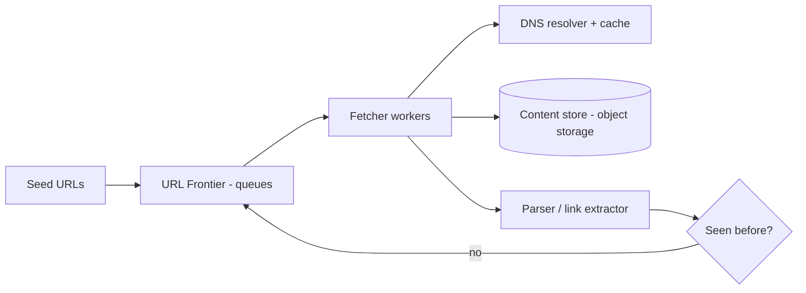

# Case Study: Web Crawler

> Design a system that systematically browses the web, downloads pages, and extracts
> links to discover more pages — the foundation of a search engine's index.

## 1. Requirements
**Functional**
- Start from seed URLs; fetch pages; extract links; recurse.
- Store page content for downstream indexing.
- Avoid re-crawling the same URL; respect `robots.txt`.

**Non-functional**
- Massive scale (billions of pages), high throughput, politeness (don't hammer a
  site), fault tolerance, extensibility (HTML now, images/video later).

## 2. Estimations
- 1B pages/month → ~400 pages/sec sustained.
- Avg page ~500 KB → ~500 TB/month of raw content → object storage.

## 3. High-level design

## 4. Components
- **URL Frontier** — the queue of URLs to crawl, with **prioritization** (importance)
  and **politeness** (per-host rate limiting; one host's URLs drain at a polite rate).
- **Fetcher** — downloads pages (worker pool), with DNS caching and timeouts.
- **Parser** — extracts links + content; normalizes URLs.
- **Dedup / "seen" set** — avoid re-crawling.
- **Content store** — object storage for raw HTML.

## 5. Deep dives
**URL Frontier design** — two-level queues: front queues for **priority**, back queues
for **per-host politeness** (each back queue maps to one host, drained with a delay).
This balances crawling important pages first while never overwhelming a single site.

**Deduplication** — billions of URLs can't all sit in memory. Use a **Bloom filter**
(compact, probabilistic "have I seen this?") in front of a durable seen-set; also dedup
**content** by hashing to skip near-duplicate pages.

**Politeness & robots.txt** — honor each site's `robots.txt`, set a crawl delay per
host, identify with a User-Agent. This is essential to avoid being blocked / causing
harm.

**Traps & freshness** — detect crawler traps (infinite calendars, dynamic URLs) with
depth/limit heuristics; re-crawl pages on a schedule based on how often they change.

**Distributed coordination** — partition the frontier by host (consistent hashing) so
each worker owns certain hosts; this keeps politeness correct across the fleet.

## 6. Trade-offs & bottlenecks
- Bloom filter saves memory but has false positives (rarely skips a new URL) — accept
  the tradeoff at scale.
- Politeness limits throughput per host but is mandatory.
- Priority vs coverage; freshness vs cost of re-crawling.

## 7. References
- *Introduction to Information Retrieval* — Manning et al. (crawling chapter)
- [System Design Primer](https://github.com/donnemartin/system-design-primer)
