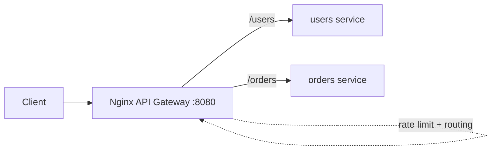

# Practice Lab: API Gateway with Nginx

> Use Nginx as an API gateway that routes paths to different backend services and applies
> a rate limit at the edge — the single "front door" pattern for microservices.

## What you'll learn
- How a **gateway routes** different URL paths to different backend services.
- How to enforce a **cross-cutting policy** (rate limiting) once, at the edge.
- Why centralizing this beats duplicating it in every service.
- The hands-on version of [Reverse proxies & API gateways](../1-knowledge/building-blocks/proxies-gateways.md).

⏱️ ~10 minutes · 💰 free · 🐳 Docker only

## Lab architecture


## Prerequisites
- Docker + Docker Compose. Port `8080` free.

## Setup

**1. `nginx.conf`** — routing + a per-IP rate limit:
```nginx
events {}
http {
  # define a shared-memory rate-limit zone: 2 requests/sec per client IP
  limit_req_zone $binary_remote_addr zone=api:10m rate=2r/s;

  upstream users  { server users:80; }
  upstream orders { server orders:80; }

  server {
    listen 80;
    # route by path prefix, apply the rate limit (allow small burst)
    location /users  { limit_req zone=api burst=2 nodelay; proxy_pass http://users; }
    location /orders { limit_req zone=api burst=2 nodelay; proxy_pass http://orders; }
  }
}
```

**2. `docker-compose.yml`:**
```yaml
services:
  users:  { image: traefik/whoami }
  orders: { image: traefik/whoami }
  gateway:
    image: nginx:alpine
    volumes: [ "./nginx.conf:/etc/nginx/nginx.conf:ro" ]
    ports: [ "8080:80" ]
    depends_on: [ users, orders ]
```

```bash
docker compose up -d
```

## Run it
```bash
# Routing: each path hits a different backend
echo "/users  ->"; curl -s localhost:8080/users  | grep Hostname
echo "/orders ->"; curl -s localhost:8080/orders | grep Hostname

# Rate limiting: hammer the endpoint; excess requests get 503
for i in $(seq 1 10); do
  curl -s -o /dev/null -w "%{http_code}\n" localhost:8080/users
done
```

## What to observe & why
- `/users` and `/orders` return **different** container hostnames — one entry point
  (`:8080`) **fans out** to multiple services based on the path. Clients don't need to know
  where each service lives.
- The burst loop returns a mix of `200` then **`503`** once you exceed ~2 req/s + burst:
  Nginx shed excess load **at the edge**, before it ever reached the backends. You wrote
  this policy **once** in the gateway instead of in every service.

## Sample expected output
```
/users  -> Hostname: <users-container-id>
/orders -> Hostname: <orders-container-id>
200
200
200
503
503
503
...
```

## Experiments to try
1. **Add a service + route:** add a `payments` whoami and a `location /payments`.
2. **Header/host routing:** route by `Host` header or a path rewrite (`rewrite ^/v1/(.*)
   /$1 break;`) to version your API.
3. **TLS termination:** add a `listen 443 ssl;` server block so the gateway handles HTTPS
   and backends stay plain HTTP (a common real setup).
4. **Tune the limit:** change `rate=10r/s` and `burst` and watch the 200/503 mix shift.

## Common pitfalls
- **Don't put business logic in the gateway** — keep it to routing + cross-cutting
  concerns (auth, rate limit, TLS), or you recreate a "smart pipe" anti-pattern.
- **The gateway is a critical dependency / potential SPOF** — run it redundantly (≥2
  instances behind a load balancer).
- `503` here is rate-limit rejection (Nginx's response for `limit_req`); APIs often map
  this to `429` at a higher layer.

## Teardown
```bash
docker compose down
```

## In the real world (common production pattern)
- **Dedicated API gateways:** **Kong**, **AWS API Gateway**, **Apigee**, **NGINX**,
  **Envoy** sit in front of microservices and centralize **authentication/authorization**,
  **rate limiting/throttling**, **request routing & aggregation**, **TLS termination**,
  logging, and metrics.
- **Netflix Zuul** pioneered the pattern (route to hundreds of services); today **Envoy**
  is common both as a gateway and as the **service-mesh** data plane for east-west traffic.
- **Backend for Frontend (BFF):** one tailored gateway per client type (web, mobile) so
  each gets an API shaped for its needs.
- **Managed serverless gateways:** **AWS API Gateway** integrates auth (Cognito/JWT/IAM),
  usage-plan throttling, and Lambda — see the
  [API Gateway + Lambda lab](./aws/api-gateway-lambda.md).
- Gateways are deployed **redundantly** and usually behind a load balancer (so the gateway
  itself isn't a SPOF).

## Connect to theory
- Concept: [Reverse proxies & API gateways](../1-knowledge/building-blocks/proxies-gateways.md)
- Managed equivalent: [API Gateway + Lambda lab](./aws/api-gateway-lambda.md)
- Used in: [microservices architectures](../1-knowledge/patterns/monolith-vs-microservices.md),
  most case studies' entry points.
