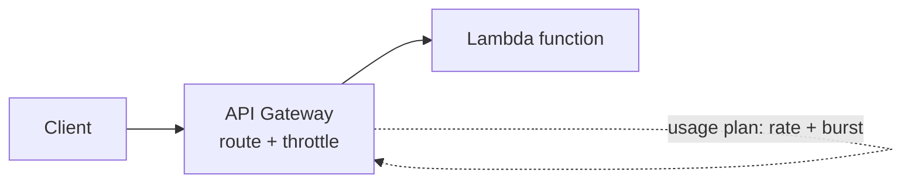

# AWS Lab: API Gateway + Lambda (Routing + Rate Limiting)

> Build a serverless API: API Gateway as the front door routing to a Lambda, with a
> **usage plan** enforcing rate limits — the managed version of the
> [Nginx API gateway lab](../api-gateway-nginx.md).

> ⚠️ **Costs:** API Gateway and Lambda both have large always-free tiers; this lab is
> effectively free. Delete resources when done.

## What you'll learn
- How an **API gateway** fronts compute and routes requests — with **no servers to run**.
- How **usage plans / throttling** apply rate limits at the edge (managed version of the
  [rate limiter](../../2-case-studies/rate-limiter.md)).
- The shape of a **serverless** request path.

⏱️ ~25 minutes · 💰 free · ☁️ AWS account

## Lab architecture


## Prerequisites
- AWS CLI configured; an IAM role for Lambda execution.

## Setup
**1. Lambda** (`hello.py` → zipped):
```python
def handler(event, context):
    return {"statusCode": 200, "body": "hello from lambda"}
```
```bash
zip fn.zip hello.py
aws lambda create-function --function-name lab-fn \
  --runtime python3.12 --handler hello.handler \
  --role <lambda-exec-role-arn> --zip-file fileb://fn.zip
```
**2. HTTP API in API Gateway** integrated with the Lambda (console: API Gateway → HTTP API
→ add `GET /hello` → Lambda `lab-fn` → deploy). Note the invoke URL.

## Run it
```bash
API=https://<api-id>.execute-api.<region>.amazonaws.com

curl -s $API/hello        # works -> "hello from lambda"

# With throttling configured (REST API usage plan: rate=1/s, burst=2), hammer it:
for i in $(seq 1 10); do
  curl -s -o /dev/null -w "%{http_code}\n" $API/hello
done
```

## What to observe & why
- `GET /hello` returns `hello from lambda` — API Gateway **routed** the request and
  **invoked** the function; no server was provisioned or kept running.
- Under throttling, the burst loop returns a mix of `200` then **`429 Too Many Requests`**
  once you exceed the configured rate — rate limiting enforced **at the gateway**, exactly
  like the Nginx lab's edge limit but fully managed and tied to API keys/usage plans.

## Common pitfalls
- **Lambda execution role** must exist with basic permissions, or `create-function` fails.
- **Throttling lives on the API/stage/usage-plan**, not the Lambda — set it there.
- **Cold starts:** the first invoke after idle is slower (the function spins up) — relevant
  for latency-sensitive APIs.

## Teardown
```bash
aws lambda delete-function --function-name lab-fn
# delete the HTTP/REST API + any usage plan/API key (console or apigatewayv2 delete-api)
```

## In the real world (common production pattern)
- **API Gateway + Lambda** is a leading **serverless** pattern: pay-per-request, auto-
  scaling, no servers. Great for APIs, webhooks, and glue.
- The gateway centralizes the [gateway concerns](../../1-knowledge/building-blocks/proxies-gateways.md):
  **auth** (Cognito/JWT/IAM authorizers), **throttling** (account + per-method + usage
  plans), request validation, caching, and logging.
- **Usage plans + API keys** give per-customer rate limits and quotas (free vs paid tiers)
  — the productized [rate limiter](../../2-case-studies/rate-limiter.md).
- For containers/microservices, the same role is played by **ALB + ECS/EKS** or an
  **Envoy/Kong** gateway; serverless picks API Gateway + Lambda.
- Mind **cold starts** (provisioned concurrency helps) and per-account throttle limits.

## Connect to theory
- Concept: [Reverse proxies & API gateways](../../1-knowledge/building-blocks/proxies-gateways.md) ·
  [Rate limiting](../../1-knowledge/building-blocks/rate-limiting.md)
- Design: [rate limiter case study](../../2-case-studies/rate-limiter.md)
- Local version: [Nginx API gateway lab](../api-gateway-nginx.md).
