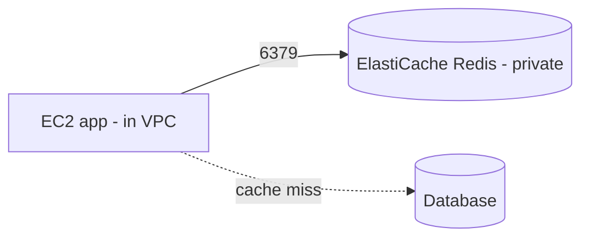

# AWS Lab: Caching with ElastiCache for Redis

> Stand up a managed Redis cluster and use it as a cache-aside store from an EC2 app — the
> managed, production version of the [Redis caching lab](../caching-redis.md).

> ⚠️ **Costs:** ElastiCache nodes bill per hour; pick `cache.t3.micro`. Tear down when done.

## What you'll learn
- How to run **managed Redis** (no ops) and connect to it from inside a VPC.
- That ElastiCache is **not publicly reachable** — and why caches live inside the VPC.
- That the **cache-aside pattern is identical** to the local lab; only operations change.

⏱️ ~25 minutes · 💰 low (tear down) · ☁️ AWS account

## Lab architecture


## Prerequisites
- AWS CLI; a VPC; an EC2 instance (`t3.micro`) **in the same VPC** as the client (Redis is
  private to the VPC).

## Setup

**1. Create a Redis cluster** (single node for the lab):
```bash
aws elasticache create-cache-cluster \
  --cache-cluster-id lab-redis --engine redis \
  --cache-node-type cache.t3.micro --num-cache-nodes 1 \
  --security-group-ids <sg-id>
```
**2.** The SG must allow inbound **TCP 6379** from your EC2 instance's SG.
**3.** Get the endpoint:
```bash
aws elasticache describe-cache-clusters --cache-cluster-id lab-redis \
  --show-cache-node-info \
  --query "CacheClusters[0].CacheNodes[0].Endpoint.Address" --output text
```

## Run it
From the EC2 instance (same VPC):
```bash
sudo dnf install -y redis6           # redis-cli
REDIS=<endpoint-from-above>

redis-cli -h $REDIS set item:42 '{"id":42,"name":"Item 42"}' EX 30
redis-cli -h $REDIS get item:42
redis-cli -h $REDIS ttl item:42
```
Or point the [local caching app](../caching-redis.md) at `$REDIS` and compare miss vs hit
latency.

## What to observe & why
- `get item:42` returns the cached JSON; `ttl` counts down from 30 and the key expires —
  identical **cache-aside + TTL** behavior to the local lab, but the cache is now managed
  (replication, failover, backups handled by AWS).
- From **outside** the VPC the endpoint is unreachable — ElastiCache has no public access.
  This is deliberate: a cache holds hot data and must be low-latency + private, co-located
  with your app tier.

## Common pitfalls
- **Connecting from your laptop fails** — you must connect from an instance inside the VPC
  (or via VPN/bastion). This trips up almost everyone first time.
- **Security group** must allow 6379 from the app's SG.
- Single-node has **no failover** — production uses a replication group (see below).

## Teardown
```bash
aws elasticache delete-cache-cluster --cache-cluster-id lab-redis
# also terminate the client EC2 instance if it was just for this lab
```

## In the real world (common production pattern)
- ElastiCache is the standard AWS cache tier in front of RDS/DynamoDB; equivalents are GCP
  **Memorystore** and Azure **Cache for Redis**.
- Production runs a **replication group**: a primary + replicas across AZs with **automatic
  failover** (Multi-AZ), and often **cluster mode** (sharded) for very large datasets.
- Common uses: **cache-aside** for DB reads, **session store** for stateless services,
  leaderboards/rate-limit counters, pub/sub.
- Watch for **hot keys** and **cache stampedes** at scale (replicate hot keys, coalesce
  requests) — the [Discord pattern](../../2-case-studies/companies/discord.md).

## Connect to theory
- Concept: [Caching strategies](../../1-knowledge/building-blocks/caching.md)
- Local version: [Redis caching lab](../caching-redis.md)
- Used in: [URL shortener](../../2-case-studies/url-shortener.md),
  [news feed](../../2-case-studies/news-feed.md).
