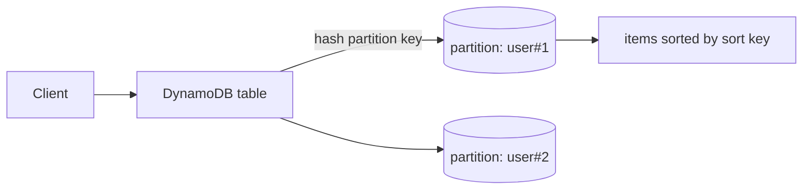

# AWS Lab: Partitioning with DynamoDB

> Use DynamoDB to see how a **partition key** distributes data and how single-digit-ms
> key-value access works — a managed, Dynamo-style key-value store with no servers to run.

> ⚠️ **Costs:** DynamoDB **on-demand** has a generous always-free tier; this lab is
> effectively free. Delete the table anyway.

## What you'll learn
- How a **partition key** + **sort key** model one-to-many data and drive distribution.
- How `query` (one partition) differs from `get-item` (one item) and `scan` (all — avoid).
- How **consistency** is a per-request choice (eventual vs strong).
- The managed realization of the [key-value store case study](../../2-case-studies/key-value-store.md).

⏱️ ~15 minutes · 💰 free · ☁️ AWS account

## Lab architecture


## Setup
A composite primary key — **partition key** `pk` + **sort key** `sk` — in on-demand mode:
```bash
aws dynamodb create-table \
  --table-name lab-orders \
  --attribute-definitions AttributeName=pk,AttributeType=S AttributeName=sk,AttributeType=S \
  --key-schema AttributeName=pk,KeyType=HASH AttributeName=sk,KeyType=RANGE \
  --billing-mode PAY_PER_REQUEST
aws dynamodb wait table-exists --table-name lab-orders
```

## Run it
```bash
# Partition by user, sort by order id
aws dynamodb put-item --table-name lab-orders \
  --item '{"pk":{"S":"user#1"},"sk":{"S":"order#100"},"total":{"N":"42"}}'
aws dynamodb put-item --table-name lab-orders \
  --item '{"pk":{"S":"user#1"},"sk":{"S":"order#101"},"total":{"N":"99"}}'
aws dynamodb put-item --table-name lab-orders \
  --item '{"pk":{"S":"user#2"},"sk":{"S":"order#200"},"total":{"N":"10"}}'

# Query: all orders for user#1 (single partition, fast)
aws dynamodb query --table-name lab-orders \
  --key-condition-expression "pk = :u" \
  --expression-attribute-values '{":u":{"S":"user#1"}}'

# Get one item by full key
aws dynamodb get-item --table-name lab-orders \
  --key '{"pk":{"S":"user#2"},"sk":{"S":"order#200"}}'
```

## What to observe & why
- The `query` returns **both** of user#1's orders: items sharing a partition key live
  together, **sorted by `sk`** — so "all orders for a user, newest first" is one efficient
  query against one partition.
- `get-item` returns user#2's single order by its full key — O(1)-ish, single-digit ms.
- Internally DynamoDB **hashes `pk`** to place items across partitions (consistent hashing
  under the hood) — the same partitioning idea as the
  [key-value store](../../2-case-studies/key-value-store.md), fully managed.

## Common pitfalls
- **Low-cardinality partition keys create hot partitions** — e.g. `pk = "ALL"` puts
  everything on one partition. Choose a **high-cardinality** key (user id, device id).
- **`scan` reads the whole table** — fine for a lab, a performance/cost trap in production.
  Design **access patterns first**, then the key schema.
- DynamoDB has **no joins** — you model data around how you'll read it (often denormalized).

## Teardown
```bash
aws dynamodb delete-table --table-name lab-orders
```

## In the real world (common production pattern)
- DynamoDB is the go-to **serverless, auto-sharding** KV/document store for high-scale,
  predictable-latency workloads (carts, sessions, user profiles, event logs) — it
  popularized the [Dynamo techniques](../../2-case-studies/key-value-store.md).
- **Single-table design** + composite keys + **Global Secondary Indexes** model multiple
  access patterns in one table.
- **Reads:** eventually consistent (default, cheaper/faster) or **strongly consistent**
  (`--consistent-read`) — the [consistency-models](../../1-knowledge/fundamentals/consistency-models.md)
  trade-off as a per-request flag.
- **Scale features:** on-demand capacity, **DAX** (in-memory cache), **Global Tables**
  (multi-region active-active), Streams (CDC). Equivalents: Cassandra/ScyllaDB,
  GCP **Bigtable/Firestore**, Azure **Cosmos DB**.
- **Hot partitions** remain the classic failure mode — pick keys that spread load.

## Connect to theory
- Concept: [SQL vs NoSQL](../../1-knowledge/data-storage/sql-vs-nosql.md) ·
  [Sharding](../../1-knowledge/data-storage/sharding.md) ·
  [Consistent hashing](../../1-knowledge/building-blocks/consistent-hashing.md)
- Design: [key-value store case study](../../2-case-studies/key-value-store.md)
- Local version: [sharding lab](../sharding-demo.md) ·
  [consistent hashing lab](../consistent-hashing-lab.md).
