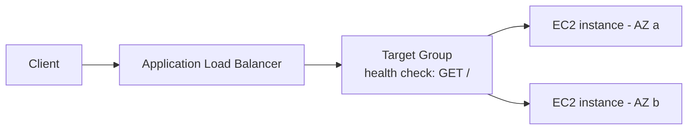

# AWS Lab: Load Balancing with an Application Load Balancer (ALB)

> Put an ALB in front of two EC2 instances and watch it distribute traffic and health-
> check out a failed instance — the managed, production version of the
> [Nginx load-balancing lab](../load-balancing-nginx.md).

> ⚠️ **Costs:** ALB bills per hour + per LCU; `t3.micro` EC2 is Free-Tier eligible. Tear
> down when done. Read [setup-and-costs](./setup-and-costs.md) first.

## What you'll learn
- How a cloud **L7 load balancer** distributes HTTP traffic across a **target group**.
- How **active health checks** automatically remove and re-add instances.
- The difference between **ALB (L7)** and **NLB (L4)**, and where each fits.

⏱️ ~30 minutes · 💰 ~Free-Tier if torn down promptly · ☁️ AWS account

## Lab architecture


## Prerequisites
- AWS CLI configured; a default VPC with ≥2 subnets in different AZs; a security group
  allowing HTTP:80.

## Setup

**1. Launch 2 EC2 instances** (`t3.micro`, Amazon Linux 2023) in two AZs. User-data runs a
web server that returns the instance's hostname:
```bash
#!/bin/bash
dnf install -y httpd
echo "Served by $(hostname)" > /var/www/html/index.html
systemctl enable --now httpd
```

**2. Create a target group** (HTTP:80, health check `/`) and register both instances:
```bash
aws elbv2 create-target-group --name lab-tg --protocol HTTP --port 80 \
  --vpc-id <vpc-id> --health-check-path /
aws elbv2 register-targets --target-group-arn <tg-arn> \
  --targets Id=<i-aaa> Id=<i-bbb>
```

**3. Create the ALB + a listener** forwarding to the target group:
```bash
aws elbv2 create-load-balancer --name lab-alb --type application \
  --subnets <subnet-a> <subnet-b> --security-groups <sg-id>
aws elbv2 create-listener --load-balancer-arn <alb-arn> \
  --protocol HTTP --port 80 \
  --default-actions Type=forward,TargetGroupArn=<tg-arn>
```
(SGs must allow HTTP:80 to the ALB and from the ALB to the instances.)

## Run it
```bash
ALB_DNS=$(aws elbv2 describe-load-balancers --names lab-alb \
  --query "LoadBalancers[0].DNSName" --output text)

# Requests alternate across the two instances
for i in $(seq 1 6); do curl -s http://$ALB_DNS/; done

# Stop one instance and keep curling (wait ~30s for health checks)
aws ec2 stop-instances --instance-ids <i-aaa>
for i in $(seq 1 6); do curl -s http://$ALB_DNS/; done
```

## What to observe & why
- Responses alternate between the two instance hostnames — the ALB spreads requests across
  healthy targets in the group (round-robin by default).
- After stopping one instance, the **active health check** (the ALB polls `/`) marks it
  **unhealthy** and stops routing to it within a couple of checks; all responses now come
  from the survivor — **no client errors**. This is the managed equivalent of the Nginx
  passive health check, but with a dedicated probe.
- Check target health directly:
  `aws elbv2 describe-target-health --target-group-arn <tg-arn>`.

## Common pitfalls
- **Security groups** are the #1 gotcha: the ALB's SG must allow inbound 80 from the
  internet, and the instances' SG must allow 80 **from the ALB's SG**.
- **Subnets in ≥2 AZs** are required for an ALB.
- Targets show **unhealthy** until the health check path returns 200 — verify httpd is up.

## Teardown
```bash
aws elbv2 delete-listener --listener-arn <listener-arn>
aws elbv2 delete-load-balancer --load-balancer-arn <alb-arn>
aws elbv2 delete-target-group --target-group-arn <tg-arn>
aws ec2 terminate-instances --instance-ids <i-aaa> <i-bbb>
```

## In the real world (common production pattern)
- **ALB (L7)** for HTTP/HTTPS: path/host routing, TLS termination, WebSocket, integrates
  with **autoscaling groups** that auto-register/deregister targets and **ECS/EKS** for
  containers. **NLB (L4)** for raw TCP/UDP, extreme throughput, or static IPs.
- Targets are almost always an **Auto Scaling Group** of stateless instances/containers, so
  capacity grows/shrinks automatically and unhealthy hosts are replaced.
- Front the ALB with **Route 53** (DNS, health-based + latency routing) and **CloudFront**
  for global edge; **WAF** attaches to the ALB for security.
- Multi-AZ targets give availability; multi-region needs Route 53 / Global Accelerator.

## Connect to theory
- Concept: [Load balancers](../../1-knowledge/building-blocks/load-balancers.md)
- Local version: [Nginx load-balancing lab](../load-balancing-nginx.md)
- Pairs with: [RDS replication](./rds-replication.md) for a full scalable tier.
