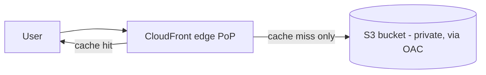

# AWS Lab: Object Storage + CDN with S3 + CloudFront

> Store a file in S3 and serve it through the CloudFront CDN — the real-world pattern
> behind images, video, and static assets, and the managed version of the
> [CDN concept](../../1-knowledge/building-blocks/cdn.md).

> ⚠️ **Costs:** S3 + CloudFront are cheap and mostly Free-Tier for tiny usage. Tear down
> anyway. CloudFront distributions take ~5–15 min to deploy/disable.

## What you'll learn
- How **object storage (S3)** serves files via a key, with a private bucket.
- How a **CDN (CloudFront)** caches at the edge — first request misses, then hits.
- The **"blob in S3, URL in DB, served via CDN"** pattern used everywhere.

⏱️ ~25 minutes · 💰 ~Free-Tier · ☁️ AWS account

## Lab architecture


## Prerequisites
- AWS CLI configured; a globally-unique bucket name.

## Setup

**1. Create a bucket and upload an object:**
```bash
BUCKET=swedocs-lab-$RANDOM
aws s3 mb s3://$BUCKET
echo "hello from S3 origin" > index.html
aws s3 cp index.html s3://$BUCKET/index.html
```
**2. Create a CloudFront distribution** with the bucket as origin, using **Origin Access
Control (OAC)** so the bucket stays private and only CloudFront can read it. Console:
CloudFront → Create distribution → S3 origin → enable OAC → let it update the bucket policy.
**3.** Wait until **Status = Deployed**; note the domain (`dxxxx.cloudfront.net`).

## Run it
```bash
DIST=dxxxxxxxxxxxxx.cloudfront.net

# First request: MISS (fetched from S3, then cached at the edge)
curl -sI https://$DIST/index.html | grep -i x-cache

# Second request: HIT from the edge
curl -sI https://$DIST/index.html | grep -i x-cache
```

## What to observe & why
- First response: `X-Cache: Miss from cloudfront` — the edge had no copy, so it fetched
  from the S3 origin and cached it.
- Second response: `X-Cache: Hit from cloudfront` — served from the edge PoP **without
  touching S3**: lower latency for the user and origin load offloaded. At scale this is why
  a CDN serves ~all read traffic for static assets.
- The bucket itself is **private** (OAC) — users can't hit S3 directly, only via
  CloudFront.

## Common pitfalls
- **Bucket policy / OAC** must allow CloudFront to read the bucket, or you get 403s. The
  console wizard sets this up; manual setups often miss it.
- **Distribution propagation** takes minutes — don't expect instant changes.
- **Stale content:** edits aren't visible until TTL expiry or an explicit **invalidation**;
  production uses **versioned filenames** (`app.a1b2.js`) instead of invalidating.

## Teardown
```bash
# Disable then delete the distribution (console is simplest), then:
aws s3 rm s3://$BUCKET --recursive
aws s3 rb s3://$BUCKET
```

## In the real world (common production pattern)
- The universal pattern: **store the blob in object storage (S3), keep only its URL/key in
  your database, and serve it through a CDN.** Used by
  [Instagram](../../2-case-studies/companies/instagram.md) (photos) and every app with user
  uploads.
- **Video** ([streaming case study](../../2-case-studies/video-streaming.md)) stores
  pre-encoded segments in S3 and serves via CloudFront; Netflix extends this with
  **Open Connect** appliances inside ISPs.
- **Direct-to-S3 uploads** via **presigned URLs** keep large transfers off your servers.
- **Cache-Control headers + cache-busting filenames** manage freshness; **S3 lifecycle
  policies** tier cold data to cheaper storage (Glacier).
- Equivalents: GCP **Cloud Storage + Cloud CDN**, Azure **Blob + CDN**, **Cloudflare R2**.

## Connect to theory
- Concepts: [Object storage](../../1-knowledge/data-storage/object-storage.md) ·
  [CDN](../../1-knowledge/building-blocks/cdn.md)
- Used in: [video streaming](../../2-case-studies/video-streaming.md),
  [Instagram](../../2-case-studies/companies/instagram.md).
