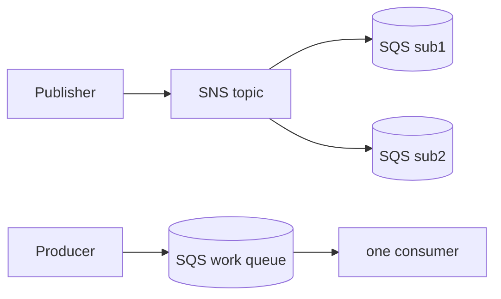

# AWS Lab: Queues & Pub/Sub with SQS + SNS

> Use SQS for a point-to-point work queue and SNS for fan-out pub/sub — the managed,
> serverless version of the [Kafka lab](../kafka-pubsub.md), and effectively free.

> ⚠️ **Costs:** SQS/SNS have generous always-free tiers; this lab is effectively free.
> Delete the resources anyway.

## What you'll learn
- **SQS** as a work queue: one message consumed by **one** worker (point-to-point).
- **SNS → multiple SQS** as **fan-out**: one message copied to **every** subscriber.
- **Visibility timeout** and at-least-once delivery in practice.

⏱️ ~20 minutes · 💰 free · ☁️ AWS account

## Lab architecture


## Prerequisites
- AWS CLI configured.

## Part A — SQS work queue
```bash
QURL=$(aws sqs create-queue --queue-name lab-queue --query QueueUrl --output text)

aws sqs send-message --queue-url $QURL --message-body "order-1"      # producer
aws sqs receive-message --queue-url $QURL --query "Messages[0].Body" --output text  # consumer
```
**Observe:** the consumer receives `order-1`. After `receive`, the message is **invisible**
for the *visibility timeout* (default 30s) instead of being deleted — you must
`delete-message` (using its receipt handle) to remove it. If you don't, it **reappears** —
that's **at-least-once** delivery (a crashed worker won't lose the message).

## Part B — SNS fan-out to two queues
```bash
TOPIC=$(aws sns create-topic --name lab-topic --query TopicArn --output text)
Q1=$(aws sqs create-queue --queue-name sub1 --query QueueUrl --output text)
Q2=$(aws sqs create-queue --queue-name sub2 --query QueueUrl --output text)
# (fetch each queue ARN via get-queue-attributes, add a policy allowing SNS to send, then:)
aws sns subscribe --topic-arn $TOPIC --protocol sqs --notification-endpoint <q1-arn>
aws sns subscribe --topic-arn $TOPIC --protocol sqs --notification-endpoint <q2-arn>

aws sns publish --topic-arn $TOPIC --message "OrderPlaced:42"        # publish ONCE
aws sqs receive-message --queue-url $Q1 --query "Messages[0].Body"
aws sqs receive-message --queue-url $Q2 --query "Messages[0].Body"
```

## What to observe & why
- **Part A:** one consumer gets the message (point-to-point work distribution). The
  visibility-timeout + explicit delete is how SQS guarantees a message isn't lost if a
  worker dies mid-processing.
- **Part B:** **both** `sub1` and `sub2` receive the single published message — SNS
  **fanned it out** to every subscriber. This is the SNS+SQS fan-out pattern: one event,
  many independent consumers (e.g. email service + analytics + inventory), each with its
  own durable queue.

## Common pitfalls
- **SNS→SQS needs a queue access policy** allowing SNS to `SendMessage`, or the queues stay
  empty. Easy to forget.
- **Duplicates:** standard queues are at-least-once → make consumers **idempotent**.
- **Forgetting to delete-message** makes messages reappear (looks like a bug, is a feature).

## Teardown
```bash
aws sqs delete-queue --queue-url $QURL
aws sqs delete-queue --queue-url $Q1
aws sqs delete-queue --queue-url $Q2
aws sns delete-topic --topic-arn $TOPIC
```

## In the real world (common production pattern)
- **SQS + SNS (or EventBridge)** is the default AWS messaging stack for decoupling
  services, buffering spikes, and fan-out — the
  [notification system](../../2-case-studies/notification-system.md) pattern.
- **Dead-letter queues** capture messages that repeatedly fail; **FIFO queues** add
  ordering + exactly-once where needed.
- **SQS vs Kafka:** SQS is a simple managed task queue (no replay, message deleted on ack);
  **Kafka/Kinesis** are durable logs for replay, multiple consumers, and high-throughput
  streaming (see the [Kafka lab](../kafka-pubsub.md)). Pick by whether you need replay.
- **EventBridge** adds routing/filtering on events for event-driven architectures.

## Connect to theory
- Concepts: [Message queues & pub/sub](../../1-knowledge/building-blocks/message-queues.md) ·
  [Event-driven architecture](../../1-knowledge/patterns/event-driven.md)
- Local version: [Kafka lab](../kafka-pubsub.md)
- Used in: [notification system](../../2-case-studies/notification-system.md).
