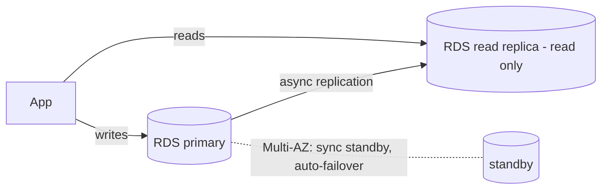

# AWS Lab: Replication with RDS (Read Replica & Multi-AZ)

> Create a managed PostgreSQL on RDS, add a **read replica**, and see writes propagate —
> the managed version of the [Postgres replication lab](../postgres-replication.md).

> ⚠️ **Costs:** RDS bills per hour even when idle; use `db.t3.micro` (Free-Tier eligible)
> and **delete promptly**. A read replica is a second billable instance.

## What you'll learn
- How **managed read replicas** scale reads with one command (no manual WAL setup).
- The crucial difference between **read replicas** (read scaling) and **Multi-AZ** (high
  availability/failover).
- How **replication lag** shows up on a managed service.

⏱️ ~30 minutes (RDS is slow to provision) · 💰 low (delete promptly) · ☁️ AWS account

## Lab architecture


## Prerequisites
- AWS CLI; a VPC; an EC2 client in the same VPC (RDS isn't public by default).

## Setup
**1. Primary DB:**
```bash
aws rds create-db-instance \
  --db-instance-identifier lab-primary \
  --engine postgres --db-instance-class db.t3.micro --allocated-storage 20 \
  --master-username app --master-user-password 'ChangeMe123!' \
  --db-name appdb --no-publicly-accessible
```
**2.** Wait until `available`, then a **read replica:**
```bash
aws rds create-db-instance-read-replica \
  --db-instance-identifier lab-replica \
  --source-db-instance-identifier lab-primary
```
**3.** Get both endpoints:
```bash
aws rds describe-db-instances \
  --query "DBInstances[].[DBInstanceIdentifier,Endpoint.Address]" --output text
```

## Run it
From the EC2 client (`psql` installed):
```bash
PRIMARY=<primary-endpoint>; REPLICA=<replica-endpoint>

PGPASSWORD='ChangeMe123!' psql -h $PRIMARY -U app -d appdb \
  -c "CREATE TABLE t(id int); INSERT INTO t VALUES (1),(2),(3);"

sleep 5
PGPASSWORD='ChangeMe123!' psql -h $REPLICA -U app -d appdb -c "SELECT * FROM t;"
PGPASSWORD='ChangeMe123!' psql -h $REPLICA -U app -d appdb -c "INSERT INTO t VALUES (4);"
```

## What to observe & why
- The replica returns rows `1, 2, 3` — AWS handled all the streaming-replication wiring;
  you just asked for a replica. Direct read traffic here to **offload the primary**.
- Writing to the replica fails (read-only) — same single-source-of-truth rule as the local
  lab.
- The `sleep 5` matters: immediately after the write, the replica may not have caught up
  (**replication lag**) — read-your-writes needs the primary.

## Common pitfalls
- **Forgetting to delete** — RDS is the most common surprise-bill source. Delete both
  instances when done.
- **Connecting from your laptop** fails (RDS is private) — use the in-VPC EC2 client.
- **Read replica ≠ failover target by default** — promoting it is manual unless you use
  Multi-AZ.

## Teardown
```bash
aws rds delete-db-instance --db-instance-identifier lab-replica --skip-final-snapshot
aws rds delete-db-instance --db-instance-identifier lab-primary --skip-final-snapshot
```

## In the real world (common production pattern)
- **Read replicas** scale read-heavy workloads (analytics, dashboards, read APIs); apps do
  **read/write splitting** — writes + read-your-writes to primary, the rest to replicas.
- **Multi-AZ** (`--multi-az`) keeps a **synchronous standby** in another AZ with
  **automatic failover** in 60–120s — this is for **availability**, a different goal from
  read scaling. Production critical DBs use both: Multi-AZ **and** read replicas.
- **Aurora** decouples compute from a distributed storage layer: up to 15 low-lag replicas,
  faster failover, and **Aurora Serverless** for autoscaling.
- **Cross-region replicas** serve global reads and disaster recovery.
- Sharding ([DynamoDB lab](./dynamodb-partitioning.md) / Vitess) is the next step when
  **writes** outgrow a single primary.

## Connect to theory
- Concepts: [Replication](../../1-knowledge/data-storage/replication.md) ·
  [Redundancy & failover](../../1-knowledge/reliability/redundancy-failover.md)
- Local version: [Postgres replication lab](../postgres-replication.md)
- Next step: [DynamoDB partitioning](./dynamodb-partitioning.md) (scales writes).
