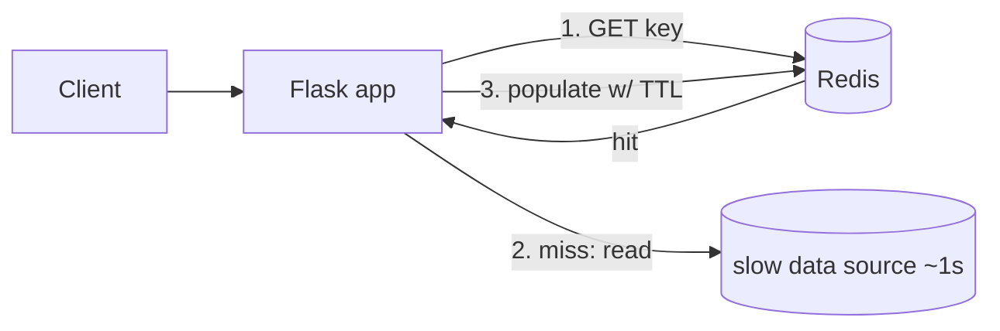

# Practice Lab: Caching with Redis (Cache-Aside)

> Measure how a cache turns a slow data source into fast responses, using the
> cache-aside pattern — the most common caching pattern in production.

## What you'll learn
- The **cache-aside** (lazy-loading) pattern: check cache → on miss, load + populate.
- How a cache cuts both **latency** and **load** on the source of truth.
- How **TTL** trades freshness for hit rate, and where **staleness** comes from.
- The hands-on version of [Caching strategies](../1-knowledge/building-blocks/caching.md).

⏱️ ~10 minutes · 💰 free · 🐳 Docker only

## Lab architecture


## Prerequisites
- Docker + Docker Compose. Port `5000` free.

## Setup

**1. `app.py`** — a deliberately slow data source + cache-aside logic:
```python
import time, redis, json
from flask import Flask
app = Flask(__name__)
cache = redis.Redis(host="redis", port=6379)

def slow_db_lookup(item_id):
    time.sleep(1)                         # pretend the DB is slow (1s)
    return {"id": item_id, "name": f"Item {item_id}"}

@app.get("/items/<item_id>")
def get_item(item_id):
    cached = cache.get(item_id)           # 1. check cache
    if cached:
        return {"source": "cache", "data": json.loads(cached)}
    data = slow_db_lookup(item_id)        # 2. miss -> read source of truth
    cache.setex(item_id, 30, json.dumps(data))   # 3. populate, TTL=30s
    return {"source": "db", "data": data}
```

**2. `docker-compose.yml`:**
```yaml
services:
  redis: { image: redis:7-alpine }
  app:
    image: python:3.12-slim
    working_dir: /app
    volumes: [ "./app.py:/app/app.py" ]
    command: sh -c "pip install flask redis -q && flask run --host 0.0.0.0"
    ports: [ "5000:5000" ]
    depends_on: [ redis ]
```

**3. Bring it up:**
```bash
docker compose up -d
sleep 5   # let pip install + flask start
```

## Run it
```bash
# First call -> cache MISS (slow, ~1s, source: db)
time curl -s localhost:5000/items/42

# Second call -> cache HIT (fast, source: cache)
time curl -s localhost:5000/items/42

# Inspect the cached key + its TTL countdown
docker compose exec redis redis-cli get 42
docker compose exec redis redis-cli ttl 42
```

## What to observe & why
- **First request** is `"source":"db"` and takes **~1,000 ms** — a cache miss, so the app
  paid the full cost of the slow source, then stored the result.
- **Second request** is `"source":"cache"` and takes **a few ms** — served entirely from
  Redis; the slow source was never touched.
- `ttl 42` shows the remaining seconds. After 30s the key **expires**, and the next read
  is a miss again (slow), then re-populates. This is the freshness/hit-rate trade-off:
  longer TTL = more hits but staler data.

## Sample expected output
```
# miss:
real    0m1.04s
{"data":{"id":"42","name":"Item 42"},"source":"db"}
# hit:
real    0m0.01s
{"data":{"id":"42","name":"Item 42"},"source":"cache"}
# redis:
"{\"id\": \"42\", \"name\": \"Item 42\"}"
(integer) 27
```

## Experiments to try
1. **Hit-rate effect:** loop 100 reads of the same key and time them — only the first is
   slow. Now read 100 *different* keys (`/items/1..100`) — every one is a miss. This is
   why cache value depends on **access skew**.
2. **TTL vs staleness:** raise TTL to 300s; update what `slow_db_lookup` returns and
   notice the cache keeps serving the old value until expiry — that's stale data.
3. **Manual invalidation:** `redis-cli del 42` and watch the next read miss → the
   write-side fix for staleness (invalidate on change).
4. **Eviction:** set a tiny `maxmemory` + `maxmemory-policy allkeys-lru` and flood keys to
   watch LRU eviction.

## Common pitfalls
- **Cache stampede / thundering herd:** if a hot key expires, many concurrent requests all
  miss and hit the DB at once. Mitigate with a short lock, request coalescing, or
  staggered TTLs (real systems do this — see [Discord's request
  coalescing](../2-case-studies/companies/discord.md)).
- **Caching write-only/rare data** wastes memory — cache what's actually read often.
- **No TTL + no invalidation = permanent staleness.** Always have one or the other.

## Teardown
```bash
docker compose down
```

## In the real world (common production pattern)
- **Cache-aside is the default** caching pattern at most companies, with **Redis** or
  **Memcached** as a shared cache tier in front of the database.
- **Managed caches:** AWS **ElastiCache**, GCP **Memorystore**, Azure **Cache for Redis**
  give you replication, failover, and backups (see the
  [ElastiCache lab](./aws/caching-elasticache.md)).
- **Write strategies** vary by need: write-through (cache always fresh), write-back (fast
  writes, durability risk), write-around (don't cache write-only data).
- **Multi-layer caching** is normal: browser → CDN → app/in-memory → distributed Redis →
  DB buffer cache. A request ideally never reaches the DB.
- **Hot-key defense:** replicate hot keys / put them behind a CDN; coalesce requests.

## Connect to theory
- Concept: [Caching strategies](../1-knowledge/building-blocks/caching.md)
- Managed equivalent: [ElastiCache for Redis lab](./aws/caching-elasticache.md)
- Used in: [URL shortener](../2-case-studies/url-shortener.md),
  [news feed](../2-case-studies/news-feed.md) (feed cache), nearly every read-heavy system.
