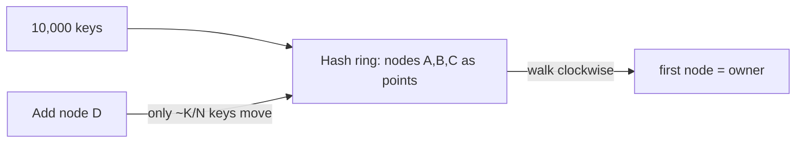

# Practice Lab: Consistent Hashing

> Implement a consistent-hash ring and measure how few keys move when a node is
> added/removed — versus naive modulo hashing.

## What you'll learn
- Why `hash(key) % N` causes a massive reshuffle when `N` changes.
- How **consistent hashing** limits movement to ~**K/N** keys.
- How **virtual nodes** improve load balance.
- The hands-on version of [Consistent hashing](../1-knowledge/building-blocks/consistent-hashing.md).

⏱️ ~10 minutes · 💰 free · 🐍 Python only (no Docker)

## Lab architecture


## Prerequisites
- Python 3 (`python --version`). Nothing else.

## Setup

**`ring.py`:**
```python
import hashlib, bisect

def h(s):
    return int(hashlib.md5(str(s).encode()).hexdigest(), 16)

class HashRing:
    def __init__(self, nodes, vnodes=100):
        self.vnodes = vnodes
        self.ring = {}            # ring position -> node
        self.sorted = []          # sorted ring positions
        for n in nodes:
            self.add(n)
    def add(self, node):
        for i in range(self.vnodes):           # each node placed at many points
            k = h(f"{node}-{i}")
            self.ring[k] = node
            bisect.insort(self.sorted, k)
    def get(self, key):
        k = h(key)
        idx = bisect.bisect(self.sorted, k) % len(self.sorted)
        return self.ring[self.sorted[idx]]     # walk clockwise to first node

KEYS = [f"key{i}" for i in range(10000)]

# --- consistent hashing: add a node, count movement ---
r = HashRing(["A", "B", "C"])
before = {k: r.get(k) for k in KEYS}
r.add("D")
after = {k: r.get(k) for k in KEYS}
moved = sum(1 for k in KEYS if before[k] != after[k])
print(f"consistent hashing: {moved}/{len(KEYS)} keys moved ({moved/100:.1f}%)")

# --- naive modulo for comparison ---
b = {k: h(k) % 3 for k in KEYS}
a = {k: h(k) % 4 for k in KEYS}
moved2 = sum(1 for k in KEYS if b[k] != a[k])
print(f"modulo hashing:     {moved2}/{len(KEYS)} keys moved ({moved2/100:.1f}%)")

# --- balance: keys per node ---
from collections import Counter
print("distribution:", Counter(after.values()))
```

## Run it
```bash
python ring.py
```

## What to observe & why
- **Consistent hashing** moves only ~**2,500/10,000 (~25%)** keys when going from 3→4
  nodes — roughly **K/N**. Only keys that now fall to the new node's ring range relocate;
  everyone else stays put.
- **Modulo hashing** moves ~**7,500/10,000 (~75%)** keys for the same 3→4 change — because
  `% 3` vs `% 4` is different for almost every key. At scale that's a **cache-miss storm**
  or a huge data reshuffle.
- The `distribution` Counter shows each node owning roughly a quarter of keys — thanks to
  **virtual nodes** spreading each node across the ring.

## Sample expected output
```
consistent hashing: 2487/10000 keys moved (24.9%)
modulo hashing:     7501/10000 keys moved (75.0%)
distribution: Counter({'A': 2600, 'D': 2530, 'C': 2470, 'B': 2400})
```

## Experiments to try
1. **Virtual node count vs balance:** set `vnodes=1` and re-run — the `distribution`
   becomes badly **uneven** (some nodes get far more keys). Raise to `vnodes=500` and it
   evens out. This is *why* virtual nodes exist.
2. **Remove a node:** call `r` built with 4 nodes, then remove one and recount — again only
   ~K/N keys move (they go to the removed node's ring neighbors).
3. **Weighting:** give a "bigger" node more vnodes and watch it take a proportionally
   larger share.

## Common pitfalls
- **Too few virtual nodes → hotspots** (uneven load), the most common real bug.
- Consistent hashing solves **resharding cost**, not **hot keys** — a single popular key
  still lands on one node (needs replication of that key).
- Hash function quality matters for even distribution.

## Teardown
Nothing to clean up — it's a single script.

## In the real world (common production pattern)
- **Distributed databases:** **Cassandra** and **DynamoDB** partition data with consistent
  hashing + virtual nodes, so adding capacity moves minimal data (see the
  [key-value store case study](../2-case-studies/key-value-store.md)).
- **Caching tiers:** **Memcached** client libraries hash keys to servers consistently, so
  adding a cache node doesn't flush the whole cache.
- **CDNs and load balancers:** used to map requests/objects to edge servers; Google's
  **Maglev** and "consistent hashing with bounded loads" refine it to avoid overload.
- **Service meshes / sharded services:** route requests for a key to the owning instance
  (e.g. Uber's **Ringpop**).
- The takeaway engineers rely on: **never `% N` across a changing server set** — use
  consistent hashing.

## Connect to theory
- Concept: [Consistent hashing](../1-knowledge/building-blocks/consistent-hashing.md)
- Used in: [key-value store](../2-case-studies/key-value-store.md),
  [sharding](../1-knowledge/data-storage/sharding.md),
  [web crawler](../2-case-studies/web-crawler.md) host partitioning.
- Pairs with: [sharding lab](./sharding-demo.md) (shows the `% N` problem this fixes).
