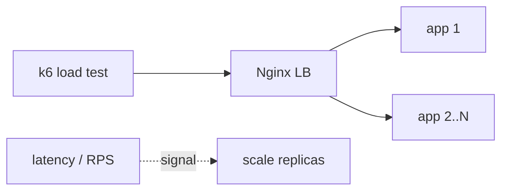

# Cross-cutting: Autoscaling & Load Testing

> Drive a service with a **load test**, watch latency climb as it saturates, then **scale
> out** and watch latency recover — the feedback loop behind autoscaling.

⏱️ ~25 min · 💰 free locally · 🐳 Docker · 🐍 Python · ☁️ AWS optional

## What you'll build


## Concepts you connect
- [Capacity planning](../1-knowledge/reliability/capacity-planning.md) + autoscaling
- [Load balancing](../1-knowledge/building-blocks/load-balancers.md)
- [Latency vs throughput](../1-knowledge/fundamentals/latency-throughput.md) (Little's Law)

## Build it locally (🐳)

**1. `app.py`** — a CPU-ish endpoint with bounded concurrency per instance:
```python
import time
from flask import Flask
app = Flask(__name__)
@app.get("/work")
def work():
    time.sleep(0.1)        # ~100ms of work per request -> ~10 rps per worker thread
    return {"ok": True}
```

**2. `nginx.conf`** — load-balance across replicas via Docker DNS:
```nginx
events {}
http {
  resolver 127.0.0.11 valid=5s;
  server { listen 80; location / { set $u app:5000; proxy_pass http://$u; } }
}
```

**3. `load.js`** — a k6 script ramping virtual users:
```javascript
import http from 'k6/http';
import { check } from 'k6';
export const options = {
  stages: [
    { duration: '20s', target: 50 },   // ramp to 50 concurrent users
    { duration: '40s', target: 50 },   // hold
  ],
  thresholds: { http_req_duration: ['p95<500'] },  // SLO: p95 < 500ms
};
export default function () {
  const r = http.get('http://lb/work');
  check(r, { '200': (res) => res.status === 200 });
}
```

**4. `docker-compose.yml`:**
```yaml
services:
  app:
    image: python:3.12-slim
    volumes: [ "./app.py:/app/app.py" ]
    working_dir: /app
    command: sh -c "pip install flask gunicorn -q && gunicorn -w 2 -b 0.0.0.0:5000 app:app"
    deploy: { replicas: 1 }            # start with ONE replica
  lb:
    image: nginx:alpine
    volumes: [ "./nginx.conf:/etc/nginx/nginx.conf:ro" ]
    depends_on: [ app ]
  k6:
    image: grafana/k6
    volumes: [ "./load.js:/load.js" ]
    command: run /load.js
    depends_on: [ lb ]
```

```bash
docker compose up -d app lb
sleep 5
```

## Run the end-to-end flow
```bash
# 1. Load test with ONE replica — watch p95 blow past the 500ms SLO
docker compose run --rm k6

# 2. Scale OUT to 5 replicas (the "autoscaler" reacting to high latency)
docker compose up -d --scale app=5
sleep 5

# 3. Re-run the same load — p95 now comfortably under the SLO
docker compose run --rm k6
```

## What to observe & why
- With **1 replica**, 50 concurrent users overwhelm the limited worker threads; requests
  **queue**, and k6 reports **p95 latency well over 500ms** (the SLO **fails**). This is
  saturation — by **Little's Law**, concurrency = throughput × latency, so when arrival rate
  exceeds capacity, latency explodes.
- After **scaling to 5 replicas**, the load balancer spreads the same traffic across 5×
  the capacity; the queue drains and **p95 drops back under the SLO**. More throughput, same
  per-request latency.
- This is the exact signal an autoscaler watches: **a metric (latency / CPU / RPS) crosses a
  threshold → add instances; falls → remove them.**

## Deploy / scale on AWS (☁️)
| Local | AWS managed |
| --- | --- |
| `--scale app=N` | **EC2 Auto Scaling Group** or **ECS/EKS service autoscaling** |
| k6 | k6 / **Distributed Load Testing on AWS** |
| scale signal | **CloudWatch alarm** (CPU, ALB latency, RPS) → scaling policy |
| **k8s** | **HPA** (Horizontal Pod Autoscaler) on CPU/custom metrics |

Real autoscaling: a **CloudWatch alarm** on target latency or CPU triggers the ASG/HPA to
add tasks; **scheduled** scaling pre-warms for known peaks (the
[capacity planning doc](../1-knowledge/reliability/capacity-planning.md)).

## Observe & break it
1. **Find the knee:** scale to 2, 3, 4 replicas and re-run; plot replicas vs p95 to see
   where it crosses the SLO — that's your required capacity.
2. **Downstream bottleneck:** point all replicas at one small Postgres and watch scaling the
   app **stop helping** — you moved the bottleneck (autoscaling can't fix a single-DB write
   limit; you'd need [sharding](./project-news-feed.md)/replicas).
3. **Cold-start lag:** note scaling isn't instant — replicas take time to boot, so reactive
   scaling lags sudden spikes (hence predictive/scheduled scaling).

## Mirrors
[Capacity planning](../1-knowledge/reliability/capacity-planning.md); how every elastic tier
(ASG/ECS/HPA) responds to load. Apply it to any project in this folder.

## Teardown
```bash
docker compose down
```
