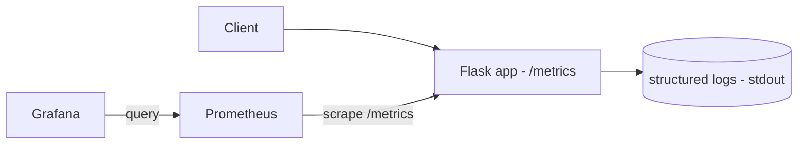

# Cross-cutting: Observability (Metrics, Logs, Traces)

> Instrument a service so you can answer "what's wrong, where, and why?" in production. Wire
> up the three pillars — **metrics** (Prometheus + Grafana), **structured logs**, and the
> idea of **traces** — around a real endpoint.

⏱️ ~25 min · 💰 free locally · 🐳 Docker · 🐍 Python · ☁️ AWS optional

## What you'll build


Apply this on top of **any** project in this folder (orders, feed, etc.) — observability is
cross-cutting.

## Concepts you connect
- [Observability: metrics, logs, traces](../1-knowledge/reliability/observability.md)
- The **Four Golden Signals** (latency, traffic, errors, saturation)
- [SLIs/SLOs](../1-knowledge/fundamentals/sla-slo-sli.md)

## Build it locally (🐳)

**1. `app.py`** — expose Prometheus metrics + structured logs:
```python
import time, random, logging, json
from flask import Flask, request
from prometheus_client import Counter, Histogram, make_wsgi_app
from werkzeug.middleware.dispatcher import DispatcherMiddleware
app = Flask(__name__)

REQS = Counter("http_requests_total", "requests", ["method", "path", "status"])
LAT = Histogram("http_request_duration_seconds", "latency", ["path"])

def log(**kw): print(json.dumps(kw))           # structured (JSON) logs

@app.get("/work")
def work():
    start = time.time()
    time.sleep(random.uniform(0, 0.3))          # simulate work
    status = 500 if random.random() < 0.1 else 200    # ~10% errors
    dur = time.time() - start
    REQS.labels("GET", "/work", status).inc()
    LAT.labels("/work").observe(dur)
    log(level="info", path="/work", status=status, duration_ms=round(dur*1000),
        trace_id=request.headers.get("X-Trace-Id", "none"))
    return {"ok": status == 200}, status

# expose /metrics for Prometheus to scrape
app.wsgi_app = DispatcherMiddleware(app.wsgi_app, {"/metrics": make_wsgi_app()})
```

**2. `prometheus.yml`:**
```yaml
global: { scrape_interval: 5s }
scrape_configs:
  - job_name: app
    static_configs: [ { targets: [ "app:5000" ] } ]
```

**3. `docker-compose.yml`:**
```yaml
services:
  app:
    image: python:3.12-slim
    volumes: [ "./app.py:/app/app.py" ]
    working_dir: /app
    command: sh -c "pip install flask prometheus_client -q && flask run --host 0.0.0.0"
    environment: { FLASK_APP: app.py }
    ports: [ "5000:5000" ]
  prometheus:
    image: prom/prometheus
    volumes: [ "./prometheus.yml:/etc/prometheus/prometheus.yml:ro" ]
    ports: [ "9090:9090" ]
  grafana:
    image: grafana/grafana
    environment: { GF_AUTH_ANONYMOUS_ENABLED: "true", GF_AUTH_ANONYMOUS_ORG_ROLE: Admin }
    ports: [ "3000:3000" ]
    depends_on: [ prometheus ]
```

```bash
docker compose up -d
sleep 8
```

## Run the end-to-end flow
```bash
# Generate traffic
for i in $(seq 1 200); do curl -s -o /dev/null localhost:5000/work; done

# Structured logs
docker compose logs app | tail -5

# Query metrics directly (or use Grafana)
curl -s 'localhost:9090/api/v1/query?query=rate(http_requests_total[1m])' | python -m json.tool
```
Then open **Grafana** at `localhost:3000` → add Prometheus data source
(`http://prometheus:9090`) → graph `rate(http_requests_total[1m])` and
`histogram_quantile(0.95, rate(http_request_duration_seconds_bucket[1m]))` (p95 latency).

## What to observe & why
- **Metrics:** Prometheus scrapes `/metrics` every 5s; you can chart **traffic** (request
  rate), **errors** (rate of status=500), and **latency** (p95 from the histogram) — three
  of the Four Golden Signals, the things users actually feel.
- **Logs:** each request emits a **structured JSON** line with status, duration, and a
  `trace_id` — greppable/queryable, and the `trace_id` lets you correlate one request across
  services (the basis of distributed tracing).
- You're observing the system from its **outputs** without touching the running process —
  exactly what you need at 3am.

## Deploy / scale on AWS (☁️)
| Local | AWS managed |
| --- | --- |
| Prometheus | **CloudWatch / Managed Prometheus (AMP)** |
| Grafana | **Managed Grafana (AMG)** |
| structured logs | **CloudWatch Logs** |
| traces | **AWS X-Ray** / OpenTelemetry |

Instrument with **OpenTelemetry** once and export to whichever backend; alert on
**symptoms** (high error rate, slow p99) tied to your SLOs.

## Observe & break it
1. **Alerting:** add a Prometheus alert rule for `rate(5xx) > 0.2` and watch it fire under
   load.
2. **Trace a request:** pass `-H "X-Trace-Id: abc123"` and find that id across the logs —
   imagine it flowing through every service (add it to the [orders](./project-event-driven-orders.md)
   or [saga](./project-saga.md) projects).
3. **Saturation:** add a CPU-bound endpoint and watch latency rise with load.

## Mirrors
[Observability knowledge doc](../1-knowledge/reliability/observability.md); every production
system runs this stack (Prometheus/Grafana/Jaeger or Datadog/CloudWatch).

## Teardown
```bash
docker compose down
```
