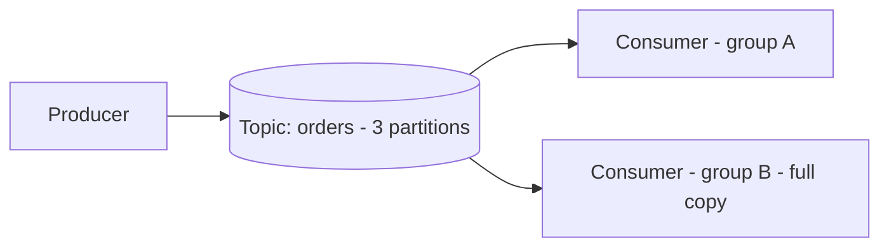

# Practice Lab: Message Queue with Kafka

> Publish messages to a Kafka topic and consume them, observing decoupling, log
> retention, and consumer groups — the backbone of event-driven systems.

## What you'll learn
- How a **producer** and **consumer** communicate **asynchronously** through a topic.
- Why Kafka is **log-based** (messages persist after being read → replayable).
- How **consumer groups** split partitions to scale out, vs separate groups each getting
  a full copy (pub/sub).
- The hands-on version of [Message queues & pub/sub](../1-knowledge/building-blocks/message-queues.md).

⏱️ ~15 minutes · 💰 free · 🐳 Docker only

## Lab architecture


## Prerequisites
- Docker + Docker Compose. Port `9092` free. ~1 GB free RAM for the broker.

## Setup

**`docker-compose.yml`** — single-node Kafka in **KRaft** mode (no ZooKeeper):
```yaml
services:
  kafka:
    image: bitnami/kafka:3.7
    ports: [ "9092:9092" ]
    environment:
      KAFKA_CFG_NODE_ID: "0"
      KAFKA_CFG_PROCESS_ROLES: controller,broker
      KAFKA_CFG_CONTROLLER_QUORUM_VOTERS: "0@kafka:9093"
      KAFKA_CFG_LISTENERS: "PLAINTEXT://:9092,CONTROLLER://:9093"
      KAFKA_CFG_ADVERTISED_LISTENERS: "PLAINTEXT://localhost:9092"
      KAFKA_CFG_CONTROLLER_LISTENER_NAMES: "CONTROLLER"
      KAFKA_CFG_OFFSETS_TOPIC_REPLICATION_FACTOR: "1"
```

```bash
docker compose up -d
sleep 10
# create a topic with 3 partitions
docker compose exec kafka kafka-topics.sh --bootstrap-server localhost:9092 \
  --create --topic orders --partitions 3 --replication-factor 1
```

## Run it
```bash
# Produce 3 messages
docker compose exec -T kafka kafka-console-producer.sh \
  --bootstrap-server localhost:9092 --topic orders <<EOF
order-1
order-2
order-3
EOF

# Consume from the beginning
docker compose exec kafka kafka-console-consumer.sh \
  --bootstrap-server localhost:9092 --topic orders --from-beginning --timeout-ms 5000
```

## What to observe & why
- The consumer prints `order-1/2/3` — the producer and consumer never talked directly;
  the **topic decoupled them** (the producer could've finished before the consumer
  started).
- **Run the consumer again** with `--from-beginning` — the messages are **still there**.
  Kafka is a **durable log**: consuming doesn't delete data (unlike a traditional queue).
  This is what enables replay, multiple independent consumers, and reprocessing.

## Sample expected output
```
order-1
order-2
order-3
[2026-... Processed a total of 3 messages]
```

## Experiments to try
1. **Consumer group scaling:** open two terminals, both consuming with the **same**
   group: `--group app --topic orders`. Produce more messages — each message goes to
   **only one** consumer in the group (the 3 partitions are split between them). That's
   horizontal scaling of processing.
2. **Pub/sub:** run two consumers with **different** groups (`--group a` and `--group b`).
   Each group receives **every** message — independent fan-out (e.g. one for emails, one
   for analytics).
3. **Ordering:** produce with keys (`key1:order-1`) — messages with the same key always go
   to the same partition, giving per-key ordering.
4. **Offsets/replay:** note that a consumer group tracks its **offset**; reset it to
   reprocess history.

## Common pitfalls
- **`advertised.listeners`** must match how clients connect, or you'll get connection
  errors — the classic Kafka-in-Docker gotcha.
- **Ordering is per-partition, not per-topic** — only messages sharing a key/partition are
  ordered.
- **At-least-once by default** — consumers can see duplicates on retry, so make processing
  **idempotent** (the [notification system](../2-case-studies/notification-system.md)
  pattern).

## Teardown
```bash
docker compose down -v
```

## In the real world (common production pattern)
- **Kafka is the de facto event backbone** at scale — Uber, LinkedIn (its birthplace),
  Netflix run huge clusters for trip events, metrics, logs, and stream processing.
- **Common uses:** decoupling microservices (event-driven architecture), buffering spikes
  (load leveling), log/metrics pipelines, CDC (change data capture), and feeding stream
  processors (**Flink**, **Kafka Streams**).
- **Managed options:** **Confluent Cloud**, **AWS MSK**; lighter needs use **AWS SQS/SNS**
  (see the [SQS+SNS lab](./aws/queue-sqs-sns.md)) or **RabbitMQ**; newer alternatives
  include **Apache Pulsar**, **Redpanda**.
- **Queue vs log:** pick a traditional broker (RabbitMQ/SQS) for simple task queues;
  pick a **log** (Kafka) when you need replay, multiple consumers, and high throughput.
- **Reliability patterns:** dead-letter queues/topics, idempotent consumers, and
  exactly-once semantics via idempotent producers + transactions.

## Connect to theory
- Concept: [Message queues & pub/sub](../1-knowledge/building-blocks/message-queues.md) ·
  [Event-driven architecture](../1-knowledge/patterns/event-driven.md)
- Managed equivalent: [SQS + SNS lab](./aws/queue-sqs-sns.md)
- Used in: [notification system](../2-case-studies/notification-system.md),
  [news feed](../2-case-studies/news-feed.md) fan-out, [ride-sharing](../2-case-studies/ride-sharing.md)
  location/event streams.
