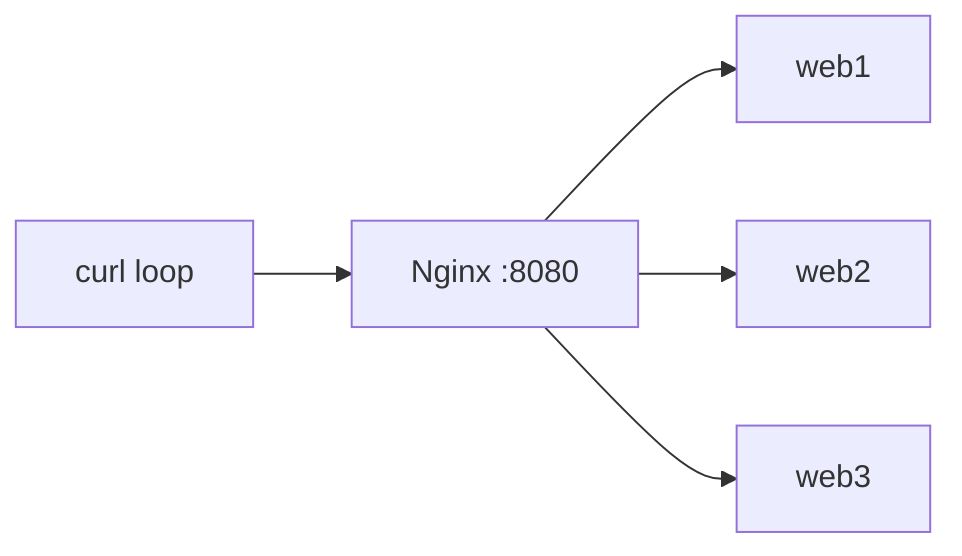

# Practice Lab: Load Balancing with Nginx

> Prove how a load balancer spreads requests across multiple backend servers, and how
> it routes around a failed one.

## What you'll learn
- How a reverse proxy **distributes** requests across a pool (round-robin).
- How Nginx **detects a dead backend** (passive health checks) and stops sending to it.
- How to **change the balancing algorithm** and weight backends.
- The hands-on version of [Load balancers](../1-knowledge/building-blocks/load-balancers.md).

⏱️ ~10 minutes · 💰 free · 🐳 Docker only

## Lab architecture
You'll run 3 identical backends (each prints its own hostname) behind one Nginx LB:


## Prerequisites
- Docker + Docker Compose (`docker --version`, `docker compose version`).
- Port `8080` free on your machine.

## Setup

**1. `nginx.conf`** — defines the backend pool and proxies to it:
```nginx
events {}
http {
  upstream backend {
    # default algorithm = round-robin.
    # Passive health checks are ON by default: after `max_fails` failed
    # attempts within `fail_timeout`, Nginx stops using a server for that window.
    server web1:80 max_fails=1 fail_timeout=10s;
    server web2:80 max_fails=1 fail_timeout=10s;
    server web3:80 max_fails=1 fail_timeout=10s;
  }
  server {
    listen 80;
    location / {
      proxy_pass http://backend;
      proxy_next_upstream error timeout;   # retry the next server on failure
    }
  }
}
```

**2. `docker-compose.yml`** — 3 backends + the LB. `traefik/whoami` returns its hostname,
so you can see *which* backend answered:
```yaml
services:
  web1: { image: traefik/whoami }
  web2: { image: traefik/whoami }
  web3: { image: traefik/whoami }
  lb:
    image: nginx:alpine
    volumes: [ "./nginx.conf:/etc/nginx/nginx.conf:ro" ]
    ports: [ "8080:80" ]
    depends_on: [ web1, web2, web3 ]
```

**3. Bring it up:**
```bash
docker compose up -d
docker compose ps     # all four containers should be "running"
```

## Run it

**Step 1 — watch requests distribute (round-robin):**
```bash
for i in $(seq 1 6); do curl -s localhost:8080 | grep Hostname; done
```

**Step 2 — simulate a backend failure and keep sending traffic:**
```bash
docker compose stop web2
for i in $(seq 1 6); do curl -s localhost:8080 | grep Hostname; done
```

## What to observe & why
- **Step 1:** the `Hostname` line cycles through `web1 → web2 → web3 → web1 …`. That's
  **round-robin** — Nginx forwards each new request to the next server in the pool.
- **Step 2:** requests still return `200`, but only from `web1` and `web3`. When Nginx
  tries `web2`, the connection fails; it marks `web2` **down for `fail_timeout` (10s)**
  (passive health check) and `proxy_next_upstream` retries the request on a healthy
  server — so **the client never sees an error**. After 10s, Nginx will probe `web2`
  again and re-add it if it's back.

> Note: Nginx open-source does **passive** health checks (detects failures from real
> traffic). **Active** health checks (a dedicated probe endpoint) are an NGINX Plus
> feature; in OSS you emulate them with `max_fails`/`fail_timeout` as above.

## Sample expected output
```
# Step 1 (round-robin):
Hostname: web1
Hostname: web2
Hostname: web3
Hostname: web1
Hostname: web2
Hostname: web3

# Step 2 (web2 stopped) — only web1 & web3, no errors:
Hostname: web1
Hostname: web3
Hostname: web1
Hostname: web3
Hostname: web1
Hostname: web3
```

## Experiments to try
1. **Least connections:** add `least_conn;` as the first line inside `upstream { … }`,
   `docker compose restart lb`, and re-run. (Effect is most visible under concurrent
   load — try `seq 1 50 | xargs -P10 -I{} curl -s localhost:8080`.)
2. **Weighting:** give one backend more traffic: `server web1:80 weight=3;`. Re-run and
   count how often `web1` answers.
3. **Recovery:** `docker compose start web2`, wait ~10s, and watch it rejoin the rotation.
4. **Sticky sessions:** add `ip_hash;` and observe the same client always hits the same
   backend (useful for stateful apps — and why stateless apps scale better).

## Common pitfalls
- **DNS caching:** Nginx OSS resolves `web1/2/3` to IPs **at startup**. If a backend
  container is recreated with a new IP, Nginx may not notice without a `resolver`
  directive + variable `proxy_pass`. `stop`/`start` (same container) is fine here.
- **`stop` vs `pause`:** `docker compose stop` closes the port (connection refused →
  Nginx marks it down). `pause` freezes it (connections hang → timeout) — try both to
  see `error` vs `timeout` handling.
- Editing `nginx.conf` requires `docker compose restart lb` (or `exec lb nginx -s
  reload`) to take effect.

## Teardown
```bash
docker compose down
```

## In the real world (common production pattern)
You rarely hand-write Nginx upstreams for internal service-to-service traffic at scale.
The common patterns:
- **Cloud load balancers** — AWS **ALB** (L7, path/host routing, TLS termination) for
  HTTP, **NLB** (L4) for raw TCP/extreme throughput; GCP/Azure equivalents. Targets are
  registered/deregistered automatically by **autoscaling groups**.
- **Service mesh (Envoy/Istio, Linkerd)** — for microservices, a sidecar proxy does
  **client-side load balancing** plus retries, timeouts, **circuit breaking**, and
  **outlier detection** (ejects hosts returning errors — active+passive health checks).
- **DNS / anycast + global LB** — to spread traffic across regions (e.g. Route 53,
  Cloudflare) before it ever reaches a regional LB.
- **Stateless services + shared session store** — production avoids `ip_hash` sticky
  sessions (they break on scale-down/failure); instead services are stateless and put
  session state in **Redis**, so any instance can serve any request. The lab's `ip_hash`
  experiment shows exactly the coupling you want to avoid.

Typical real stack: `DNS → global LB → regional ALB → autoscaling group of stateless
pods/instances`, with a mesh handling east-west calls.

## Connect to theory
- Concept: [Load balancers (L4/L7, algorithms, health checks)](../1-knowledge/building-blocks/load-balancers.md)
- Managed equivalent: [AWS ALB lab](./aws/load-balancing-alb.md) — the same behavior with
  a cloud Application Load Balancer + EC2 targets.
- Used in: [URL shortener](../2-case-studies/url-shortener.md),
  [news feed](../2-case-studies/news-feed.md), and essentially every horizontally-scaled
  service.
