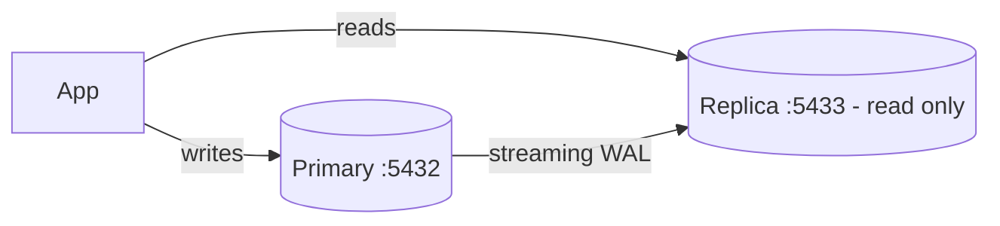

# Practice Lab: PostgreSQL Primary–Replica Replication

> Set up streaming replication between two PostgreSQL instances and watch writes on the
> primary appear on a read-only replica — the foundation of read scaling and failover.

## What you'll learn
- How **leader–follower** (primary–replica) replication propagates writes.
- Why replicas are **read-only**, and how to use them to **scale reads**.
- Where **replication lag** comes from and why it breaks "read your own writes."
- The hands-on version of [Replication](../1-knowledge/data-storage/replication.md).

⏱️ ~10 minutes · 💰 free · 🐳 Docker only

## Lab architecture


## Prerequisites
- Docker + Docker Compose. Ports `5432`/`5433` free. (Uses the Bitnami image, which wires
  replication via env vars so you can focus on the behavior.)

## Setup

**`docker-compose.yml`:**
```yaml
services:
  primary:
    image: bitnami/postgresql:16
    ports: [ "5432:5432" ]
    environment:
      POSTGRESQL_REPLICATION_MODE: master
      POSTGRESQL_REPLICATION_USER: repl
      POSTGRESQL_REPLICATION_PASSWORD: replpass
      POSTGRESQL_USERNAME: app
      POSTGRESQL_PASSWORD: apppass
      POSTGRESQL_DATABASE: appdb
  replica:
    image: bitnami/postgresql:16
    ports: [ "5433:5432" ]
    depends_on: [ primary ]
    environment:
      POSTGRESQL_REPLICATION_MODE: slave
      POSTGRESQL_REPLICATION_USER: repl
      POSTGRESQL_REPLICATION_PASSWORD: replpass
      POSTGRESQL_MASTER_HOST: primary
      POSTGRESQL_MASTER_PORT_NUMBER: 5432
      POSTGRESQL_PASSWORD: apppass
```

```bash
docker compose up -d
sleep 15   # let the replica do its initial sync from the primary
```

## Run it
```bash
# 1. WRITE on the primary
docker compose exec primary psql -U app -d appdb -c \
  "CREATE TABLE t(id int); INSERT INTO t VALUES (1),(2),(3);"

# 2. READ on the replica — the rows replicated over
docker compose exec replica psql -U app -d appdb -c "SELECT * FROM t;"

# 3. Try to WRITE on the replica — it refuses
docker compose exec replica psql -U app -d appdb -c "INSERT INTO t VALUES (4);"
```

## What to observe & why
- **Step 2:** the replica returns rows `1, 2, 3` — the primary streamed its **WAL**
  (write-ahead log) to the replica, which replayed it. You now have a second copy you can
  read from to offload the primary.
- **Step 3:** the insert fails with `cannot execute INSERT in a read-only transaction`. A
  replica is **read-only** by design — all writes must go to the primary, which is the
  single source of truth (and avoids write conflicts).

## Sample expected output
```
# step 2:
 id
----
  1
  2
  3
# step 3:
ERROR:  cannot execute INSERT in a read-only transaction
```

## Experiments to try
1. **See replication lag:** in one terminal continuously insert on the primary; in another
   repeatedly `SELECT count(*)` on the replica — under load the replica count trails
   slightly. That lag is why "read your own write" can fail if you read a replica right
   after writing.
2. **Read-your-writes fix:** route reads that need the latest data to the **primary**, and
   only eventually-consistent reads to replicas.
3. **Check replication status:** on the primary,
   `SELECT * FROM pg_stat_replication;` shows the connected replica and its lag.
4. **Add a second replica** (`replica2` on `:5434`) to see fan-out read scaling.

## Common pitfalls
- **Reading the replica immediately after writing the primary** can return stale data
  (lag). Design for it.
- **Replicas don't help write scaling** — every write still goes through one primary. For
  that you need [sharding](./sharding-demo.md).
- **Failover isn't automatic here** — if the primary dies, promoting a replica needs
  orchestration (see real-world below).

## Teardown
```bash
docker compose down -v
```

## In the real world (common production pattern)
- **Read replicas for read scaling** is one of the most common database patterns: send
  reads to replicas, writes to the primary. Managed services make it one click:
  **AWS RDS/Aurora read replicas**, **GCP Cloud SQL**, **Azure Database**.
- **Multi-AZ / synchronous standby for high availability:** a hot standby in another
  availability zone with **automatic failover** (different goal from read scaling — see
  the [RDS lab](./aws/rds-replication.md)).
- **Self-managed HA** uses tools like **Patroni + etcd** or **repmgr** for leader election
  and automatic failover, avoiding split-brain.
- **Async vs sync replication:** async (default) is fast but can lose the last writes on
  failover; semi-sync waits for one replica to reduce data loss.
- App frameworks route queries with **read/write splitting** (e.g. primary for writes +
  recent reads, replicas for the rest).

## Connect to theory
- Concept: [Database replication](../1-knowledge/data-storage/replication.md) ·
  [Redundancy & failover](../1-knowledge/reliability/redundancy-failover.md)
- Managed equivalent: [RDS read replica & Multi-AZ lab](./aws/rds-replication.md)
- Contrast with: [sharding lab](./sharding-demo.md) (scales **writes**, not just reads).
