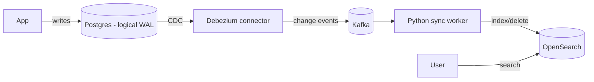

# Project: CDC → Search Index Sync

> Keep a search index in sync with your database **automatically** using **Change Data
> Capture (CDC)**: every insert/update/delete in Postgres flows through Kafka into
> OpenSearch — no dual writes, no nightly batch reindex.

⏱️ ~40 min · 💰 free locally · 🐳 Docker · 🐍 Python · ☁️ AWS optional · ⚠️ heaviest lab

## What you'll build


The database stays the **source of truth**; the search index is a **derived** read model
kept eventually consistent by streaming its changes — the standard way to add search.

## Concepts you connect
- Change Data Capture (CDC) — streaming the DB's write-ahead log
- [Message queues](../1-knowledge/building-blocks/message-queues.md) (Kafka as the pipe)
- [Full-text search](../1-knowledge/data-storage/search.md) (OpenSearch index)
- [Eventual consistency](../1-knowledge/fundamentals/consistency-models.md) between store + index

## Build it locally (🐳)

**1. `docker-compose.yml`** — Postgres (logical WAL) + Kafka + Debezium Connect + OpenSearch:
```yaml
services:
  postgres:
    image: debezium/postgres:16          # ships with logical decoding enabled
    environment: { POSTGRES_PASSWORD: pass, POSTGRES_DB: shop, POSTGRES_USER: postgres }
  kafka:
    image: bitnami/kafka:3.7
    environment:
      KAFKA_CFG_NODE_ID: "0"
      KAFKA_CFG_PROCESS_ROLES: controller,broker
      KAFKA_CFG_CONTROLLER_QUORUM_VOTERS: "0@kafka:9093"
      KAFKA_CFG_LISTENERS: "PLAINTEXT://:9092,CONTROLLER://:9093"
      KAFKA_CFG_ADVERTISED_LISTENERS: "PLAINTEXT://kafka:9092"
      KAFKA_CFG_CONTROLLER_LISTENER_NAMES: "CONTROLLER"
      KAFKA_CFG_OFFSETS_TOPIC_REPLICATION_FACTOR: "1"
  connect:
    image: debezium/connect:2.7
    ports: [ "8083:8083" ]
    environment:
      BOOTSTRAP_SERVERS: kafka:9092
      GROUP_ID: cdc
      CONFIG_STORAGE_TOPIC: _cfg
      OFFSET_STORAGE_TOPIC: _off
      STATUS_STORAGE_TOPIC: _sts
    depends_on: [ kafka, postgres ]
  opensearch:
    image: opensearchproject/opensearch:2.15.0
    environment:
      discovery.type: single-node
      DISABLE_SECURITY_PLUGIN: "true"
      OPENSEARCH_JAVA_OPTS: "-Xms512m -Xmx512m"
    ports: [ "9200:9200" ]
  sync:
    image: python:3.12-slim
    volumes: [ "./sync.py:/app/sync.py" ]
    working_dir: /app
    command: sh -c "pip install kafka-python opensearch-py -q && sleep 30 && python sync.py"
    depends_on: [ kafka, opensearch ]
```

**2. `sync.py`** — consume Debezium events, index into OpenSearch:
```python
import json
from kafka import KafkaConsumer
from opensearchpy import OpenSearch
os_client = OpenSearch([{"host": "opensearch", "port": 9200}])
c = KafkaConsumer("shop.public.products", bootstrap_servers="kafka:9092",
                  value_deserializer=lambda b: json.loads(b) if b else None,
                  auto_offset_reset="earliest", group_id="sync")
for msg in c:
    if not msg.value: continue
    payload = msg.value["payload"]
    op, after = payload["op"], payload.get("after")
    if op in ("c", "u") and after:                       # create/update -> index
        os_client.index(index="products", id=after["id"], body=after)
        print(f"[sync] indexed {after['id']} ({op})")
    elif op == "d":                                      # delete -> remove
        os_client.delete(index="products", id=payload["before"]["id"], ignore=404)
        print(f"[sync] deleted {payload['before']['id']}")
```

**3. Start, create the table, register the Debezium connector:**
```bash
docker compose up -d
sleep 25
# create a table to capture
docker compose exec postgres psql -U postgres -d shop -c \
  "CREATE TABLE products(id int primary key, name text, price int);"
# register the Postgres CDC connector
curl -s -X POST localhost:8083/connectors -H 'content-type: application/json' -d '{
  "name": "pg-products",
  "config": {
    "connector.class": "io.debezium.connector.postgresql.PostgresConnector",
    "database.hostname": "postgres", "database.port": "5432",
    "database.user": "postgres", "database.password": "pass", "database.dbname": "shop",
    "topic.prefix": "shop", "table.include.list": "public.products",
    "plugin.name": "pgoutput"
  }}'
```

## Run the end-to-end flow
```bash
# Write to Postgres
docker compose exec postgres psql -U postgres -d shop -c \
  "INSERT INTO products VALUES (1,'keyboard',50),(2,'mouse',25);"
docker compose exec postgres psql -U postgres -d shop -c \
  "UPDATE products SET price=45 WHERE id=1;"
sleep 3

# Search OpenSearch — the rows are already there, with the updated price
curl -s "localhost:9200/products/_search?q=name:keyboard" | python -m json.tool
```

## What to observe & why
- You only ever wrote to **Postgres** — yet the rows appear in **OpenSearch**, with the
  updated price. Debezium read Postgres's **write-ahead log** and streamed each change
  through Kafka; the Python worker applied it to the index.
- This avoids **dual writes** (app writing to DB *and* search, which drift on partial
  failures). CDC makes the DB the single source of truth and the index a **derived**
  view — eventually consistent, a few seconds behind.
- Delete a row and watch it disappear from the index too — deletes propagate as well.

## Deploy / scale on AWS (☁️)
| Local | AWS managed |
| --- | --- |
| Postgres | **RDS** (logical replication) |
| Debezium/Connect | **DMS** (CDC) or MSK Connect + Debezium |
| Kafka | **MSK** / Kinesis |
| sync worker | **Lambda** |
| OpenSearch | **OpenSearch Service** |
| (DynamoDB variant) | **DynamoDB Streams → Lambda → OpenSearch** |

## Observe & break it
1. **Index lag:** rapid-fire updates and watch the index trail slightly — eventual
   consistency you can measure.
2. **Rebuild:** delete the OpenSearch index and **replay** the Kafka topic from the
   beginning to rebuild it — the log is your reprocessing safety net.
3. **Resilience:** stop the sync worker, make DB changes, restart — it catches up from its
   Kafka offset (nothing lost).

## Mirrors
How search indexes, caches, and read models are kept in sync at scale (e.g. product search,
the [search knowledge doc](../1-knowledge/data-storage/search.md)); the same CDC pattern
feeds data lakes and analytics.

## Teardown
```bash
docker compose down -v
```
