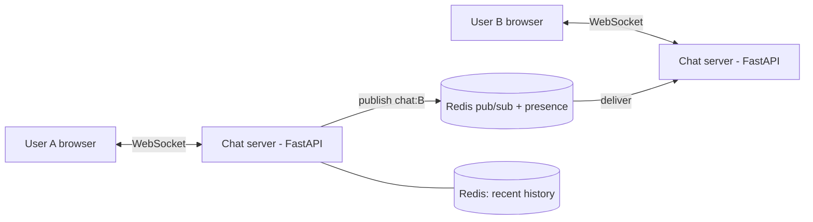

# Project: Real-Time Chat

> Build a real-time chat backend showing the core pattern from the
> [chat case study](../2-case-studies/chat-system.md): persistent **WebSocket** connections,
> a **Redis pub/sub backplane** that routes a message to whichever server holds the
> recipient, and **presence**.

⏱️ ~30 min · 💰 free locally · 🐳 Docker · 🐍 Python (FastAPI) · ☁️ AWS optional

## What you'll build


Each server only holds *its* connections; **Redis pub/sub** is the bus that lets a message
from A's server reach B's server. This is why the design scales horizontally.

## Concepts you connect
- Persistent connections & session routing — [chat case study](../2-case-studies/chat-system.md)
- [Pub/sub](../1-knowledge/building-blocks/message-queues.md) as the delivery backplane
- Presence via heartbeats + Redis TTL
- [WebSockets](../1-knowledge/communication/realtime.md)

## Build it locally (🐳)

**1. `server.py`** — FastAPI WebSocket server with a Redis backplane:
```python
import os, json, asyncio
from fastapi import FastAPI, WebSocket, WebSocketDisconnect
from fastapi.responses import HTMLResponse
import redis.asyncio as redis

app = FastAPI()
R = redis.Redis(host="redis", port=6379, decode_responses=True)
local = {}   # user_id -> websocket held by THIS server instance

@app.websocket("/ws/{user}")
async def ws(websocket: WebSocket, user: str):
    await websocket.accept()
    local[user] = websocket
    await R.set(f"presence:{user}", "online", ex=30)        # presence w/ TTL
    sub = R.pubsub(); await sub.subscribe(f"chat:{user}")    # listen for my messages

    async def pump():                                        # Redis -> this socket
        async for m in sub.listen():
            if m["type"] == "message":
                await websocket.send_text(m["data"])
    task = asyncio.create_task(pump())
    try:
        while True:
            raw = await websocket.receive_text()
            msg = json.loads(raw)                            # {"to": "...", "text": "..."}
            payload = json.dumps({"from": user, "text": msg["text"]})
            await R.lpush(f"hist:{user}:{msg['to']}", payload)   # recent history
            await R.publish(f"chat:{msg['to']}", payload)        # route via bus
            await R.set(f"presence:{user}", "online", ex=30)     # heartbeat
    except WebSocketDisconnect:
        pass
    finally:
        task.cancel(); await sub.unsubscribe(f"chat:{user}")
        local.pop(user, None); await R.delete(f"presence:{user}")

@app.get("/")                                                # tiny test client
async def client():
    return HTMLResponse("""
<input id=me placeholder=you><input id=to placeholder=to>
<input id=t placeholder=msg><button onclick=send()>send</button><pre id=log></pre>
<script>
let ws;
function conn(){ws=new WebSocket(`ws://${location.host}/ws/${me.value}`);
  ws.onmessage=e=>log.textContent+=e.data+"\\n";}
me.onchange=conn;
function send(){ws.send(JSON.stringify({to:to.value,text:t.value}));
  log.textContent+="me: "+t.value+"\\n";t.value="";}
</script>""")
```

**2. `docker-compose.yml`:**
```yaml
services:
  redis: { image: redis:7-alpine }
  chat:
    image: python:3.12-slim
    volumes: [ "./server.py:/app/server.py" ]
    working_dir: /app
    command: sh -c "pip install fastapi uvicorn 'redis>=4.2' -q && uvicorn server:app --host 0.0.0.0 --port 8000"
    ports: [ "8000:8000" ]
    depends_on: [ redis ]
```

```bash
docker compose up -d
sleep 8
```

## Run the end-to-end flow
1. Open **two browser tabs** at `http://localhost:8000`.
2. In tab 1, set `you = alice`; in tab 2, `you = bob` (this opens each WebSocket).
3. In tab 1, set `to = bob`, type a message, send → it appears in **bob's** tab in real
   time. Reply from bob to alice.

```bash
# Check presence (set with a 30s TTL, refreshed by heartbeats)
docker compose exec redis redis-cli keys 'presence:*'
docker compose exec redis redis-cli lrange hist:alice:bob 0 -1
```

## What to observe & why
- Messages appear **instantly** with no polling — the server **pushes** down the open
  WebSocket. The browser holds one persistent connection.
- A message is delivered via **`PUBLISH chat:<recipient>`**: even if alice and bob were on
  *different* server instances, Redis pub/sub routes it to the instance holding the
  recipient's socket. That's the **backplane** that makes chat horizontally scalable.
- `presence:<user>` keys carry a **30s TTL**; heartbeats refresh them, so if a client
  vanishes the key expires → "offline" without any explicit signal.

## Deploy / scale on AWS (☁️)
| Local | AWS managed |
| --- | --- |
| FastAPI WS servers | **ECS/EKS** behind an **ALB** (WebSocket support) or **API Gateway WebSocket** |
| Redis pub/sub + presence | **ElastiCache (Redis)** |
| recent history | **DynamoDB** / **Cassandra/Keyspaces** (partition by conversation+time) |
| offline push | **SNS → APNs/FCM** |

The session-registry + pub/sub pattern is exactly how WhatsApp/Slack scale connections; the
[case study](../2-case-studies/chat-system.md) covers offline delivery, receipts, and
storage in depth.

## Observe & break it
1. **Scale the backplane:** run `--scale chat=2` behind a TCP load balancer; messages still
   route correctly because Redis (not server memory) is the bus. (Sticky routing needed so a
   client stays on one instance.)
2. **Presence expiry:** close a tab and watch its `presence:` key disappear within 30s.
3. **Offline:** message a user who isn't connected — it's stored in `hist:` but not
   delivered; real systems also fire a push notification (add SNS).

## Extend it
- Add **delivery/read receipts** (ack messages, track `last_read`).
- Persist to **Postgres/Cassandra** with per-conversation `seq` for ordering.
- Add **group chat** (publish to each member's channel).

## Mirrors
The [chat system case study](../2-case-studies/chat-system.md) (WhatsApp/Messenger).

## Teardown
```bash
docker compose down -v
```
